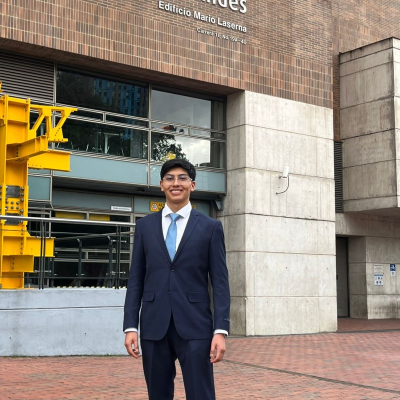
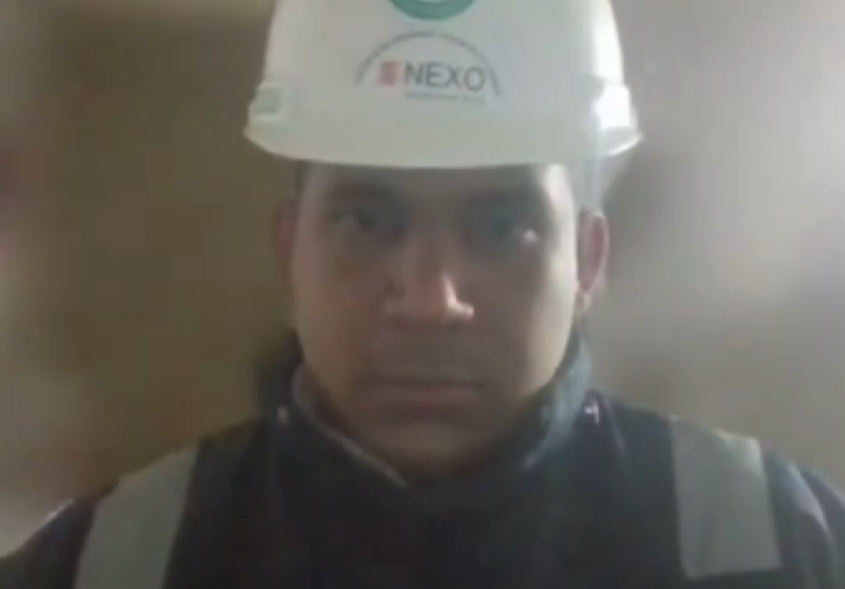
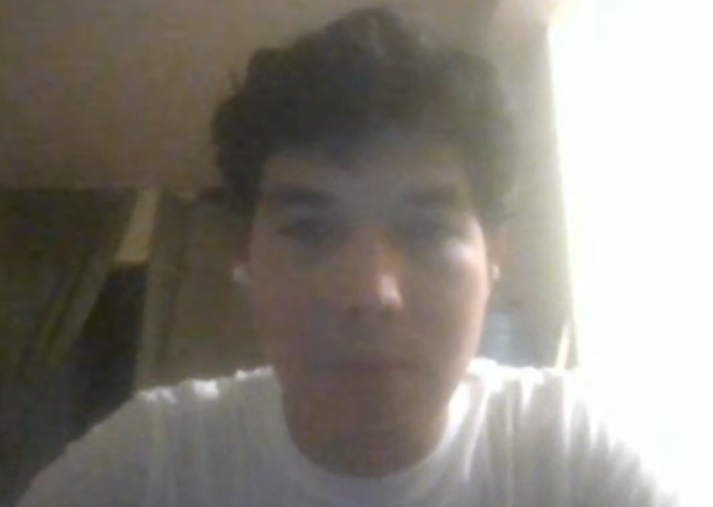
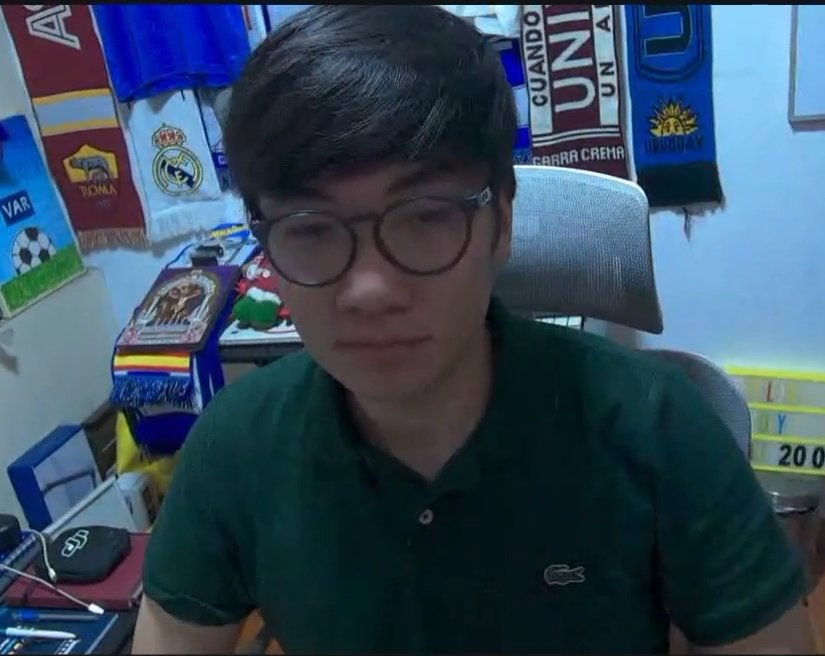
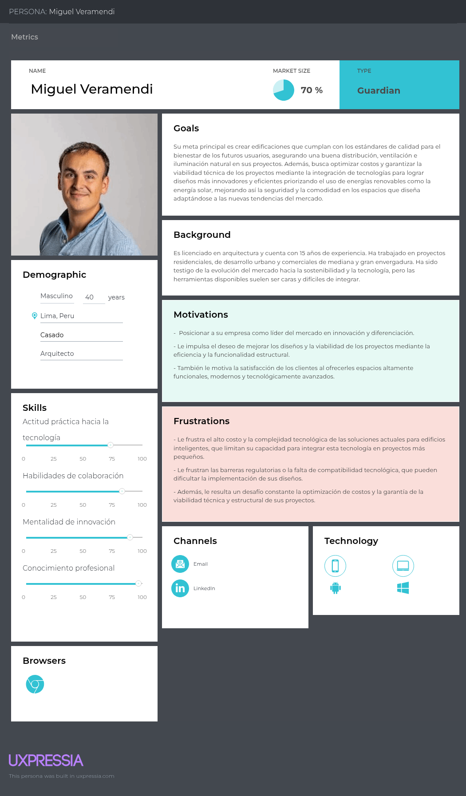
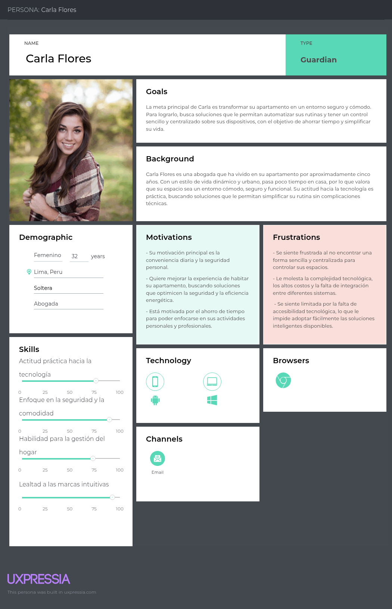
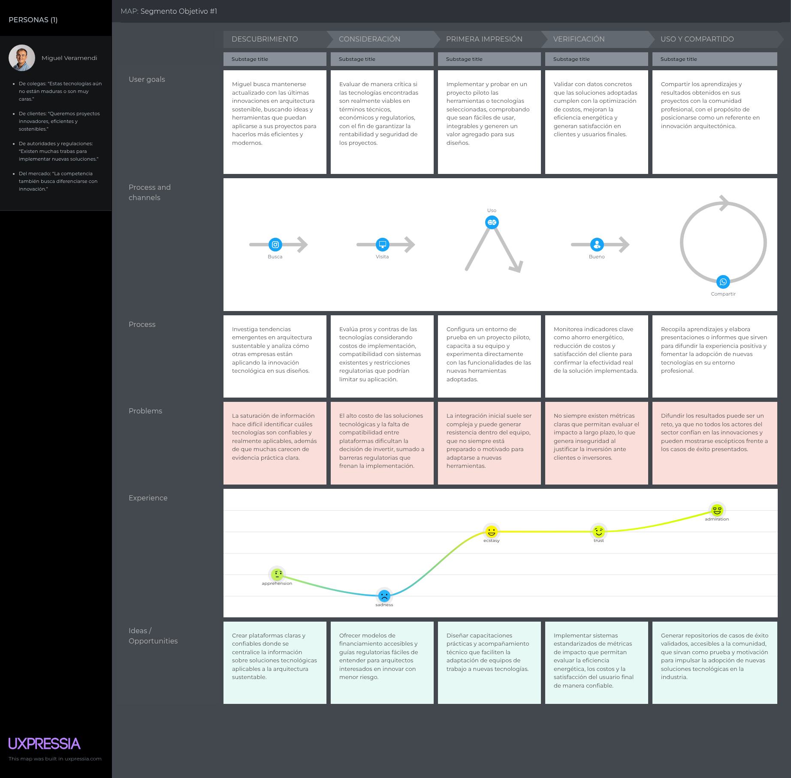
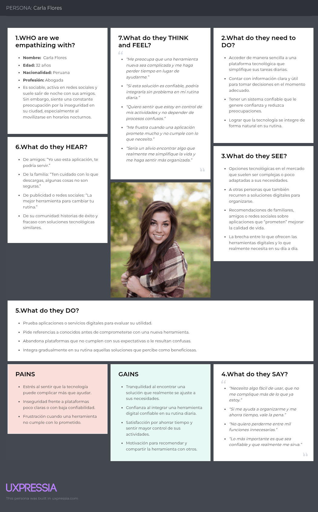

# 
COURSE PROJECT

    </img> 
    <strong>Universidad Peruana de Ciencias Aplicadas</strong> 
    <strong>Ingeniería de Software</strong> 
    <strong>Periodo: 2026-2</strong> 
    <strong>Desarrollo de Soluciones IoT</strong> 
    <strong>NRC: 16518</strong> 
    <strong>Profesor: Jimmy Enrique Sanchez Portugal</strong> 
     INFORME TRABAJO FINAL

#### Startup: **CcaritaTech**
#### Product: **IoBuild**

### 
Team Members:

| Member                           | Code       |
|----------------------------------|------------|
|Ordoñez Ricaldi, Axel Randall|U202216827|
|Ccarita Cruz, Brayan Roberto|U20221c218|
|Panta Castro, Fabrizio Martin|U20231a810|
|Loechle Arias, Mateo Italo|U202215004|
|Guia Carrasco, Pedro Andre|U202212010|
|Alejo Jesus, Anyelo Bill|U20231d149|
|Escalante Baygorrea, Janiel Franz|U201912668|

  Setiembre 2026

  

# Registro de Versiones del Informe

| Version | Fecha | Autor | Descripcion de Modificacion |
| :---: | :---: | :--- | :--- |
| 0.0 | 05/09/2026 | Ccarita Cruz, Brayan Roberto | Inicialización del repositorio y estructura base del informe del proyecto. |
| 0.1 | 06/09/2026 | Ordoñez Ricaldi, Axel Randall | Redacción del Capítulo 1: Startup Profile, descripción de la organización y perfiles profesionales de los integrantes. |
| 0.2 | 07/09/2026 | Panta Castro, Fabrizio Martin | Elaboración del Solution Profile, antecedentes, problemática, proceso Lean UX (Problem Statements, Assumptions, Hypothesis, Canvas) y segmentos objetivo. |
| 0.3 | 08/09/2026 | Loechle Arias, Mateo Italo | Desarrollo del Capítulo 2: Análisis competitivo, benchmarking de competidores directos e indirectos y estrategias frente a la competencia. |
| 0.4 | 09/09/2026 | Guia Carrasco, Pedro Andre | Elaboración de entrevistas: diseño de guía de preguntas, registro audiovisual, transcripción y análisis de respuestas de los segmentos objetivo. |
| 0.5 | 10/09/2026 | Alejo Jesus, Anyelo Bill | Desarrollo de Needfinding: creación de User Personas, User Task Matrix, User Journey Mapping y Empathy Mapping. |
| 0.6 | 11/09/2026 | Escalante Baygorrea, Janiel Franz | Modelado de Big Picture EventStorming y definición formal del Ubiquitous Language del dominio de la solución. |
| 0.7 | 12/09/2026 | Ccarita Cruz, Brayan Roberto | Desarrollo del Capítulo 3: Especificación de requerimientos, definición de Épicas, User Stories con criterios de aceptación (Gherkin) y Technical Stories. |
| 0.8 | 13/09/2026 | Ordoñez Ricaldi, Axel Randall | Construcción del Impact Mapping y estructuración del Product Backlog general con estimación de puntos de historia y priorización por Sprints. |
| 0.9 | 15/09/2026 | Panta Castro, Fabrizio Martin | Elaboración del Capítulo 4: Strategic-Level DDD (Design-Level EventStorming, Candidate Contexts, Bounded Context Canvases y Context Mapping). |
| 1.0 | 16/09/2026 | Loechle Arias, Mateo Italo | Tactical-Level DDD para los 4 Bounded Contexts, diagramas de arquitectura de software C4, conclusiones, bibliografía, anexos y consolidación final de la entrega hasta el Capítulo 4. |  

# Project Report Collaboration Insights
URL del repositorio: https://github.com/IoBuild-IoT/report
(Imagenes de los commits cada entrega)

# Contenido

- [Registro de Versiones del Informe](#registro-de-versiones-del-informe)
- [Project Report Collaboration Insights](#project-report-collaboration-insights)
- [Student Outcome](#student-outcome)
- [Capítulo I: Introducción](#capítulo-i-introducción)
  - [1.1. Startup Profile](#11-startup-profile)
    - [1.1.1. Descripción de la Startup](#111-descripción-de-la-startup)
    - [1.1.2. Perfiles de integrantes del equipo](#112-perfiles-de-integrantes-del-equipo)
  - [1.2. Solution Profile](#12-solution-profile)
    - [1.2.1 Antecedentes y problemática](#121-antecedentes-y-problemática)
    - [1.2.2 Lean UX Process.](#122-lean-ux-process)
      - [1.2.2.1. Lean UX Problem Statements.](#1221-lean-ux-problem-statements)
      - [1.2.2.2. Lean UX Assumptions.](#1222-lean-ux-assumptions)
      - [1.2.2.3. Lean UX Hypothesis Statements.](#1223-lean-ux-hypothesis-statements)
      - [1.2.2.4. Lean UX Canvas.](#1224-lean-ux-canvas)
  - [1.3. Segmentos objetivo.](#13-segmentos-objetivo)
- [Capítulo II: Requirements Elicitation & Analysis](#capítulo-ii-requirements-elicitation--analysis)
  - [2.1. Competidores.](#21-competidores)
    - [2.1.1. Análisis competitivo.](#211-análisis-competitivo)
    - [2.1.2. Estrategias y tácticas frente a competidores.](#212-estrategias-y-tácticas-frente-a-competidores)
  - [2.2. Entrevistas.](#22-entrevistas)
    - [2.2.1. Diseño de entrevistas.](#221-diseño-de-entrevistas)
    - [2.2.2. Registro de entrevistas.](#222-registro-de-entrevistas)
    - [2.2.3. Análisis de entrevistas.](#223-análisis-de-entrevistas)
  - [2.3. Needfinding.](#23-needfinding)
    - [2.3.1. User Personas.](#231-user-personas)
    - [2.3.2. User Task Matrix.](#232-user-task-matrix)
    - [2.3.3. User Journey Mapping.](#233-user-journey-mapping)
    - [2.3.4. Empathy Mapping.](#234-empathy-mapping)
  - [2.4. Big Picture EventStorming.](#24-big-picture-eventstorming)
  - [2.5. Ubiquitous Language.](#25-ubiquitous-language)
- [Capítulo III: Requirements Specification](#capítulo-iii-requirements-specification)
  - [3.1. User Stories.](#31-user-stories)
  - [3.2. Impact Mapping.](#32-impact-mapping)
  - [3.3. Product Backlog.](#33-product-backlog)
- [Capítulo IV: Solution Software Design](#capítulo-iv-solution-software-design)
  - [4.1. Strategic-Level Domain-Driven Design.](#41-strategic-level-domain-driven-design)
    - [4.1.1. Design-Level EventStorming.](#411-design-level-eventstorming)
      - [4.1.1.1 Candidate Context Discovery.](#4111-candidate-context-discovery)
      - [4.1.1.2 Domain Message Flows Modeling.](#4112-domain-message-flows-modeling)
      - [4.1.1.3 Bounded Context Canvases.](#4113-bounded-context-canvases)
    - [4.1.2. Context Mapping.](#412-context-mapping)
    - [4.1.3. Software Architecture.](#413-software-architecture)
      - [4.1.3.1. Software Architecture System Landscape Diagram.](#4131-software-architecture-system-landscape-diagram)
      - [4.1.3.2. Software Architecture Context Level Diagrams.](#4132-software-architecture-context-level-diagrams)
      - [4.1.3.3. Software Architecture Container Level Diagrams.](#4133-software-architecture-container-level-diagrams)
      - [4.1.3.4. Software Architecture Deployment Diagrams.](#4134-software-architecture-deployment-diagrams)
  - [4.2. Tactical-Level Domain-Driven Design](#42-tactical-level-domain-driven-design)
    - [4.2.1. Bounded Context: Smart Project Setup.](#421-bounded-context-smart-project-setup)
      - [4.2.1.1. Domain Layer.](#4211-domain-layer)
      - [4.2.1.2. Interface Layer.](#4212-interface-layer)
      - [4.2.1.3. Application Layer.](#4213-application-layer)
      - [4.2.1.4. Infrastructure Layer.](#4214-infrastructure-layer)
      - [4.2.1.5. Bounded Context Software Architecture Component Level Diagrams.](#4215-bounded-context-software-architecture-component-level-diagrams)
      - [4.2.1.6. Bounded Context Software Architecture Code Level Diagrams.](#4216-bounded-context-software-architecture-code-level-diagrams)
    - [4.2.2. Bounded Context: Service Execution and Monitoring.](#422-bounded-context-service-execution-and-monitoring)
      - [4.2.2.1. Domain Layer.](#4221-domain-layer)
      - [4.2.2.2. Interface Layer.](#4222-interface-layer)
      - [4.2.2.3. Application Layer.](#4223-application-layer)
      - [4.2.2.4. Infrastructure Layer.](#4224-infrastructure-layer)
      - [4.2.2.5. Bounded Context Software Architecture Component Level Diagrams.](#4225-bounded-context-software-architecture-component-level-diagrams)
      - [4.2.2.6. Bounded Context Software Architecture Code Level Diagrams.](#4226-bounded-context-software-architecture-code-level-diagrams)
    - [4.2.3. Bounded Context: Smart Assistant.](#423-bounded-context-smart-assistant)
      - [4.2.3.1. Domain Layer.](#4231-domain-layer)
      - [4.2.3.2. Interface Layer.](#4232-interface-layer)
      - [4.2.3.3. Application Layer.](#4233-application-layer)
      - [4.2.3.4. Infrastructure Layer.](#4234-infrastructure-layer)
      - [4.2.3.5. Bounded Context Software Architecture Component Level Diagrams.](#4235-bounded-context-software-architecture-component-level-diagrams)
      - [4.2.3.6. Bounded Context Software Architecture Code Level Diagrams.](#4236-bounded-context-software-architecture-code-level-diagrams)
    - [4.2.4. Bounded Context: Energy Management.](#424-bounded-context-energy-management)
      - [4.2.4.1. Domain Layer.](#4241-domain-layer)
      - [4.2.4.2. Interface Layer.](#4242-interface-layer)
      - [4.2.4.3. Application Layer.](#4243-application-layer)
      - [4.2.4.4. Infrastructure Layer.](#4244-infrastructure-layer)
      - [4.2.4.5. Bounded Context Software Architecture Component Level Diagrams.](#4245-bounded-context-software-architecture-component-level-diagrams)
      - [4.2.4.6. Bounded Context Software Architecture Code Level Diagrams.](#4246-bounded-context-software-architecture-code-level-diagrams)
- [Conclusiones y recomendaciones.](#conclusiones-y-recomendaciones)
- [Video About-the-Team.](#video-about-the-team)
- [Bibliografía](#bibliografía)
- [Anexos](#anexos)  

# Student Outcome

| Criterio Específico | Acciones Realizadas | Conclusiones |
|---|---|---|
| Participa en equipos multidisciplinarios con eficacia, eficiencia y objetividad, en el marco de un proyecto en soluciones de ingeniería de software. | **Compañero 1:**  *TB1:* Texto de evidencia...  *TB2:* Texto de evidencia... | Conclusión del criterio |
| Conoce al menos un sector empresarial o dominio de aplicación de soluciones de software. | **Compañero 1:**  *TB1:* Texto de evidencia...  *TB2:* Texto de evidencia... | Conclusión del criterio |

---

# Capítulo I: Introducción

## 1.1. Startup Profile
### 1.1.1. Descripción de la Startup
**IoBuild** es una startup tecnológica que nace con el propósito de democratizar y simplificar la integración del Internet de las Cosas (IoT) en el sector residencial y de la construcción. Diseñamos una **plataforma integral web y móvil** para el control y la gestión unificada de dispositivos IoT en condominios, abordando de manera cohesionada tanto los espacios comunes como los departamentos individuales.

A diferencia de las complejas soluciones industriales o de domótica propietaria de alto costo, IoBuild se enfoca en una solución accesible, práctica y viable. En su alcance principal, nuestra plataforma centraliza el monitoreo de **condiciones ambientales (sensores de temperatura y humedad)** y el control automatizado de la **iluminación a través de actuadores (módulos de relé)**. Esto permite, por ejemplo, automatizar el encendido y apagado de luces en pasillos y zonas compartidas de un condominio según horarios o niveles ambientales, así como brindar a cada residente el control remoto y personalizado del confort lumínico y térmico de su propio departamento desde su smartphone o navegador web.

IoBuild se dirige a dos segmentos clave:

- **Empresas constructoras, arquitectos y administradores de condominios:** que buscan incorporar un valor agregado tecnológico real, estandarizado y de bajo costo en sus proyectos residenciales, facilitando la supervisión y automatización básica de las áreas comunes.
- **Propietarios e inquilinos residenciales:** que desean disfrutar de mayor confort, supervisión ambiental y autonomía en sus viviendas mediante una interfaz amigable y sin complicaciones técnicas.

Nuestra propuesta de valor se sustenta en la simplicidad, la accesibilidad económica y la cohesión: conectar hardware accesible (microcontroladores, sensores y actuadores) con una arquitectura digital moderna que elimina la dispersión de aplicaciones.

- **Misión:** Facilitar la modernización de espacios residenciales a través de soluciones IoT accesibles, brindando a constructoras, administradores y residentes herramientas prácticas para el monitoreo ambiental y el control eficiente de dispositivos.
- **Visión:** Convertirnos en la plataforma referente de integración IoT residencial en la región, promoviendo viviendas y condominios más conectados, confortables y energéticamente conscientes.

### 1.1.2. Perfiles de integrantes del equipo
| Miembros del equipo | Código Estudiante | Carrera | Conocimientos / Habilidades |
|---|---|---|---|
| **Axel Randall Ordoñez Ricaldi**  | U202216827 | Ingeniería de Software | Estudiante de la carrera de Ingeniería de Software en la UPC. Con capacidad para el trabajo en equipo y resolución de problemas técnicos bajo presión. Posee conocimientos en lenguajes como C# y Python, frameworks web y móviles como React, Vue y Angular, además de diseño y gestión de bases de datos relacionales y no relacionales como SQL y MongoDB. |
| **Brayan Roberto Ccarita Cruz**  | U20221c218 | Ingeniería de Software | Estudiante de la carrera de Ingeniería de Software en la UPC. Caracterizado por la perseverancia, puntualidad y enfoque en el cumplimiento eficiente de objetivos. Cuenta con experiencia en desarrollo con tecnologías como Golang y TypeScript, herramientas de frontend como Astro.js y Svelte, y aplicación de metodologías ágiles de diseño como Design Sprint. |
| **Fabrizio Martin Panta Castro**  | U20231a810 | Ingeniería de Software | Estudiante de la carrera de Ingeniería de Software en la UPC. Destacado por su proactividad, compañerismo y compromiso con el avance continuo del equipo. Posee competencias técnicas en C++ y Python, frameworks para desarrollo web y móvil como Flutter y Vue, así como administración de bases de datos relacionales SQL. |
| **Mateo Italo Loechle Arias**  | U202215004 | Ingeniería de Software | Estudiante de la carrera de Ingeniería de Software en la UPC. Enfocado en el desarrollo backend con arquitectura hexagonal, diseño de interfaces de programación (APIs) y automatización de procesos. Cuenta con sólidos conocimientos en bases de datos relacionales y no relacionales como SQL y MongoDB, aportando al trabajo colaborativo con enfoque estructurado. |
| **Pedro Andre Guia Carrasco**  | U202212010 | Ingeniería de Software | Estudiante de la carrera de Ingeniería de Software en la UPC, de 22 años. De perfil autodidacta y con vocación de liderazgo en equipos de trabajo, enfocado en generar confianza y seguridad en la dirección de proyectos. Posee capacitación técnica en lenguajes de programación como Java, Python, C#, JavaScript y TypeScript. |
| **Anyelo Bill Alejo Jesus**  | U20231d149 | Ingeniería de Software | Estudiante de octavo ciclo de la carrera de Ingeniería de Software en la UPC. Caracterizado por ser una persona responsable, comprometida y con iniciativa, orientada a aportar activamente al logro de los objetivos del equipo. Cuenta con sólidos conocimientos en lenguajes como C++ y Python para el desarrollo eficiente de soluciones. |
| **Janiel Franz Escalante Baygorrea**  | U201912668 | Ingeniería de Software | Estudiante próximo a egresar de la carrera de Ingeniería de Software en la UPC, con perfil Full Stack & AI Specialist. Especializado en el diseño e implementación de aplicaciones escalables, integración de soluciones de Inteligencia Artificial y experiencia comprobada en desarrollo integral end-to-end. |

## 1.2. Solution Profile
### 1.2.1 Antecedentes y problemática
En los últimos años, el sector inmobiliario y de la construcción ha experimentado una transformación impulsada por la creciente demanda de espacios inteligentes, sostenibles y personalizables. Las tendencias globales en domótica, IoT (Internet of Things) y eficiencia energética han comenzado a redefinir la forma en que las personas interactúan con sus viviendas y lugares de trabajo. Sin embargo, en gran parte de Latinoamérica y específicamente en el Perú, la adopción de estas tecnologías sigue siendo limitada debido a altos costos de implementación, falta de estandarización y ausencia de soluciones accesibles para el usuario final.

Actualmente, la mayoría de proyectos inmobiliarios no incorpora de manera nativa funcionalidades inteligentes como control automatizado de iluminación, climatización, seguridad o gestión energética en tiempo real. Cuando estas soluciones se incluyen, suelen estar restringidas a segmentos de alto poder adquisitivo, generando una brecha de accesibilidad entre quienes pueden disfrutar de la tecnología y quienes no.

Por otro lado, los propietarios e inquilinos enfrentan problemas al intentar personalizar sus espacios: las opciones suelen ser costosas, requieren conocimientos técnicos avanzados o dependen de la contratación de múltiples proveedores sin integración entre sistemas. Esto genera experiencias fragmentadas y reduce el valor percibido de la inversión.

En el caso de las constructoras, arquitectos e ingenieros, la problemática se centra en la necesidad de diferenciar sus proyectos en un mercado altamente competitivo. Si bien existe interés en ofrecer soluciones innovadoras, los equipos de construcción se enfrentan a falta de plataformas unificadas que simplifiquen la integración de tecnología inteligente en sus edificaciones, lo que dificulta la planificación y eleva los costos de implementación.

La problemática puede resumirse en los siguientes puntos:
- **Accesibilidad limitada:** la mayoría de soluciones de automatización están dirigidas a mercados premium, dejando de lado a gran parte de la población.

- **Falta de estandarización:** los sistemas actuales suelen ser propietarios y poco compatibles, lo que genera barreras técnicas.

- **Costos elevados:** implementar tecnologías inteligentes requiere inversiones iniciales altas, lo que desalienta a constructoras y propietarios.

- **Complejidad técnica:** los usuarios finales carecen de herramientas intuitivas para personalizar y gestionar sus espacios de manera autónoma.

- **Baja diferenciación en proyectos inmobiliarios:** las constructoras tienen dificultades para ofrecer un valor agregado innovador frente a la competencia.

En este contexto, IoBuild surge como respuesta a la necesidad de democratizar el acceso a los espacios inteligentes, ofreciendo una plataforma que facilita la integración tecnológica desde la etapa de construcción hasta la personalización por parte del usuario final.  

**1. What (¿Qué?)**

La mayoría de proyectos inmobiliarios no incorporan de manera integral soluciones inteligentes desde su diseño, lo que provoca que los espacios continúen siendo rígidos y poco adaptables a las necesidades de los usuarios. Las opciones que existen en el mercado suelen estar enfocadas en segmentos de alto costo, como consecuencia, los usuarios finales terminan recurriendo a dispositivos aislados, como focos inteligentes o asistentes de voz, que no siempre son compatibles entre sí.

**2. Why (¿Por qué?)**

Porque las tecnologías de domótica e IoT han sido diseñadas de forma fragmentada, con estándares poco unificados que dificultan la integración entre sistemas. Además, el costo de implementación es elevado, ya que no solo implica la adquisición de hardware, sino también licencias y soporte especializado. A ello se suma la complejidad tecnológica, pues la configuración y mantenimiento de estos sistemas requieren conocimientos avanzados que no todos los usuarios poseen.

**3. Who (¿Quién?)**

Impacta principalmente en empresas constructoras, arquitectos e ingenieros que buscan diferenciar sus proyectos, pero no encuentran soluciones accesibles que les permitan añadir valor con espacios inteligentes. También, afecta a los propietarios e inquilinos, quienes experimentan frustración al no poder personalizar fácilmente sus viviendas u oficinas y ven reducido su nivel de confort.

**4. Where (¿Dónde?)**

Se manifiesta tanto en proyectos de construcción urbana como en remodelaciones de viviendas y oficinas. En el primer caso, los edificios se levantan bajo modelos tradicionales, con muy poca o nula integración de sistemas inteligentes, lo que limita el atractivo de las propuestas inmobiliarias. En el segundo, los propietarios interesados en modernizar sus espacios encuentran barreras técnicas y económicas que dificultan la incorporación de funcionalidades de automatización.

**5. When (¿Cuándo?)**

Se presenta en la actualidad, en un momento en que la digitalización y la sostenibilidad se han convertido en factores clave de competitividad. La demanda de espacios inteligentes es cada vez más alta, especialmente entre nuevas generaciones que valoran la tecnología como parte de su estilo de vida.

**6. How (¿Cómo?)**

Se refleja en la dificultad de las constructoras y arquitectos para ofrecer proyectos innovadores sin depender de sistemas costosos y difíciles de implementar. Para los propietarios e inquilinos, se traduce en experiencias limitadas, ya que deben conformarse con dispositivos sueltos que no logran integrarse en un ecosistema coherente.

**7. How much (¿Cuánto?)**

El costo de implementar tecnologías inteligentes en espacios inmobiliarios tradicionales suele ser elevado, no solo por el precio de los dispositivos, sino también por la necesidad de contratar integradores especializados y adquirir licencias propietarias. Para una empresa constructora, la integración de soluciones de automatización puede representar entre un 10 % y un 20 % adicional sobre el presupuesto inicial de un proyecto, lo que limita su adopción en desarrollos de bajo o mediano costo. Para un propietario, la inversión inicial en sistemas fragmentados puede superar varios miles de dólares, sin garantizar una experiencia unificada ni la posibilidad de escalar a nuevas funcionalidades.

### 1.2.2 Lean UX Process.
#### 1.2.2.1. Lean UX Problem Statements.
IoBuild es una plataforma digital que permite a empresas constructoras, arquitectos, ingenieros y propietarios transformar edificios y espacios en entornos inteligentes, accesibles y personalizables, fomentando la innovación en el sector inmobiliario y mejorando la experiencia de habitar y gestionar espacios.

**Contexto:** IoBuild es una plataforma que busca transformar edificios y espacios inmobiliarios en entornos inteligentes, accesibles y altamente personalizables. Nuestro servicio permite a empresas constructoras, arquitectos e ingenieros integrar fácilmente funcionalidades inteligentes en sus proyectos, al mismo tiempo que ofrece a propietarios e inquilinos la posibilidad de gestionar y personalizar su experiencia dentro de los espacios que habitan, sin necesidad de conocimientos técnicos avanzados.

**Observación del problema:** Sin embargo, hemos identificado que muchas empresas constructoras aún enfrentan barreras para implementar soluciones de automatización y gestión inteligente debido a la complejidad tecnológica, los altos costos y la falta de integración de sistemas. Por otro lado, los propietarios suelen experimentar frustración al no encontrar una forma sencilla y centralizada para controlar sus espacios, lo que limita la adopción de estas tecnologías. Estas observaciones provienen de entrevistas con profesionales de la construcción, arquitectos y usuarios finales, quienes señalan dificultades para incorporar soluciones accesibles y confiables que se adapten a las necesidades reales de sus proyectos y hogares.

**Impacto:** Esta situación genera una baja adopción de tecnologías inteligentes en nuevos proyectos inmobiliarios, lo que limita la capacidad de las constructoras para diferenciarse en el mercado y reduce el valor agregado que los propietarios perciben en sus viviendas o espacios de trabajo. Además, la falta de accesibilidad tecnológica contribuye a una brecha entre la innovación disponible y la experiencia práctica de los usuarios, afectando tanto la competitividad del sector como la satisfacción de los clientes finales.

**Necesidad insatisfecha:** Actualmente, las empresas constructoras, arquitectos e ingenieros necesitan soluciones integradas y fáciles de implementar para modernizar sus proyectos con tecnologías inteligentes. Al mismo tiempo, los propietarios requieren herramientas intuitivas y accesibles que les permitan personalizar y gestionar sus espacios de manera práctica, confiable y sin barreras técnicas.

**Pregunta de mejora:** ¿Cómo podríamos simplificar la integración y gestión de tecnologías inteligentes en proyectos inmobiliarios para que tanto constructoras como propietarios adopten estas soluciones con mayor facilidad, incrementando así el valor, la eficiencia y la satisfacción en los espacios construidos?

#### 1.2.2.2. Lean UX Assumptions.

En la fase inicial de desarrollo de la plataforma IoBuild, hemos identificado y articulado una serie de supuestos fundamentales siguiendo los principios del marco de trabajo Lean UX. Estos supuestos son nuestras hipótesis iniciales sobre quiénes son nuestros usuarios, qué beneficios esperan, cómo operará el negocio, el impacto que anticipamos generar y las características clave que necesitamos para lograrlo. Formalizar estas creencias nos permite enfocar el desarrollo del producto en la validación temprana, la minimización de riesgos y la toma de decisiones estratégicas basada en datos.

Los supuestos se han clasificado en cinco categorías principales para una estructuración clara:

- **User Assumptions**: Nuestras creencias sobre las necesidades, comportamientos y motivaciones de las empresas constructoras, arquitectos y propietarios.
- **User Outcome Assumptions**: Los resultados positivos y las ganancias de eficiencia que esperamos que nuestros usuarios experimenten al interactuar con IoBuild.
- **Business Assumptions**: Hipótesis sobre la viabilidad de nuestro modelo de negocio y el contexto del mercado inmobiliario.
- **Business Outcome Assumptions**: Los impactos mensurables que esperamos que la plataforma genere en la empresa, como crecimiento de ingresos y reducción de costos.
- **Feature Assumptions**: Nuestras creencias sobre cómo funcionalidades específicas resolverán los problemas de los usuarios y validarán los supuestos de negocio.

Estos supuestos formarán la estructura de nuestra estrategia de diseño y proporcionarán un marco para la validación continua.

- **User Assumptions** 
   - **Creemos que el 65 % de las empresas constructoras y arquitectos buscan soluciones de automatización de edificios que no requieran una integración compleja y costosa**, ya que las barreras tecnológicas y económicas actuales limitan la adopción de la domótica en sus proyectos.

   - **Creemos que el 90 % de los propietarios y arrendatarios valoran una interfaz de control unificada para sus hogares inteligentes**, porque la fragmentación de aplicaciones y dispositivos genera una experiencia frustrante e ineficiente.

   - **Creemos que el 80 % de los propietarios desea personalizar su entorno doméstico (iluminación, temperatura, seguridad) sin necesidad de conocimientos técnicos**, debido a que la personalización es un factor clave en la satisfacción residencial moderna.

   - **Creemos que el 75 % de los ingenieros y técnicos de la construcción desean herramientas que les permitan configurar y desplegar sistemas inteligentes de forma remota y sin interrupciones**, porque la gestión de proyectos a gran escala demanda flexibilidad y control en tiempo real.

   - **Creemos que el 55 % de los promotores inmobiliarios priorizarán la integración de tecnologías inteligentes si estas les permiten ofrecer un valor distintivo en el mercado**, ya que la innovación tecnológica se está convirtiendo en un factor decisivo de compra y arrendamiento.
 

- **User Outcome Assumptions**
   - **Creemos que si las constructoras pueden integrar nuestra solución con un proceso simplificado y modular, entonces reducirán el tiempo de implementación de tecnologías inteligentes en al menos un 40 %**, lo que les permitirá finalizar proyectos más rápido y de manera más competitiva.

    - **Creemos que si los propietarios tienen una herramienta accesible para controlar sus espacios, entonces su calificación de satisfacción con la experiencia de habitar será un 25 % superior** en encuestas de salida o de satisfacción anual.

    - **Creemos que si nuestra plataforma permite la gestión centralizada de múltiples funciones (seguridad, energía, confort), entonces el 60 % de los usuarios reportará una reducción significativa de la frustración** asociada al uso de múltiples aplicaciones dispares.

    - **Creemos que si los arquitectos y diseñadores pueden visualizar y simular la integración de nuestros sistemas en sus modelos BIM, entonces acelerarán su fase de diseño conceptual en un 30 %,** mejorando la eficiencia de sus flujos de trabajo.
 

- **Business Assumptions**
   - **Creemos que el 70 % de nuestros ingresos provendrá de la venta de licencias de proyecto (B2B)** a constructoras y arquitectos, y el 30 % restante de suscripciones y servicios de gestión para propietarios finales (B2C), ya que el sector de la construcción se digitaliza a un ritmo acelerado.

    - **Creemos que el 15 % de los proyectos registrados en la plataforma en el primer año superará los 100 usuarios activos**, lo que nos permitirá generar ingresos adicionales por el escalado de licencias.

    - **Creemos que mantendremos un margen bruto del 60 %**, ya que nuestro modelo de negocio de software y la producción bajo demanda evitan los costos de inventario.

    - **Creemos que cerraremos al menos 10 alianzas estratégicas con fabricantes de hardware y domótica**, lo que solidificará nuestra propuesta de valor y atraerá a un 20 % de clientes que prefieren ecosistemas de productos definidos.

    - **Creemos que al ofrecer una prueba de concepto gratuita para proyectos pequeños, lograremos convertir al 25 % de esos usuarios en clientes de pago en los primeros seis meses**, validando así la efectividad de nuestro embudo de ventas.

    - **Creemos que el 50 % de nuestras nuevas adquisiciones de clientes provendrá de marketing de contenido y alianzas con influenciadores de la industria inmobiliaria**, porque la confianza y las referencias son cruciales en este sector.
 

- **Business Outcome Assumptions**
    - **Creemos que si los propietarios adoptan y utilizan la plataforma con regularidad, entonces lograremos una tasa de retención de licencias B2C del 75 % en el primer año**, lo que generará un flujo de ingresos recurrente.
    - **Creemos que si la plataforma ofrece una experiencia de usuario fluida y sin complicaciones, entonces reduciremos los costos de soporte y atención al cliente en un 30 %** durante los primeros seis meses, mejorando la rentabilidad operativa.
    - **Creemos que si los ingenieros pueden configurar los sistemas de forma remota, entonces se reducirá en un 40 %** el tiempo y los costos de implementación en sitio, permitiéndonos escalar nuestra operación a más proyectos simultáneamente.
    - **Creemos que si fortalecemos las alianzas estratégicas, entonces conseguiremos una reducción del 15 % en los costos de adquisición de clientes (CAC)**, ya que las recomendaciones de nuestros socios nos proporcionarán nuevos clientes de forma más eficiente.
    - **Creemos que si las empresas constructoras pueden integrar nuestra plataforma fácilmente, entonces incrementaremos la tasa de conversión de proyectos de prueba a clientes de pago en un 25 %** durante el primer semestre, aumentando los ingresos directos.
 

- **Feature Assumptions**
    - **Creemos que la funcionalidad de un constructor de espacios inteligentes permitirá a los arquitectos e ingenieros diseñar layouts arrastrando y soltando dispositivos IoT**, de modo que el 60 % de ellos lo utilice para planificar sus proyectos en la plataforma.
    - **Creemos que el simulador en tiempo real de flujos de automatización permitirá a las constructoras validar la lógica de sus sistemas antes de la instalación**, de forma que el 90 % lo utilice para probar sus configuraciones.
    - **Creemos que el panel de control unificado permitirá a los propietarios gestionar su espacio desde una sola interfaz**, consiguiendo que el 80 % lo use como su herramienta principal de control diario.
    - **Creemos que la integración con marcas de hardware permitirá a los usuarios conectar sus dispositivos existentes a la plataforma**, logrando que el 70 % de los clientes B2C lo use en su primera semana de activación.
    - **Creemos que las notificaciones y alertas personalizables permitirán a los usuarios estar al tanto de la seguridad y el consumo de energía en sus propiedades**, de forma que el 50 % de ellos configure al menos 3 alertas en los primeros 30 días.
    - **Creemos que la funcionalidad de acceso remoto permitirá a los ingenieros y propietarios gestionar sus espacios desde cualquier lugar**, alcanzando que el 75 % de las gestiones fuera de la oficina se realicen en dispositivos móviles.
    - **Creemos que el sistema de reportes de consumo de energía permitirá a los usuarios tomar decisiones para optimizar sus gastos**, logrando una disminución del 20 % en el consumo energético reportado en el primer año.
    - **Creemos que la funcionalidad de creación de escenas o perfiles ambientales personalizados (ej. "Modo descanso", "Modo concentración") simplificará la vida de los propietarios**, con el 60 % de ellos creando al menos una escena en el primer mes de uso.
    - **Creemos que la integración con asistentes de voz (ej. Alexa, Google Home) mejorará la experiencia del usuario**, consiguiendo que el 40 % de los usuarios de hogares inteligentes conecte su cuenta en los primeros tres meses.
    - **Creemos que un sistema de permisos y roles permitirá a los administradores de proyectos controlar quién puede acceder a qué funciones**, logrando una reducción del 95 % en los problemas de seguridad o acceso no autorizado reportados.
 

#### 1.2.2.3. Lean UX Hypothesis Statements.

- **Creemos que lograremos** una tasa de retención de licencias B2C del 75% en el primer año  
  **Si** propietarios y arrendatarios  
  **Obtienen** una calificación de satisfacción un 25% superior en la experiencia de habitar  
  **Con** el panel de control unificado de la plataforma.  

- **Creemos** que lograremos reducir los costos de soporte y atención al cliente en un 30% en seis meses  
  **Si** usuarios finales (propietarios)  
  **Obtienen** una reducción significativa de la frustración al gestionar múltiples funciones  
  **Con** la funcionalidad de gestión centralizada de seguridad, energía y confort.  

- **Creemos** que lograremos reducir en un 40% los costos de implementación en sitio  
  **Si** ingenieros y técnicos de la construcción  
  **Obtienen** la posibilidad de configurar y desplegar sistemas de forma remota y sin interrupciones  
  **Con** la funcionalidad de acceso remoto para proyectos inteligentes.  

- **Creemos** que lograremos una reducción del 15% en el CAC gracias a alianzas estratégicas  
  **Si** constructoras y arquitectos  
  **Obtienen** un 30% de aceleración en la fase de diseño conceptual  
  **Con** el constructor de espacios inteligentes y la simulación en modelos BIM.  

- **Creemos** que lograremos incrementar la tasa de conversión de proyectos de prueba a clientes de pago en un 25% durante el primer semestre  
  **Si** empresas constructoras  
  **Obtienen** una reducción del 40% en el tiempo de implementación de tecnologías inteligentes  
  **Con** el simulador en tiempo real de flujos de automatización.  

- **Creemos** que lograremos un flujo de ingresos recurrente gracias a una tasa de retención B2C del 75%  
  **Si** propietarios  
  **Obtienen** una gestión centralizada que reduce en un 60% la frustración de usar múltiples aplicaciones  
  **Con** la integración con asistentes de voz y el panel unificado de IoBuild.  

- **Creemos** que lograremos reducir los costos de soporte en un 30% en los primeros seis meses  
  **Si** propietarios de viviendas inteligentes  
  **Obtienen** un aumento del 25% en su satisfacción con la experiencia de habitar  
  **Con** la funcionalidad de personalización de escenas y perfiles ambientales para optimizar el confort y el consumo.  

- **Creemos** que lograremos escalar nuestra operación a más proyectos simultáneamente reduciendo en un 40% los costos de implementación  
  **Si** ingenieros y técnicos de construcción  
  **Obtienen** mayor flexibilidad y control remoto de los sistemas inteligentes  
  **Con** el sistema de gestión remota y reportes energéticos en la plataforma.  

- **Creemos** que lograremos incrementar los ingresos directos en un 25% al convertir proyectos de prueba en clientes de pago  
  **Si** constructoras y promotores inmobiliarios  
  **Obtienen** una reducción del 40% en el tiempo de integración de tecnologías inteligentes en sus proyectos  
  **Con** la prueba de concepto gratuita y el simulador en tiempo real de automatización.  

- **Creemos** que lograremos reducir en un 40% los costos y tiempos de implementación en sitio  
  **Si** ingenieros de proyectos  
  **Obtienen** una aceleración del 30% en la fase de diseño conceptual  
  **Con** el simulador en tiempo real y la integración con modelos BIM.  

- **Creemos** que lograremos una reducción del 15% en el CAC gracias a recomendaciones de socios estratégicos  
  **Si** promotores inmobiliarios  
  **Obtienen** una experiencia de integración simplificada y modular que disminuye el tiempo de implementación en un 40%  
  **Con** la integración directa con marcas de hardware compatibles.  

- **Creemos** que lograremos incrementar los ingresos directos en un 25% durante el primer semestre  
  **Si** constructoras  
  **Obtienen** una disminución del 60% en la frustración por la fragmentación de aplicaciones  
  **Con** la gestión centralizada de funciones en un solo panel de control.  

- **Creemos** que lograremos un flujo de ingresos recurrente mediante la retención del 75% de usuarios B2C  
  **Si** propietarios y arrendatarios  
  **Obtienen** un 20% de reducción en su consumo energético anual  
  **Con** el sistema de reportes y análisis de consumo de energía.  

- **Creemos** que lograremos reducir los costos de soporte en un 30% en seis meses  
  **Si** usuarios residenciales  
  **Obtienen** una experiencia personalizada sin necesidad de conocimientos técnicos  
  **Con** la funcionalidad de creación de escenas y automatizaciones adaptadas al usuario.  

#### 1.2.2.4. Lean UX Canvas.

  

## 1.3. Segmentos objetivo.

| Variables | Segmento 1: Arquitectos e Ingenieros Civiles (B2B) | Segmento 2: Dueños y Residentes de Apartamentos (B2C) |
|---|---|---|
| **Definición del segmento** | Profesionales de la construcción, diseño arquitectónico e ingeniería civil involucrados en la planificación, edificación o administración de proyectos inmobiliarios multifamiliares y condominios residenciales. | Propietarios e inquilinos que habitan departamentos en condominios residenciales y buscan modernizar su vivienda con soluciones prácticas de confort, supervisión ambiental y automatización. |
| **Geográfica** | Principalmente en áreas urbanas de alto crecimiento inmobiliario en Latinoamérica, con especial énfasis en ciudades capitales (como Lima Metropolitana, Bogotá o Ciudad de México), donde la demanda y densificación de proyectos de vivienda colectiva y torres de departamentos es intensiva. | Residentes en zonas urbanas consolidadas y distritos de media y alta densidad residencial (como distritos céntricos o suburbanos de Lima y principales urbes). Priorizan la conectividad, la accesibilidad a servicios y la modernidad de su entorno habitacional. |
| **Demográfica** | • **Edad:** 30 a 55 años. • **Género:** Hombres y mujeres profesionales. • **Educación:** Superior universitaria completa (Arquitectura, Ingeniería Civil, Edificaciones o afines). • **Nivel de Ingresos:** Medio-alto a alto. • **Ocupación:** Proyectistas independientes, contratistas o líderes técnicos en empresas constructoras e inmobiliarias. | • **Edad:** 25 a 45 años. • **Género:** Mixto. • **Educación:** Nivel universitario o técnico superior. • **Nivel de Ingresos:** Medio a medio-alto. • **Estado Civil / Hogar:** Solteros, parejas jóvenes o familias pequeñas que adquieren su primera o segunda vivienda. • **Ocupación:** Profesionales urbanos, colaboradores en modalidad remota/híbrida o emprendedores. |
| **Psicológica (Psicográfica)** | Orientados a la innovación y sostenibilidad, valoran la diferenciación competitiva y la eficiencia de costos. Buscan integrar tecnología domótica e IoT sin complicaciones de instalación industrial ni sobrecostos que encarezcan el metro cuadrado. Son meticulosos, analíticos y pragmáticos, motivados por entregar edificaciones modernas y atractivas para la venta o arriendo. | Buscadores de confort térmico, lumínico y tranquilidad. Tienen una actitud práctica ante la tecnología: valoran la conveniencia del día a día, la privacidad y el ahorro energético. Su estilo de vida es dinámico y aprecian llegar a un hogar con ambientes acogedores, automatizados y fáciles de controlar sin requerir soporte técnico constante. |
| **Función de comportamiento** | Evalúan e incorporan soluciones tecnológicas desde la etapa de diseño de planos y memoria descriptiva. Valoran la estandarización y compatibilidad con hardware accesible (sensores ambientales y actuadores/relés para iluminación en pasillos o áreas comunes). Se frustran enormemente por sistemas propietarios cerrados, costosos o difíciles de configurar en obra. Su meta es entregar condominios con valor agregado inteligente garantizando viabilidad técnica y operativa. | Uso frecuente y diario de aplicaciones móviles y asistentes para el hogar. Su adopción de tecnología se basa estrictamente en la facilidad de uso y la inmediatez: desean verificar la temperatura/humedad de sus habitaciones y controlar las luces (o activar escenas como "Modo Noche" o "Modo Fuera de Casa") con un toque. Se frustran ante la multiplicidad de apps incompatibles o fallas de configuración. Su meta es maximizar el bienestar dentro de su vivienda de forma intuitiva. |

---

# Capítulo II: Requirements Elicitation & Analysis

## 2.1. Competidores.
### 2.1.1. Análisis competitivo.
|  | **Competitive Analysis** |
| :---: | :--- |
| ¿Por qué llevar acabo este análisis? | El objetivo es identificar oportunidades de mejora y diferenciación frente a nuestros principales competidores en el sector de automatización, control de acceso y domótica. |

|  | IoBuild | MWF Solutions | Orvibo Perú | Domotec Perú |
| :---: | :--- | :--- | :--- | :--- |
| *Logo* |  |  |  |  |
| *Overview* | Startup que transforma edificios y espacios en entornos inteligentes, accesibles y personalizables. Ofrece una plataforma digital sencilla para constructoras, arquitectos y propietarios, facilitando la integración de soluciones smart. | Empresa líder en soluciones multitécnicas. Especialistas en diseño, ejecución y mantenimiento de proyectos de ingeniería. | Empresa dedicada a soluciones de domótica y automatización de hogares. | Especialistas en convertir hogares y edificios en Smart Home, ofreciendo control desde dispositivos móviles y asistentes de voz. |
| *Ventaja competitiva ¿Qué valor ofrece a los clientes?* | Enfoque low-barrier: integración simplificada, costos accesibles y experiencia de usuario unificada. Prioriza la personalización, escalabilidad y eficiencia energética. | Equipo de ingenieros altamente capacitados. Experiencia comprobada en proyectos exitosos. Alta calidad, eficiencia energética y estándares internacionales. Partner estratégico en todas las fases del proyecto (diseño, ejecución, mantenimiento). | Ofrecen soluciones completas de domótica personalizadas para hogares y empresas. Control y monitoreo fácil desde app, voz y diversos equipos smart. | Soluciones profesionales, completas y fáciles de usar. Integración con asistentes de voz (Apple, Alexa, Google). Garantizan la ciberseguridad y control centralizado de todos los dispositivos. |
| *Mercado Objetivo* | Constructoras que buscan diferenciarse con proyectos inteligentes sin complejidad tecnológica. Propietarios que desean personalizar y gestionar sus hogares de manera práctica y accesible. | Empresas constructoras de oficinas, edificaciones industriales, comerciales y residenciales que necesiten ingeniería multitécnica. | Oficinas y hogares interesados en automatización y domótica. | Hogares, edificios, hoteles y oficinas interesados en automatización y modernización smart. |
| *Estrategia de Marketing* | Redes sociales (Facebook, Instagram, Youtube, Linkedin). Marketing de contenidos (demos). | Activos en Facebook, Linkedin, Instagram y Youtube. Promoción de servicios, casos de éxito, y artículos de ingeniería. | Redes Sociales (Facebook, Instagram, Youtube). Promocionan productos y nuevas tecnologías en posts. | Redes Sociales (Facebook, Instagram, Linkedin); Enfocados en la experiencia de usuario y difusión de soluciones smart. |
| *Productos y servicios* | Control unificado de iluminación, clima, seguridad, riego y energía. Funcionalidades avanzadas: escenas personalizadas, reportes de consumo, permisos multiusuario, integración con Alexa/Google Home. | Aire acondicionado, ventilación, clima, seguridad electrónica, domótica, automatización, energía, instalación eléctrica, sistemas contra incendio, refrigeración, mantenimiento. | Smart Film, cortinas inteligentes, gestión y ahorro de energía, seguridad smart, equipos Sonoff, luces smart, audio, jardín smart. | Cerraduras inteligentes, cortinas inteligentes, iluminación inteligente, seguridad, redes unificadas, interfaces, soluciones de automatización personalizadas. |
| *Precios y costos* | B2B: licencias por proyecto + servicios de integración. Instalación inicial con costo fijo ajustado al proyecto. B2C: suscripción mensual/anual según tamaño del espacio. | Cotización personalizada, generalmente modelo proyecto a medida (no disponibles en línea). | Servicios personalizados. Contacto para cotización (no disponibles en línea) basado en la selección del cliente. | Servicios personalizados. Contacto para cotización. Ventas por proyecto, cada solución es a medida. |
| *Canales de distribución (Web y/o Móvil)* | Plataforma web y aplicación móvil. Contacto directo vía sitio web, WhatsApp, correo y redes sociales. | Web, contacto vía sitio, redes sociales, WhatsApp, email, móvil para atención y soporte. | Web, contacto por teléfono, correo, WhatsApp, y redes sociales. | Web, WhatsApp, contacto por teléfono, presencial. |
| *Fortalezas* | Modelo de negocio por suscripción (ingresos recurrentes). Alianza directa con constructoras. Servicio integral que incluye instalación, soporte de cableado y plataforma centralizada. Doble interfaz para administradores y residentes. | Especialistas en experiencia de cliente smart y conectividad centralizada. Trabajan múltiples verticales (hogares, hoteles, edificios). Alto nivel de integración. | Propuesta innovadora con soluciones “llave en mano” para hogares inteligentes. Fácil integración y foco en simplificar la tecnología al usuario doméstico. | Experiencia multisectorial, enfoque integral en proyectos. Soluciones personalizadas para empresas. Alta capacidad técnica y enfoque en eficiencia y cumplimiento normativo. |
| *Debilidades* | Alta dependencia del sector construcción e inmobiliario. Ciclo de ventas potencialmente largo con las constructoras. Requiere una inversión inicial fuerte en tecnología y personal técnico especializado. | Foco muy avanzado puede limitar llegada a usuarios menos familiarizados. Reto en escalar por requerir asesoría y soporte muy personalizado. | Menor penetración en segmento corporativo. Posible dependencia de productos de marcas externas/globales para domótica. Segmentación principalmente residencial. | Dependencia de proyectos grandes (segmento corporativo/industrial). Requiere relaciones comerciales de largo plazo. Adaptación tecnológica constante frente a nuevas tendencias globales. |
| *Oportunidades* | Auge de los "edificios inteligentes" como estándar en nuevos proyectos inmobiliarios. Potencial para ofrecer servicios de valor añadido (mantenimiento predictivo, analítica de datos). Expansión a otros mercados verticales. | Hoteles y edificios buscan modernización. Auge de viviendas premium smart. Oportunidad de crear plataformas propias de gestión y control. Potencial expansión internacional. | Tendencia de adopción masiva de IoT y hogares inteligentes en Latinoamérica. Posibilidad de alianzas con desarrolladoras inmobiliarias. Ampliación de servicios postventa y soporte. | Crecimiento del mercado en automatización industrial y sostenibilidad. Expansión a nuevos mercados verticales (hospitales, data centers, infraestructuras especiales). Alianzas con marcas globales. |
| *Amenazas* | Posible resistencia de las constructoras a adoptar un modelo de suscripción. Ciberseguridad como riesgo crítico al centralizar el control del edificio. Rápida evolución de estándares y protocolos IoT que exigen actualización constante. | Vulnerabilidad a cambios en protocolos de asistentes de voz o plataformas smart grandes. Volatilidad del mercado inmobiliario. Ciberseguridad como preocupación creciente. | Entradas de nuevas startups globales con soluciones más económicas o DIY. Cambio rápido de estándares (protocolos, compatibilidad). Piratería tecnológica. | Competencia de multinacionales o integradores globales. Cambios regulatorios en el sector técnico. Riesgo tecnológico por obsolescencia rápida de equipos o sistemas. |

### 2.1.2. Estrategias y tácticas frente a competidores.
A partir del análisis competitivo realizado, se propone la siguiente tabla de estrategias y tácticas. El objetivo es identificar oportunidades de mejora y diseñar acciones específicas que permitan a **IoBuild** superar las debilidades detectadas en los principales competidores, fortalecer su propuesta de valor y consolidar una ventaja competitiva sostenible en el mercado.

| Competidores | ¿Qué debemos hacer para destacar más frente a nuestros principales competidores? |
| :--- | :--- |
| **Domotec Perú** | La fortaleza de Domotec es la alta personalización. Debemos posicionar nuestro modelo de suscripción como una solución **más escalable y financieramente predecible** para las constructoras. Enfatizar que ofrecemos un ecosistema estandarizado y fácil de implementar en proyectos inmobiliarios completos, reduciendo la complejidad y el costo por unidad en comparación con sus soluciones a medida. |
| **Orvibo Perú** | Su enfoque es el cliente final (B2C) y la "llave en mano" en hogares ya construidos. Nuestra estrategia debe ser resaltar el valor de una **integración nativa desde la fase de construcción**. Debemos demostrar a las inmobiliarias cómo nuestra plataforma no solo beneficia al residente, sino que ofrece una herramienta de gestión y mantenimiento centralizada para el administrador del edificio, una ventaja competitiva que Orvibo no posee. |
| **MWF Solutions** | Este competidor se enfoca en proyectos industriales complejos y de gran escala. Debemos posicionarnos como los **especialistas en el sector residencial inteligente**. Nuestra plataforma es más ágil, está diseñada para la experiencia del usuario residencial y nuestro modelo de negocio (suscripción) es más adecuado para la gestión de propiedades que el modelo de proyecto único y de alto costo de MWF. |

## 2.2. Entrevistas.
Para comprender a fondo las necesidades, expectativas y frustraciones de nuestros segmentos clave —ingenieros y arquitectos de constructoras, y propietarios o residentes de viviendas e inmuebles— realizamos entrevistas estructuradas con formularios diseñados específicamente para cada grupo. Las preguntas abiertas permitieron explorar su experiencia en el uso de tecnologías inteligentes, sus prioridades al diseñar o habitar un espacio, y sus percepciones sobre personalización, accesibilidad y eficiencia.

Las entrevistas fueron registradas, resumidas y posteriormente analizadas para identificar patrones de comportamiento y criterios de decisión. Los resultados sirvieron de base para elaborar User Personas, Empathy Maps y User Task Matrices, herramientas que nos permitieron captar con mayor claridad los puntos clave de cada segmento.

Las entrevistas realizadas aportaron información clave para definir los requisitos y guiar el diseño de IoBuild, asegurando que la plataforma responda a las expectativas de constructores y propietarios en la gestión de espacios inteligentes.

### 2.2.1. Diseño de entrevistas.
En esta sección se define la información a recolectar de los segmentos objetivos. Los datos demográficos y de perfil básico de los entrevistados se registran previamente mediante el siguiente formulario: [Formulario de Registro de Entrevistas](https://docs.google.com/forms/d/e/1FAIpQLSd4m5vmdvWBw-Lr2Kmbf6e4agyUNKCXlsnA6-H6IMEBz90eTg/viewform?usp=dialog).

A fin de garantizar sesiones dinámicas con una duración máxima estimada de **5 minutos** por participante, las preguntas han sido sintetizadas y adaptadas al alcance específico de **IoBuild**: integración accesible de hardware IoT (sensores de temperatura y humedad, y control de iluminación mediante actuadores/relés) en proyectos multifamiliares y residenciales.

---

#### Segmento 1: Arquitectos e Ingenieros Civiles (B2B)
1. **Demanda y experiencia:** En los proyectos inmobiliarios multifamiliares que ha diseñado o liderado, ¿ha recibido solicitudes para incorporar automatización o domótica (como control eficiente de iluminación o monitoreo ambiental)? ¿Con qué frecuencia?
2. **Frustraciones y costos:** ¿Cuáles han sido los mayores obstáculos al intentar integrar tecnología inteligente en obra (ej. sobrecostos de soluciones industriales cerradas, complejidad de cableado o falta de estandarización)?
3. **Viabilidad técnica en planos:** Desde la etapa de planos, ¿qué tan viable considera preinstalar una infraestructura IoT accesible (sensores ambientales y relés/actuadores para iluminación en pasillos, áreas comunes o departamentos) sin encarecer significativamente el metro cuadrado?
4. **Valor comercial y diferenciación:** En una escala del 1 al 10, ¿cuánto valor o atractivo comercial cree que aporta a una torre de apartamentos incluir preinstalación IoT y una plataforma de control centralizada frente a la competencia?
5. **Mantenimiento y gestión post-construcción:** ¿De qué manera un panel web unificado que permita supervisar dispositivos y estados en tiempo real facilitaría el trabajo de entrega y mantenimiento entre constructora y administración del edificio?
6. **Modelo de suscripción:** ¿Qué disposición observa en promotores o juntas de administración hacia un modelo SaaS (suscripción mensual/anual accesible) que garantice soporte técnico continuo, actualizaciones y compatibilidad del ecosistema?

---

#### Segmento 2: Propietarios y Residentes de Apartamentos (B2C)
1. **Hábitos y uso actual:** En su día a día dentro del departamento, ¿utiliza o le interesaría utilizar dispositivos inteligentes para gestionar la iluminación o supervisar el confort térmico (temperatura y humedad)?
2. **Frustraciones tecnológicas:** ¿Ha enfrentado problemas con soluciones inteligentes previas (ej. configuraciones complejas, tener múltiples aplicaciones incompatibles entre sí o caídas de conexión)?
3. **Casos de uso prioritarios:** Si pudiera gestionar su departamento desde una app unificada, ¿en qué momentos le resultaría más valioso (ej. programar el apagado automático de luces al salir/dormir, o recibir alertas si la humedad o temperatura varían fuera de lo normal)?
4. **Influencia en la decisión de compra/alquiler:** En una escala del 1 al 10, ¿cuánto influiría en su decisión de compra o alquiler que el departamento ya cuente con automatización de luces y monitoreo ambiental integrado desde el primer día?
5. **Preocupaciones clave:** Al utilizar una aplicación para gestionar el confort y la energía de su hogar, ¿cuáles son sus mayores inquietudes (facilidad de uso para toda la familia, privacidad de datos o estabilidad del servicio)?
6. **Disposición al modelo de servicio:** Si el departamento ya viene con los sensores y actuadores instalados, ¿estaría dispuesto a mantener una suscripción mensual accesible por funciones avanzadas como reportes de eficiencia de energía, automatizaciones personalizadas y soporte garantizado?

### 2.2.2. Registro de entrevistas.
En esta sección se documenta detalladamente cada entrevista realizada a los distintos segmentos objetivo. Se incluye información relevante como el perfil del entrevistado, sus respuestas y los principales hallazgos obtenidos.

#### Segmento objetivo #1: Arquitectos e Ingenieros Civiles (B2B)

| Segmento objetivo #1: Arquitectos/Ingenieros | |
|---|---|
| **Entrevista 1:** Javier Maximo Ordoñez Cordova | |
| **Enlace de la entrevista:** | [https://youtu.be/l9eikn4YOmw](https://youtu.be/l9eikn4YOmw) |
| **Sexo:** Masculino | **Edad**: 59 |
| **Instante en el que inicia:** 0 minutos y 0 segundos | **Duración:** 5 minutos y 7 segundos |
| **Imagen del entrevistado:**  | |
| **Resumen de la entrevista:** Javier Ordóñez Córdoba es arquitecto con 30 años de experiencia en el sector. A lo largo de su trayectoria ha ejercido como docente en construcción civil, perito judicial en obras públicas, funcionario en municipalidades en áreas de desarrollo urbano y obras, además de supervisor y residente de proyectos arquitectónicos. Su trabajo está centrado en el diseño de viviendas, departamentos y otras edificaciones, siempre buscando garantizar buenas condiciones de ventilación, iluminación natural y distribución de espacios que favorezcan el bienestar de los usuarios. Considera esencial mantenerse actualizado en el uso de software y herramientas tecnológicas como Revit, que simplifican procesos constructivos y permiten una mejor colaboración. Está abierto a la integración de tecnologías inteligentes en viviendas, como sistemas de iluminación automatizada, accesos inteligentes y control inalámbrico de dispositivos, aunque reconoce que esto incrementa ligeramente los costos de construcción. En cuanto a sostenibilidad, enfatiza la necesidad de priorizar energías renovables, como la solar y la eólica, para reducir la dependencia de fuentes contaminantes y costosas. Entre sus frustraciones destaca la falta de apoyo gubernamental al desarrollo de la arquitectura y los bajos sueldos en comparación con el aporte profesional que se brinda. Pese a ello, se mantiene enfocado en incorporar innovaciones que satisfagan a los usuarios y en fomentar edificaciones modernas, sostenibles y adaptadas a las tendencias actuales del mercado inmobiliario.  **Datos adicionales del entrevistado:** **Navegador preferido:** Google Chrome **Sistema operativo de preferencia:** Windows **Dispositivo usado con más frecuencia:** Computadora estacionaria, Laptop, Smartphone **Dispositivo móvil preferido:** Android **Principal medio de contacto:** Apps de colaboración **Herramientas utilizadas:** Revit y software de diseño arquitectónico. **Enfoque de diseño:** Distribución eficiente de espacios, ventilación e iluminación natural. **Tecnologías inteligentes incorporadas:** Iluminación automatizada, accesos inteligentes, control inalámbrico de agua, desagüe y comunicación. **Factores clave en diseño residencial:** Necesidades del usuario, satisfacción del cliente final y adaptación a tendencias tecnológicas. **Motivaciones:** Crear edificaciones sostenibles y modernas, incorporar tecnologías inteligentes, mejorar procesos constructivos con software especializado. **Frustraciones:** Falta de apoyo gubernamental, bajos sueldos en el sector, limitaciones presupuestarias de los clientes. | |
| | |
| **Entrevista 2:** Arturo Velazco | |
| **Enlace de la entrevista:** | [https://youtu.be/zBm7PVg4cjI](https://youtu.be/zBm7PVg4cjI) |
| **Sexo:** Masculino | **Edad:** 57 |
| **Instante en el que inicia:** 11 minutos y 6 segundos | **Duración:** 4 minutos y 59 segundos |
| **Imagen del entrevistado:**  | |
| **Resumen de la entrevista:** Arturo Velasco es ingeniero civil colegiado desde 1994, con más de 30 años de experiencia en el sector construcción, especialmente en proyectos inmobiliarios y multifamiliares. Ha participado en obras de gran envergadura, como la ciudad de Nueva Cuerabamba, una central termoeléctrica y diversos edificios residenciales. Actualmente se desempeña como jefe de producción en una empresa inmobiliaria, donde prioriza la eficiencia en la gestión de obra, la coordinación de planos y tableros eléctricos, así como la integración de sistemas de automatización. En su labor enfatiza la comodidad del cliente, la eficiencia en las instalaciones y la coordinación entre especialidades. Sus objetivos incluyen escalar a puestos de mayor responsabilidad, fundar su propia constructora y aplicar su experiencia en proyectos modernos y altamente competitivos. Entre los principales retos que identifica se encuentran la incompatibilidad de planos, las limitaciones técnicas de contratistas y el incremento de costos al integrar nuevas tecnologías. Reconoce que la automatización de luminarias, audio, cortinas, tomas eléctricas y electrodomésticos aporta un valor agregado de 7 a 8 en el mercado, aunque su adopción en el Perú aún es limitada. Considera viable una implementación progresiva con factibilidad de 6 sobre 10, siempre que no incremente significativamente los costos, y resalta que la clave está en alinear a clientes, constructores y autoridades. Además, señala como factores clave en el diseño residencial la adaptación a las necesidades del cliente, la integración tecnológica, la sostenibilidad y la eficiencia energética, recomendando que toda innovación se implemente de forma práctica y enfocada en la confianza y la eficiencia para los usuarios finales.  **Datos adicionales del entrevistado:** **Navegador preferido:** Google Chrome **Sistema operativo de preferencia:** Windows **Dispositivo usado con más frecuencia:** Laptop **Dispositivo móvil preferido:** iOS **Principal medio de contacto:** LinkedIn **Herramientas utilizadas:** Revit. **Enfoque de diseño:** Optimiza procesos, unifica sistemas y prioriza la eficiencia y satisfacción del cliente. **Tecnologías inteligentes incorporadas:** Uso de BIM (Revit) y automatización en puertas y semáforos, con visión de integración futura. **Factores clave en diseño residencial:** Demanda del mercado, eficiencia energética, seguimiento postventa e innovación progresiva. **Motivaciones:** Centralizar herramientas, mantener competitividad y modernizar la gestión con nuevas tecnologías. **Frustraciones:** Resistencia tecnológica, burocracia estatal, tecnologías inestables y falta de apoyo institucional. | |
| | |
| **Entrevista 3:** Miguel Díaz | |
| **Enlace de la entrevista:** | [https://youtu.be/M1nDEEuHymI](https://youtu.be/M1nDEEuHymI) |
| **Sexo:** Masculino | **Edad:** 31 |
| **Instante en el que inicia:** 16 minutos y 5 segundos | **Duración:** 6 minutos y 18 segundos |
| **Imagen del entrevistado:**  | |
| **Resumen de la entrevista:** Miguel es ingeniero civil con aproximadamente 10 años de experiencia profesional, 3 de ellos en Venezuela y 7 en Perú. Actualmente se desempeña como ingeniero residente en Nexo Ingeniería, empresa enfocada en la construcción de edificios multifamiliares. A lo largo de su trayectoria ha participado en proyectos de remodelaciones residenciales, habilitaciones urbanas, viviendas unifamiliares y plantas industriales. Su labor está centrada en el control de obra, asegurando que los proyectos se ejecuten conforme a los planos aprobados y a los presupuestos establecidos. Considera esencial regirse por el Reglamento Nacional de Edificaciones, que constituye la base normativa para cualquier proyecto, y trabajar en conjunto con arquitectos y desarrolladores inmobiliarios para alinear las tendencias del mercado con las necesidades de los usuarios. Está abierto a la integración de tecnologías inteligentes en departamentos, como sistemas de control de iluminación o seguridad, a los que asigna un alto valor en términos de atractivo comercial. Sin embargo, reconoce que su implementación incrementa inevitablemente los costos, por lo que estima su viabilidad en un nivel medio. Recomienda que los planos que integren estas tecnologías sigan la claridad de los planos eléctricos, de modo que sean comprensibles para diferentes especialistas en obra. Entre las principales dificultades de su rol actual, destaca los procesos burocráticos que surgen cuando se presentan modificaciones en los proyectos, ya que implican nuevos trámites y aprobaciones municipales. A pesar de ello, sostiene que una buena planificación y programación de obra reduce los contratiempos y permite ejecutar proyectos con eficiencia.  **Datos adicionales:** **Navegador preferido:** Google Chrome **Sistema operativo de preferencia:** Windows **Dispositivo usado con más frecuencia:** Laptop **Dispositivo móvil preferido:** Android **Principal medio de contacto:** Email **Herramientas utilizadas:** AutoCAD, Excel, Project, Mathcad. **Ocupación actual:** Ingeniero residente en Nexo Ingeniería. **Enfoque de diseño:** Cumplimiento del Reglamento Nacional de Edificaciones, alineación con tendencias del mercado y satisfacción del cliente final. **Tecnologías inteligentes incorporadas:** Control de iluminación y seguridad. **Motivaciones:** Garantizar calidad y rentabilidad en los proyectos, mantenerse abierto a la innovación tecnológica, mejorar procesos constructivos. **Frustraciones:** Burocracia en modificaciones de obra y lentitud en aprobaciones municipales. | |
| | |
| **Entrevista 4:** Jorge Gomez | |
| **Enlace de la entrevista:** | [https://www.youtube.com/watch?v=3jIZBLw9X-8](https://www.youtube.com/watch?v=3jIZBLw9X-8) |
| **Sexo:** Masculino | **Edad:** 31 |
| **Instante en el que inicia:** 16 minutos y 5 segundos | **Duración:** 6 minutos y 18 segundos |
| **Imagen del entrevistado:**  | |
| **Resumen de la entrevista:** Jorge Gómez es arquitecto con 4 años de experiencia en proyectos residenciales. Actualmente apoya en el desarrollo, coordinación y revisión de diseños en una constructora. Su labor se centra en asegurar que los planos sean funcionales y ejecutables. Considera vital el equilibrio entre estética, funcionalidad y presupuesto. Valora altamente la integración de domótica (iluminación, cerraduras, seguridad) por la modernidad que aportan, pero estima su viabilidad en un nivel medio (5/10) por altos costos y falta de especialistas. Recomienda dejar preparadas las bases de conectividad desde la fase inicial. Entre sus principales frustraciones están los cambios de último momento y la información poco clara, además de la incompatibilidad entre sistemas domóticos. Afronta esto con orden y coordinación constante.  **Datos adicionales:** **Navegador preferido:** No especificado **Sistema operativo de preferencia:** No especificado **Dispositivo usado con más frecuencia:** No especificado **Dispositivo móvil preferido:** No especificado **Principal medio de contacto:** No especificado **Herramientas utilizadas:** AutoCAD, Revit, SketchUp. **Ocupación actual:** Arquitecto de apoyo en constructora. **Enfoque de diseño:** Funcionalidad, estética moderna y viabilidad presupuestaria. **Tecnologías inteligentes incorporadas:** Cerraduras, iluminación y seguridad básicas. **Motivaciones:** Ganar experiencia para liderar proyectos multifamiliares a futuro. **Frustraciones:** Cambios de diseño tardíos e incompatibilidad técnica entre sistemas. | |
| | |
| **Entrevista 5:** Alex Moreno Yactayo | |
| **Enlace de la entrevista:** | [https://youtu.be/FRZoNssTUv0](https://youtu.be/FRZoNssTUv0) |
| **Sexo:** Masculino | **Edad:** 28 |
| **Instante en el que inicia:** 0 minutos y 0 segundos | **Duración:** 4 minutos y 17 segundos |
| **Imagen del entrevistado:**  | |
| **Resumen de la entrevista:** Alex Moreno Yactayo tiene 28 años, es bachiller en Ingeniería Civil y trabaja como asistente de proyectos, participando principalmente en la coordinación de planos e instalaciones para edificios multifamiliares. Señala que la domótica todavía no se solicita en todos los proyectos, aunque ya existe interés por automatizar la iluminación de pasillos, estacionamientos y otras áreas comunes. Para Alex, los principales obstáculos son el costo, la falta de planificación temprana y la incompatibilidad entre equipos de distintas marcas. Considera que la preinstalación de sensores y actuadores es viable si se contempla desde el inicio, dejando listas las conexiones, cajas y canalizaciones para evitar modificaciones costosas cuando la obra ya está terminada. También propone comenzar por las áreas comunes y permitir que cada departamento amplíe posteriormente una instalación básica. Califica con 8 de 10 el valor comercial de incorporar IoT y una plataforma centralizada, especialmente para compradores jóvenes. Destaca que un panel web permitiría detectar fallas, ubicar dispositivos desconectados y facilitar el traspaso de la gestión a la administración del edificio. Asimismo, considera aceptable una suscripción si tiene un precio razonable, ofrece soporte y actualizaciones, y ayuda a reducir el consumo eléctrico y resolver problemas con rapidez.  **Datos adicionales inferidos (pendientes de validación con el entrevistado):** **Navegador preferido:** Google Chrome **Sistema operativo de preferencia:** Windows **Dispositivo usado con más frecuencia:** Laptop **Dispositivo móvil preferido:** Android **Principal medio de contacto:** WhatsApp y correo electrónico **Herramientas utilizadas:** AutoCAD, Revit, Microsoft Excel y Microsoft Project. **Ocupación actual:** Asistente de proyectos. **Enfoque de diseño:** Coordinación temprana de planos e instalaciones para evitar modificaciones y sobrecostos. **Tecnologías inteligentes incorporadas:** Iluminación automática en pasillos, estacionamientos y áreas comunes; preinstalación de sensores y actuadores. **Factores clave en diseño residencial:** Planificación desde el inicio, compatibilidad entre equipos, facilidad de uso y mantenimiento. **Motivaciones:** Diferenciar los proyectos inmobiliarios, facilitar la supervisión de dispositivos y reducir el consumo eléctrico. **Frustraciones:** Costos elevados, propuestas tardías, cambios en cableado y tableros, e incompatibilidad entre marcas. | |
| | |
| **Entrevista 6:** Mathias Rodríguez Salinas | |
| **Enlace de la entrevista:** | [https://lix.li/neaB](https://lix.li/neaB) |
| **Sexo:** Masculino | **Edad:** 42 |
| **Instante en el que inicia:** 0 minutos y 0 segundos | **Duración:** 5 minutos y 7 segundos |
| **Imagen del entrevistado:**  | |
| **Resumen de la entrevista:** Mathias Rodríguez Salinas es promotor inmobiliario y lidera proyectos multifamiliares, donde observa una demanda moderada (30% a 40%) de automatización: un estándar en áreas comunes para optimizar el consumo energético y un lujo solicitado en departamentos de nivel socioeconómico medio-alto y alto. Su principal obstáculo en obra son las marcas domóticas tradicionales, a las que considera cerradas, excesivamente costosas y difíciles de integrar, lo que suele generar "islas tecnológicas" (sistemas de accesos, ascensores e intercomunicadores que no se comunican entre sí) y errores por parte de la mano de obra eléctrica estándar. Considera altamente viable (8/10) preinstalar infraestructura IoT desde la etapa de planos sin encarecer la obra más de un 2%, siempre y cuando se utilicen protocolos inalámbricos (como Zigbee o Wi-Fi) en lugar de cableados complejos. Ve la tecnología como un gran gancho comercial en la sala de ventas, aportando un atractivo de edificio "futurista". Además, un panel de control unificado le resultaría un alivio enorme al momento de entregar el edificio a la administración, ya que permite demostrar el funcionamiento de todo en tiempo real. Sin embargo, como promotor, su disposición a pagar una suscripción SaaS a largo plazo es nula, ya que su modelo de negocio es "construir, vender y salir". Considera que la Junta de Propietarios tendría una disposición moderada (5/10) a asumirlo, solo si la cuota es baja y demuestra ahorros reales en mantenimiento o luz.  **Datos adicionales:** **Navegador preferido:** Google Chrome **Sistema operativo de preferencia:** Windows 11 **Dispositivo usado con más frecuencia:** Laptop y Tablet (para planos en obra) **Dispositivo móvil preferido:** Android **Principal medio de contacto:** Correo electrónico y llamadas telefónicas **Personalidad tecnológica:** Visionario y pragmático; valora la tecnología como herramienta de ventas y eficiencia, pero huye de las complicaciones de instalación. **Objetivos principales:** Aumentar el atractivo comercial de sus torres (ventas rápidas), facilitar la entrega de áreas comunes y evitar problemas de postventa. **Tecnologías inteligentes de interés:** Plataformas centralizadas, automatización de bombas y luces en áreas comunes, protocolos inalámbricos (Zigbee/Wi-Fi) y paneles web de supervisión. **Motivaciones:** Destacar frente a la competencia en la sala de ventas e implementar infraestructura inteligente con un impacto mínimo en el presupuesto (menor al 1% o 2%). **Frustraciones:** Cotizaciones infladas de marcas tradicionales, dependencia de programadores especializados, falta de estandarización ("islas tecnológicas") y errores de cableado en obra. **Preocupaciones:** Que los sistemas requieran manuales complejos para el usuario final y se conviertan en quejas o problemas de mantenimiento a futuro. **Disposición de pago (SaaS):** Nula desde su rol de constructora (solo pagaría el primer año para traspasarlo); disposición moderada para las Juntas de Propietarios, condicionada a la demostración de ahorro económico real. | |

#### Segmento objetivo #2: Propietarios y Residentes de Apartamentos (B2C)

| Segmento objetivo #2: Dueños de apartamentos                                                                                                                                                                                                                                                                                                                                                                                                                                                                                                                                                                                                                                                                                                                                                                                                                                                                                                                                                                                                                                                                                                                                                                                                                                                                                                                                                                                                                                                                                                                                                                                                                                                                                                                                                                                                                                                                                                                                                                                                                                                                                                                                                                                                                                                                                                                                                                                                                                                                                                                                                                                                                                                                                                                                                                             | |
|--------------------------------------------------------------------------------------------------------------------------------------------------------------------------------------------------------------------------------------------------------------------------------------------------------------------------------------------------------------------------------------------------------------------------------------------------------------------------------------------------------------------------------------------------------------------------------------------------------------------------------------------------------------------------------------------------------------------------------------------------------------------------------------------------------------------------------------------------------------------------------------------------------------------------------------------------------------------------------------------------------------------------------------------------------------------------------------------------------------------------------------------------------------------------------------------------------------------------------------------------------------------------------------------------------------------------------------------------------------------------------------------------------------------------------------------------------------------------------------------------------------------------------------------------------------------------------------------------------------------------------------------------------------------------------------------------------------------------------------------------------------------------------------------------------------------------------------------------------------------------------------------------------------------------------------------------------------------------------------------------------------------------------------------------------------------------------------------------------------------------------------------------------------------------------------------------------------------------------------------------------------------------------------------------------------------------------------------------------------------------------------------------------------------------------------------------------------------------------------------------------------------------------------------------------------------------------------------------------------------------------------------------------------------------------------------------------------------------------------------------------------------------------------------------------------------------|---|
| **Entrevista 1:** Angela Alvarado Ordóñez                                                                                                                                                                                                                                                                                                                                                                                                                                                                                                                                                                                                                                                                                                                                                                                                                                                                                                                                                                                                                                                                                                                                                                                                                                                                                                                                                                                                                                                                                                                                                                                                                                                                                                                                                                                                                                                                                                                                                                                                                                                                                                                                                                                                                                                                                                                                                                                                                                                                                                                                                                                                                                                                                                                                                                                | |
| **Enlace de la entrevista:**                                                                                                                                                                                                                                                                                                                                                                                                                                                                                                                                                                                                                                                                                                                                                                                                                                                                                                                                                                                                                                                                                                                                                                                                                                                                                                                                                                                                                                                                                                                                                                                                                                                                                                                                                                                                                                                                                                                                                                                                                                                                                                                                                                                                                                                                                                                                                                                                                                                                                                                                                                                                                                                                                                                                                                                             | [https://youtu.be/z5K2cowIBxg](https://youtu.be/z5K2cowIBxg) |
| **Sexo:** Femenino                                                                                                                                                                                                                                                                                                                                                                                                                                                                                                                                                                                                                                                                                                                                                                                                                                                                                                                                                                                                                                                                                                                                                                                                                                                                                                                                                                                                                                                                                                                                                                                                                                                                                                                                                                                                                                                                                                                                                                                                                                                                                                                                                                                                                                                                                                                                                                                                                                                                                                                                                                                                                                                                                                                                                                                                       | **Edad:** 35 |
| **Instante en el que inicia:** 27 minutos y 19 segundos                                                                                                                                                                                                                                                                                                                                                                                                                                                                                                                                                                                                                                                                                                                                                                                                                                                                                                                                                                                                                                                                                                                                                                                                                                                                                                                                                                                                                                                                                                                                                                                                                                                                                                                                                                                                                                                                                                                                                                                                                                                                                                                                                                                                                                                                                                                                                                                                                                                                                                                                                                                                                                                                                                                                                                  | **Duración:** 5 minutos y 18 segundos |
| **Imagen del entrevistado:**                                                                                                                                                                                                                                                                                                                                                                                                                                                                                                                                                                                                                                                                                                                                                                                                                                                                                                                                                                                                                                                                                                                                                                                                                                                                                                                                                                                                                                                                                                                                                                                                                                                                                                                                                                                                                                                                                                                                                                                                                                                                                                                                                                                                                                                                                                                                                                                                                                                                                                                                                                                                                                                  | |
| **Resumen de la entrevista:** Ángela Alvarado Ordóñez es abogada de 35 años y reside desde el 2022 en un departamento en Jesús María, adquirido en 2021 por su ubicación céntrica y el precio accesible. Sus principales objetivos al vivir en un departamento son la comodidad, la seguridad y el acceso a una vivienda que se ajuste a su presupuesto. Su rutina diaria transcurre principalmente fuera de casa debido a su trabajo, por lo que utiliza el departamento sobre todo para descansar, aunque dedica tiempo a actividades como correr por las mañanas. Entre sus frustraciones actuales menciona la falta de consideración de algunos vecinos en la limpieza y uso de áreas comunes, el olor a cigarro en pasillos, la saturación de ascensores en horas pico y la percepción de un control insuficiente por parte del personal de seguridad. Aunque no utiliza dispositivos inteligentes en su hogar, muestra interés en soluciones de domótica orientadas a la seguridad, como cerraduras electrónicas y cámaras en pasillos, así como en el control remoto de luces y electrodomésticos para evitar olvidos. Considera que una aplicación que integre estas funciones sería de gran utilidad, especialmente en las noches y al salir de casa, y asegura que la disponibilidad de esta tecnología influiría significativamente en su decisión de compra de un nuevo departamento. No obstante, expresa preocupaciones en torno a la privacidad, el manejo de datos y los posibles sobrecostos en electricidad, aunque estaría dispuesta a pagar una suscripción mensual si incluye funciones avanzadas como reportes de energía y alertas personalizadas, siempre que su costo guarde relación con la utilidad percibida.  **Datos adicionales:** **Navegador preferido:** Brave **Sistema operativo de preferencia:** Windows **Dispositivo usado con más frecuencia:** Laptop **Dispositivo móvil preferido:** Android **Principal medio de contacto:** Email **Personalidad tecnológica:** Cautelosa, interesada en tecnología práctica y segura. **Objetivos principales:** Comodidad, seguridad y precio accesible. **Tecnologías inteligentes de interés:** Cerraduras inteligentes, cámaras en pasillos, control remoto de luces y electrodomésticos. **Motivaciones:** Garantizar seguridad, comodidad y evitar preocupaciones por olvidos o accesos no controlados. **Frustraciones:** Vecinos poco considerados, olor a cigarro, saturación de ascensores, falta de control en seguridad y desorden en áreas comunes. **Preocupaciones:** Privacidad de datos, control de imágenes y posibles sobrecostos de electricidad. **Disposición de pago:** Sí, por suscripción mensual si aporta funciones útiles como reportes de energía y alertas. | |
|                                                                                                                                                                                                                                                                                                                                                                                                                                                                                                                                                                                                                                                                                                                                                                                                                                                                                                                                                                                                                                                                                                                                                                                                                                                                                                                                                                                                                                                                                                                                                                                                                                                                                                                                                                                                                                                                                                                                                                                                                                                                                                                                                                                                                                                                                                                                                                                                                                                                                                                                                                                                                                                                                                                                                                                                                          | |
| **Entrevista 2:** Christy Karen Callata Alvarez                                                                                                                                                                                                                                                                                                                                                                                                                                                                                                                                                                                                                                                                                                                                                                                                                                                                                                                                                                                                                                                                                                                                                                                                                                                                                                                                                                                                                                                                                                                                                                                                                                                                                                                                                                                                                                                                                                                                                                                                                                                                                                                                                                                                                                                                                                                                                                                                                                                                                                                                                                                                                                                                                                                                                                          | |
| **Enlace de la entrevista:**                                                                                                                                                                                                                                                                                                                                                                                                                                                                                                                                                                                                                                                                                                                                                                                                                                                                                                                                                                                                                                                                                                                                                                                                                                                                                                                                                                                                                                                                                                                                                                                                                                                                                                                                                                                                                                                                                                                                                                                                                                                                                                                                                                                                                                                                                                                                                                                                                                                                                                                                                                                                                                                                                                                                                                                             | [https://youtu.be/aDa8HZ03PWQ](https://youtu.be/aDa8HZ03PWQ) |
| **Sexo:** Femenino                                                                                                                                                                                                                                                                                                                                                                                                                                                                                                                                                                                                                                                                                                                                                                                                                                                                                                                                                                                                                                                                                                                                                                                                                                                                                                                                                                                                                                                                                                                                                                                                                                                                                                                                                                                                                                                                                                                                                                                                                                                                                                                                                                                                                                                                                                                                                                                                                                                                                                                                                                                                                                                                                                                                                                                                       | **Edad:** 24 |
| **Instante en el que inicia:** 32 minutos y 37 segundos                                                                                                                                                                                                                                                                                                                                                                                                                                                                                                                                                                                                                                                                                                                                                                                                                                                                                                                                                                                                                                                                                                                                                                                                                                                                                                                                                                                                                                                                                                                                                                                                                                                                                                                                                                                                                                                                                                                                                                                                                                                                                                                                                                                                                                                                                                                                                                                                                                                                                                                                                                                                                                                                                                                                                                  | **Duración:** 4 minutos y 56 segundos |
| **Imagen del entrevistado:**                                                                                                                                                                                                                                                                                                                                                                                                                                                                                                                                                                                                                                                                                                                                                                                                                                                                                                                                                                                                                                                                                                                                                                                                                                                                                                                                                                                                                                                                                                                                                                                                                                                                                                                                                                                                                                                                                                                                                                                                                                                                                                                                                                                                                                                                                                                                                                                                                                                                                                                                                                                                                                                  | |
| **Resumen de la entrevista:** Cristi Karen Callata Álvarez vive desde hace menos de un año en un departamento, elegido por el espacio y la cantidad de habitaciones necesarias para compartir. Valora principalmente la tranquilidad de la zona, lo que le permite descansar, aunque reconoce como principal frustración la distancia hacia su centro laboral, que le implica viajes de hasta una hora y veinte minutos. Su rutina diaria transcurre mayormente fuera de casa, por lo que busca que ciertas tareas domésticas se realicen de forma más automática y práctica, como el encendido y apagado de luces. Actualmente no cuenta con dispositivos inteligentes, pero muestra interés en incorporarlos para simplificar su día a día y mejorar la seguridad. Callata considera útil una aplicación que permita controlar luces, cámaras y accesos de manera remota, ya que mejoraría su comodidad y seguridad dentro del hogar. Valora especialmente que la app sea fácil de usar, intuitiva y accesible. Puntúa con un 6 o 7 sobre 10 la influencia de estas funcionalidades en la decisión de adquirir un nuevo apartamento. Reconoce que la principal preocupación sería la seguridad de sus datos personales al usar una aplicación de este tipo. Además, estaría dispuesta a pagar una suscripción mensual por funciones avanzadas, siempre que estas ofrezcan mayores facilidades y control en su vivienda.  **Datos adicionales:** **Navegador preferido:** Google Chrome **Sistema operativo de preferencia:** Windows **Dispositivo usado con más frecuencia:** Laptop **Dispositivo móvil preferido:** Android **Principal medio de contacto:** Apps de colaboración **Personalidad tecnológica:** Interesada, pero aún sin adopción. **Objetivos principales:** Tranquilidad, comodidad y seguridad en el hogar. **Tecnologías inteligentes de interés:** Automatización de luces, cámaras de seguridad conectadas al celular, control de accesos. **Motivaciones:** Ahorrar tiempo, simplificar tareas y reforzar seguridad. **Frustraciones:** Larga distancia al trabajo y tiempo de traslado. **Preocupaciones:** Seguridad y privacidad de datos personales. **Disposición de pago:** Sí, suscripción mensual por funciones avanzadas.                                                                                                                                                                                                                                                                                                                                                                                                                                                                                                           | |
|                                                                                                                                                                                                                                                                                                                                                                                                                                                                                                                                                                                                                                                                                                                                                                                                                                                                                                                                                                                                                                                                                                                                                                                                                                                                                                                                                                                                                                                                                                                                                                                                                                                                                                                                                                                                                                                                                                                                                                                                                                                                                                                                                                                                                                                                                                                                                                                                                                                                                                                                                                                                                                                                                                                                                                                                                          | |
| **Entrevista 3:** Marco Antonio Peralta Gongora                                                                                                                                                                                                                                                                                                                                                                                                                                                                                                                                                                                                                                                                                                                                                                                                                                                                                                                                                                                                                                                                                                                                                                                                                                                                                                                                                                                                                                                                                                                                                                                                                                                                                                                                                                                                                                                                                                                                                                                                                                                                                                                                                                                                                                                                                                                                                                                                                                                                                                                                                                                                                                                                                                                                                                          | |
| **Enlace de la entrevista:**                                                                                                                                                                                                                                                                                                                                                                                                                                                                                                                                                                                                                                                                                                                                                                                                                                                                                                                                                                                                                                                                                                                                                                                                                                                                                                                                                                                                                                                                                                                                                                                                                                                                                                                                                                                                                                                                                                                                                                                                                                                                                                                                                                                                                                                                                                                                                                                                                                                                                                                                                                                                                                                                                                                                                                                             | [https://youtu.be/aDa8HZ03PWQ](https://youtu.be/aDa8HZ03PWQ) |
| **Sexo:** Masculino                                                                                                                                                                                                                                                                                                                                                                                                                                                                                                                                                                                                                                                                                                                                                                                                                                                                                                                                                                                                                                                                                                                                                                                                                                                                                                                                                                                                                                                                                                                                                                                                                                                                                                                                                                                                                                                                                                                                                                                                                                                                                                                                                                                                                                                                                                                                                                                                                                                                                                                                                                                                                                                                                                                                                                                                      | **Edad:** 24 |
| **Instante en el que inicia:** 32 minutos y 37 segundos                                                                                                                                                                                                                                                                                                                                                                                                                                                                                                                                                                                                                                                                                                                                                                                                                                                                                                                                                                                                                                                                                                                                                                                                                                                                                                                                                                                                                                                                                                                                                                                                                                                                                                                                                                                                                                                                                                                                                                                                                                                                                                                                                                                                                                                                                                                                                                                                                                                                                                                                                                                                                                                                                                                                                                  | **Duración:** 4 minutos y 56 segundos |
| **Imagen del entrevistado:**                                                                                                                                                                                                                                                                                                                                                                                                                                                                                                                                                                                                                                                                                                                                                                                                                                                                                                                                                                                                                                                                                                                                                                                                                                                                                                                                                                                                                                                                                                                                                                                                                                                                                                                                                                                                                                                                                                                                                                                                                                                                                                                                                                                                                                                                                                                                                                                                                                                                                                                                                                                                                                                | |
| **Resumen de la entrevista:** El entrevistado muestra una alta aceptación hacia una solución de automatización residencial integrada. Los principales beneficios percibidos son el control de iluminación, monitoreo de temperatura y humedad, automatizaciones y alertas. Sin embargo, existen preocupaciones relacionadas con la facilidad de uso, estabilidad de conexión y privacidad. Además, existe disposición a pagar una suscripción mensual, siempre que las funciones avanzadas representen un beneficio tangible.  **Datos adicionales:** **Navegador preferido:** Google Chrome **Sistema operativo de preferencia:** Windows **Dispositivo usado con más frecuencia:** Laptop **Dispositivo móvil preferido:** Android **Principal medio de contacto:** Aplicaciones de mensajería y colaboración. **Personalidad tecnológica:** Interesado en la tecnología, pero todavía con poca adopción de dispositivos inteligentes. **Objetivos principales:** Buscar mayor tranquilidad, comodidad y seguridad dentro del hogar. **Tecnologías inteligentes de interés:** Automatización de luces, monitoreo de temperatura y humedad, cámaras de seguridad conectadas al celular y control de accesos. **Motivaciones:** Ahorrar tiempo, simplificar tareas cotidianas, mejorar el confort y reforzar la seguridad del hogar. **Frustraciones:** Configuraciones complicadas, necesidad de utilizar múltiples aplicaciones y problemas de conexión entre dispositivos. **Preocupaciones:** Seguridad y privacidad de los datos personales, además de la estabilidad del servicio. **Disposición de pago:** Sí. Estaría dispuesto a pagar una suscripción mensual por funciones avanzadas, siempre que el costo sea accesible y los beneficios sean claros.                                                                                                                                                                                                                                                                                                                                                                                                                                                                                                                                                                                                                                                                                                                                                                                                                                                                                                                                                                                                           | |
|                                                                                                                                                                                                                                                                                                                                                                                                                                                                                                                                                                                                                                                                                                                                                                                                                                                                                                                                                                                                                                                                                                                                                                                                                                                                                                                                                                                                                                                                                                                                                                                                                                                                                                                                                                                                                                                                                                                                                                                                                                                                                                                                                                                                                                                                                                                                                                                                                                                                                                                                                                                                                                                                                                                                                                                                                          | |
| **Entrevista 4:** Franco Bautista Salazar | |
| **Enlace de la entrevista:** | [https://lix.li/seV508](https://lix.li/seV508) |
| **Sexo:** Masculino | **Edad:** 29 |
| **Instante en el que inicia:** 0 minutos y 0 segundos | **Duración:** 4 minutos y 40 segundos |
| **Imagen del entrevistado:**  | |
| **Resumen de la entrevista:** Franco Bautista Salazar ya tiene experiencia integrando tecnología en su departamento, utilizando actualmente dispositivos como focos inteligentes, enchufes y cerraduras digitales. Valora principalmente la comodidad y el ahorro energético, mostrando un gran interés en la gestión del confort térmico para evitar la humedad y mantener el ambiente fresco sin esfuerzo. Su principal frustración actual radica en la fragmentación de su ecosistema: debe usar hasta tres aplicaciones distintas y sufre dolores de cabeza cuando los dispositivos se desconectan del Wi-Fi y deben ser reconfigurados. Franco considera que una aplicación unificada sería sumamente valiosa, especialmente para configurar rutinas prácticas como "salir de casa" y para recibir alertas preventivas sobre fugas o humedad cuando no está. Califica con un 7 u 8 sobre 10 el atractivo de un departamento que ya incluya esta automatización, viéndolo como un indicador de modernidad y calidad que le ahorra gastos de instalación. Sus mayores preocupaciones son la estabilidad del servicio (no depender exclusivamente de internet para no quedarse a oscuras) y que la plataforma sea intuitiva para que toda su familia pueda usarla. Respecto a pagar una suscripción (SaaS), su disposición es baja; solo la aceptaría si el costo es simbólico y se demuestra un ahorro real en su recibo de luz.  **Datos adicionales:** **Navegador preferido:** Safari **Sistema operativo de preferencia:** iOS / macOS **Dispositivo usado con más frecuencia:** Smartphone **Dispositivo móvil preferido:** iPhone **Principal medio de contacto:** WhatsApp **Personalidad tecnológica:** Usuario proactivo y pragmático; adopta la tecnología pero le frustra la complejidad y la fragmentación. **Objetivos principales:** Comodidad en el hogar, eficiencia energética y protección del departamento (prevención de moho y daños). **Tecnologías inteligentes de interés:** Iluminación automatizada, cerraduras digitales, enchufes inteligentes y sensores de confort térmico/humedad. **Motivaciones:** Ejecutar rutinas rápidas con un solo toque, ahorrar en la factura eléctrica y evitar instalaciones complejas post-mudanza. **Frustraciones:** Lidiar con múltiples aplicaciones incompatibles, desconexiones de red repentinas y pérdida de configuraciones. **Preocupaciones:** La dependencia total de la conexión a internet/servidores y la curva de aprendizaje de la app para el resto de su familia. **Disposición de pago:** Muy condicionada; solo pagaría un monto mensual simbólico si la plataforma prueba generar ahorros tangibles de energía.                                          | |

### 2.2.3. Análisis de entrevistas.

| Segmento | Características | Objetivos comunes | Características subjetivas comunes |
|---|---|---|---|
| **Segmento #1: Ingenieros/Arquitectos** | **Sexo:** Masculino **Edad:** 29-59 años **Dispositivos:** Laptop/PC con software especializado **Programas:** Revit, AutoCAD, software de diseño arquitectónico, coordinación de planos eléctricos **Canales de información:** Actualización constante en tendencias tecnológicas, uso de correo de forma empresarial **Canales de trabajo:** Colaboración con equipos multidisciplinarios, comunicación y liderazgo | • Garantizar eficiencia y calidad en el diseño y ejecución de proyectos residenciales.  • Incorporar tecnologías inteligentes y sostenibles en sus proyectos.  • Adaptarse a las tendencias del mercado y necesidades del usuario final.  • Mejorar procesos constructivos mediante software especializado.  • Escalar profesionalmente y/o fundar su propia empresa.  • Superar retos técnicos y de coordinación entre especialidades. | **Motivación:** Usar tecnología para optimizar proyectos, mostrarlos a más público, personalizar funciones y recibir retroalimentación.  **Frustración:** Falta de plataformas flexibles, baja exposición de diseños y trabas técnicas que dificultan la integración tecnológica. |
| **Segmento #2: Propietarios de apartamentos** | **Sexo:** Mixto **Edad:** 24-63 años **Dispositivos:** Laptop, smartphone, televisores, computadoras **Programas:** Apps de noticias, organización y movilidad, no uso de software profesional **Canales de información:** Redes sociales, aplicaciones móviles, medios digitales **Marcas preferidas:** Samsung, HP, Lenovo, Android, Apple | • Priorizar comodidad y seguridad en el hogar.  • Optimizar el uso de tecnología para facilitar la vida diaria.  • Garantizar privacidad y control de datos personales.  • Disposición a pagar por suscripción si aporta valor.  • Mejorar la eficiencia y el control de dispositivos en el hogar. | **Motivación:** Mejorar la experiencia en el hogar con tecnología interactiva, gestionar dispositivos de forma personalizada, optimizar comodidad y seguridad, y recibir retroalimentación por el uso eficiente.  **Frustración:** Carencia de plataformas atractivas y flexibles, limitaciones en dispositivos inteligentes, dificultad de adaptación a cada hogar y barreras técnicas que complican su integración. |

## 2.3. Needfinding.
El Needfinding, como proceso de investigación, se enfocó en descubrir las necesidades y frustraciones subyacentes de dos segmentos de usuario clave: arquitectos e ingenieros civiles, representados por Miguel Veramendi; y dueños de apartamentos, representados por Carla Flores. A través de entrevistas cualitativas, se identificaron patrones comunes y específicos que revelaron la necesidad de herramientas tecnológicas para optimizar la colaboración y la gestión de proyectos en el sector de la construcción, así como la demanda de control intuitivo y centralizado en el hogar, priorizando la seguridad y la funcionalidad para el usuario final. Este entendimiento profundo de los deseos y expectativas de los usuarios fue fundamental para sentar las bases de una solución que responda genuinamente a sus necesidades y requisitos.

### 2.3.1. User Personas.
En esta sección se elaboraron perfiles representativos, denominados "User Personas", que compilan los rasgos esenciales de los usuarios a partir del estudio cualitativo de entrevistas. Este recurso permite transformar los datos de los individuos en arquetipos comprensibles que guían la estrategia de diseño, facilitando decisiones clave sobre funcionalidades y experiencia de usuario. Se crearon dos perfiles principales para el proyecto: uno correspondiente a arquitectos e ingenieros civiles, y otro vinculado a los dueños de apartamentos.

**Anexo Diagrama User Persona:** [https://goo.su/nQxos3](https://goo.su/nQxos3)

**Segmento 1: Arquitectos e Ingenieros Civiles**
 

**Segmento 2: Dueños de apartamentos**
 

### 2.3.2. User Task Matrix.
A continuación se presenta el **User Task Matrix**, elaborado a partir del análisis cualitativo y empírico de las entrevistas realizadas a los dos segmentos clave para el proyecto. Este artefacto concentra las actividades que los usuarios realizan habitualmente para satisfacer sus metas y necesidades, independientemente de la existencia de una solución de software específica.

Para este estudio se consideran los dos segmentos objetivo del proyecto:
- **Segmento #1: Arquitectos e Ingenieros Civiles (B2B)**, representado por el User Persona **Miguel Veramendi**, enfocado en la viabilidad técnica, habitabilidad, coordinación de especialidades y eficiencia constructiva.
- **Segmento #2: Propietarios y Residentes de Apartamentos (B2C)**, representado por la User Persona **Carla Flores**, centrada en el confort térmico, la seguridad, la conveniencia doméstica y el ahorro familiar.

El cuadro presenta como columnas a cada User Persona, desglosando como subcolumnas la **Frecuencia** (*Frequency*) y la **Importancia** (*Importance*) que le otorgan a cada tarea. En las filas se ubican las tareas identificadas en el dominio de gestión energética, confort ambiental, automatización e instalaciones residenciales.

| N° | Tarea (Task) | Miguel Veramendi (Arquitectos / Ingenieros) | | Carla Flores (Dueños de apartamentos) | |
| :---: | :--- | :---: | :---: | :---: | :---: |
| | | **Frecuencia** | **Importancia** | **Frecuencia** | **Importancia** |
| 1 | Revisar el consumo eléctrico en recibos mensuales | Mensual | Alta | Mensual | Alta |
| 2 | Estimar el gasto energético de dispositivos y equipos instalados | Semanal | Alta | Ocasional | Media |
| 3 | Supervisar el encendido/apagado y uso responsable de luminarias y equipos | Diaria | Alta | Diaria | Alta |
| 4 | Monitorear el confort ambiental interior (temperatura, humedad y ventilación) | Semanal | Alta | Diaria | Alta |
| 5 | Verificar la seguridad física y el control de accesos a las instalaciones | Diaria | Alta | Diaria | Alta |
| 6 | Identificar picos de consumo y momentos de sobrecarga o mayor gasto | Semanal | Alta | Semanal | Alta |
| 7 | Coordinar con proveedores, especialistas o servicios de mantenimiento | Semanal | Alta | Ocasional | Media |
| 8 | Buscar alternativas de sostenibilidad, automatización y eficiencia energética | Semanal | Alta | Ocasional | Alta |
| 9 | Establecer metas de ahorro y presupuestos de consumo | Mensual | Alta | Continua / Siempre | Alta |
| 10 | Comparar el consumo y comportamiento entre diferentes periodos | Mensual | Alta | Ocasional | Media |
| 11 | Revisar gastos generales y balances económicos (de obra o del hogar) | Mensual | Alta | Mensual | Alta |
| 12 | Asistir a capacitaciones o talleres de actualización técnica y normativa | Trimestral | Media | Ocasional | Baja |

#### Análisis y Hallazgos del User Task Matrix

A partir de la matriz de tareas, se identifican las prioridades funcionales que orientan el desarrollo de la solución digital de **IoBuild**:

1. **Tareas con mayor frecuencia e importancia (Tareas Críticas):**
   - **Para Miguel Veramendi (B2B):** Las tareas más críticas corresponden a la *supervisión diaria del estado de luminarias y equipos* (Tarea 3), *verificación de seguridad y accesos* (Tarea 5), y el *seguimiento semanal de consumos y condiciones ambientales de los proyectos* (Tareas 2, 4 y 6). Para el segmento profesional, desatender estos puntos genera sobrecostos operativos, riesgo de penalidades eléctricas en faena o entregas con deficiencias de confort para los futuros compradores.
   - **Para Carla Flores (B2C):** Sus tareas prioritarias y más frecuentes son de periodicidad diaria: *apagar y regular luminarias y aparatos para evitar consumos fantasma* (Tarea 3), *asegurar los accesos del departamento al salir o dormir* (Tarea 5) y *verificar el confort térmico interior* (Tarea 4). Estas actividades se articulan con la *revisión mensual del recibo eléctrico* (Tarea 1) y el esfuerzo continuo por *mantener metas de ahorro* (Tarea 9).

2. **Principales coincidencias entre User Personas:**
   - **Preocupación central por el ahorro energético y la prevención de sobrecostos:** Ambos perfiles asignan importancia **Alta** a la revisión de recibos (Tarea 1), detección de picos de gasto (Tarea 6) y balance general de gastos (Tarea 11), evidenciando que el costo de la energía es un factor de fricción transversal.
   - **Control de iluminación y accesos como rutina obligada:** Tanto en la gestión de un edificio/obra como dentro de la vivienda, asegurar que no queden luces encendidas innecesariamente y constatar el cierre seguro de puertas son hábitos diarios esenciales.
   - **Interés creciente en la sostenibilidad y automatización:** Ambos segmentos buscan soluciones que optimicen el uso de recursos y aporten sostenibilidad (Tarea 8), siempre que no impliquen complejidades técnicas o costos desproporcionados.

3. **Principales diferencias entre lo realizado por los User Personas:**
   - **Perspectiva macro y técnica vs. micro y doméstica:** Miguel ejecuta tareas con rigor normativo, cálculo de cargas eléctricas y proyección a escala de edificio multifamiliar (coordinación con ingenierías y subcontratistas), mientras que Carla se concentra en la practicidad inmediata, la sencillez de uso y el bienestar familiar directo.
   - **Frecuencia operativa en estimación y mantenimiento:** Para Miguel, la *estimación de consumos* (Tarea 2) y la *coordinación con especialistas y servicios técnicos* (Tarea 7) son actividades semanales indispensables para su labor constructiva, mientras que para Carla son esporádicas, suscitadas únicamente ante fallas puntuales o la compra de nuevos electrodomésticos.
   - **Enfoque de fijación de metas:** Miguel establece metas de ahorro enmarcadas en cierres contables mensuales de obra, en tanto que Carla mantiene una actitud de vigilancia continua y constante sobre los hábitos de consumo en su vivienda.

### 2.3.3. User Journey Mapping.
Con el propósito de obtener una comprensión integral de las necesidades, comportamientos, emociones y principales dificultades de nuestros segmentos de usuario, elaboramos un User Journey Map empleando la herramienta especializada UXPressia. Este ejercicio facilitó la representación clara y empática del recorrido que cada perfil de usuario experimenta, desde la detección de una necesidad inicial hasta la interacción final con el producto o servicio, permitiéndonos identificar oportunidades de mejora y optimización en su experiencia.

La actividad se centró en dos segmentos clave:

1. **Miguel Veramendi:** Arquitecto e ingeniero civil que busca garantizar la viabilidad técnica de los proyectos mediante la integración de tecnologías para lograr diseños más innovadores.
2. **Carla Flores:** Dueña de apartamento que busca soluciones que le permitan automatizar sus rutinas y tener un control sencillo y centralizado sobre sus dispositivos.

Para ambos perfiles se diseñó un mapa que incluye:

- Las fases del proceso.
- Los objetivos del usuario en cada etapa.
- El detalle de acciones realizadas, canales utilizados y emociones experimentadas.
- Los problemas identificados y las oportunidades de mejora a lo largo del recorrido.

Mediante el uso de UXPressia se obtuvo una representación visual clara y dinámica que favorece la toma de decisiones con un enfoque centrado en el usuario. Este proceso no solo profundiza en la comprensión de sus motivaciones y retos, sino que también orienta el diseño de soluciones más pertinentes, empáticas y funcionales para cada perfil identificado.

**Segmento Objetivo #1: Arquitectos e Ingenieros Civiles**
 

**Segmento Objetivo #2: Dueños de apartamentos**
 

### 2.3.4. Empathy Mapping.
Como parte del enfoque de diseño centrado en el usuario, se desarrollaron mapas de empatía (*Empathy Maps*) para los dos segmentos principales identificados: Propietarios y Constructoras. Esta técnica, introducida por Dave Gray, permite plasmar de manera visual lo que los usuarios piensan, sienten, expresan y hacen en relación con el producto o servicio, facilitando una comprensión más profunda de su experiencia tanto emocional como cognitiva.

#### Objetivo del Empathy Mapping
El mapa de empatía tiene como finalidad ampliar la visión sobre el usuario más allá de sus conductas observables, explorando sus motivaciones, temores, frustraciones y aspiraciones implícitas. Se trata de una herramienta clave para identificar oportunidades de mejora desde un enfoque cualitativo, complementando los hallazgos obtenidos a través de entrevistas, observaciones y análisis de comportamientos.

#### Segmento 1: Arquitectos e Ingenieros Civiles (Miguel Veramendi)

##### Desglose del Empathy Map 1 (Miguel Veramendi)
- **¿Con quién estamos empatizando?** Miguel Veramendi, 40 años, arquitecto peruano enfocado en integrar tecnología innovadora y sostenible en edificaciones, pero que enfrenta barreras de costo, complejidad técnica y regulaciones.
- **¿Qué necesita hacer?** Integrar tecnologías inteligentes y sostenibles en sus proyectos arquitectónicos; garantizar la viabilidad técnica y estructural; optimizar costos sin comprometer la calidad; y posicionar a su empresa como referente en innovación.
- **¿Qué ve?** Soluciones tecnológicas innovadoras en el mercado pero costosas y complejas; tendencias crecientes hacia energías renovables y automatización; competencia que busca diferenciarse; y clientes exigentes que valoran eficiencia, seguridad y modernidad.
- **¿Qué escucha?** De colegas: *"Estas tecnologías aún no están maduras o son muy caras"*; de clientes: *"Queremos proyectos innovadores, eficientes y sostenibles"*; de autoridades: *"Existen muchas trabas para implementar nuevas soluciones"*; y del mercado: *"La competencia también busca diferenciarse con innovación"*.
- **¿Qué dice?** *“Quiero ofrecer espacios innovadores, sostenibles y seguros”*, *“Las soluciones inteligentes existen, pero son muy costosas y difíciles de integrar”*, *“Necesitamos tecnologías accesibles y compatibles para realmente transformar el sector”*, y *“Lo más importante es asegurar la calidad estructural de mis proyectos”*.
- **¿Qué hace?** Investiga constantemente nuevas tecnologías y tendencias del mercado; evalúa proveedores y soluciones con rigurosidad técnica; realiza pruebas piloto para medir la viabilidad de integración; y colabora con ingenieros y clientes para validar propuestas.
- **¿Qué piensa y siente?**
  - *Piensa:* *“Quiero que mis proyectos sean innovadores, pero muchas tecnologías son demasiado costosas”*, *“Necesito asegurarme de que cada propuesta sea viable técnica y económicamente”*, *“La innovación es clave para diferenciarme, pero siento que aún hay demasiados obstáculos”*, y *“Si logro integrar soluciones inteligentes accesibles, mi trabajo tendrá un impacto real en el sector”*.
  - *Siente:* *“Me frustra que las regulaciones retrasen la implementación de soluciones sostenibles”*.
- **Pains (Dolores y Frustraciones):** Frustración por los altos costos y complejidad de las soluciones inteligentes; estrés por la falta de compatibilidad tecnológica entre sistemas; preocupación por trabas regulatorias que frenan la innovación; y carga constante de garantizar viabilidad técnica y optimización de costos.
- **Gains (Aspiraciones y Beneficios):** Satisfacción al lograr proyectos modernos, eficientes y sostenibles; orgullo de posicionar a su empresa como líder en innovación arquitectónica; confianza al ofrecer edificaciones seguras y funcionales; y tranquilidad al verificar que la inversión tecnológica aporta valor agregado y reconocimiento.

#### Segmento 2: Propietarios y Residentes de Apartamentos (Carla Flores)

##### Desglose del Empathy Map 2 (Carla Flores)
- **¿Con quién estamos empatizando?** Carla Flores, 32 años, abogada peruana. Es sociable, activa en redes sociales y suele salir de noche con sus amigos. Siente una constante preocupación por la inseguridad en su ciudad, especialmente al movilizarse en horarios nocturnos.
- **¿Qué necesita hacer?** Acceder de manera sencilla a una plataforma tecnológica que simplifique sus tareas diarias; contar con información clara y útil para tomar decisiones en el momento adecuado; tener un sistema confiable que le genere tranquilidad y reduzca preocupaciones; y lograr que la tecnología se integre de forma natural en su rutina.
- **¿Qué ve?** Opciones tecnológicas en el mercado que suelen ser complejas o poco adaptadas a sus necesidades reales; personas que recurren a soluciones digitales para organizarse; recomendaciones de familiares y amigos sobre aplicaciones que prometen mejorar la calidad de vida; y una brecha notable entre lo que ofrecen las herramientas digitales y lo que realmente necesita en su día a día.
- **¿Qué escucha?** De amigos: *"Yo uso esta aplicación, te podría servir"*; de la familia: *"Ten cuidado con lo que descargas, algunas cosas no son seguras"*; de publicidad: *"La mejor herramienta para cambiar tu rutina"*; y de su comunidad: historias de éxito y fracaso con soluciones tecnológicas similares.
- **¿Qué dice?** *“Necesito algo fácil de usar, que no me complique más de lo que ya estoy”*, *“Si me ayuda a organizarme y me ahorra tiempo, vale la pena”*, *“No quiero perderme entre mil funciones innecesarias”*, y *“Lo más importante es que sea confiable y que realmente me sirva”*.
- **¿Qué hace?** Prueba aplicaciones o servicios digitales para evaluar su utilidad; pide referencias a conocidos antes de comprometerse con una nueva herramienta; abandona plataformas confusas que no cumplen sus expectativas; e integra gradualmente en su rutina aquellas soluciones que percibe como beneficiosas.
- **¿Qué piensa y siente?**
  - *Piensa:* *“Si esta solución es confiable, podría integrarla sin problema en mi rutina diaria”*, *“Me preocupa que una herramienta nueva sea complicada y me haga perder tiempo en lugar de ayudarme”*, *“Quiero sentir que estoy en control de mis actividades y no depender de procesos confusos”*, y *“Sería un alivio encontrar algo que realmente me simplifique la vida y me haga sentir más organizada”*.
  - *Siente:* *“Me frustra cuando una aplicación promete mucho y no cumple con lo que necesito”*.
- **Pains (Dolores y Frustraciones):** Estrés al sentir que la tecnología puede complicar más que ayudar; inseguridad frente a plataformas poco claras o con baja confiabilidad; y frustración cuando una herramienta no cumple con lo prometido.
- **Gains (Aspiraciones y Beneficios):** Tranquilidad al encontrar una solución ajustada a sus necesidades; confianza al integrar una herramienta digital estable en su rutina diaria; satisfacción por ahorrar tiempo y sentir mayor control de sus actividades; y motivación para recomendar la herramienta con su círculo cercano.

## 2.4. Big Picture EventStorming.

Para el desarrollo del Big Picture EventStorming, se utilizó la herramienta colaborativa Miro, la cual facilitó la exploración visual, dinámica y consensuada de los diferentes elementos y flujos del negocio de extremo a extremo. A continuación, se presentan los componentes identificados durante las sesiones de modelado del dominio:

Primero, se definieron las leyendas y códigos visuales para los diferentes artefactos utilizados en el modelado del EventStorming:

 

- **Domain Events (Naranja):** Representa un hecho significativo del negocio que ya ocurrió en el pasado y es inmutable. 
- **Hotspot Question Improvement (Rojo/Púrpura):** Señala un punto de incertidumbre, duda o posible conflicto en el proceso para visibilizar preguntas que requieren análisis y mejora continua. 
- **Definition (Amarillo claro):** Aporta una explicación breve y precisa de un concepto clave dentro del dominio del negocio. 
- **Actor (Amarillo pequeño):** Representa a la persona, rol u organización que interactúa con el sistema o desencadena acciones directas. 
- **Command (Azul):** Expresa la intención o petición explícita de realizar una acción dentro del sistema promovida por un actor o política. 
- **Comment (Gris/Blanco):** Sirve para registrar notas, aclaraciones u observaciones de contexto que enriquecen la discusión del equipo sin alterar el flujo principal. 
- **Policy (Lila/Gris claro):** Define una regla o condición de negocio que conecta reactivamente un evento previo con un nuevo comando consecuente. 
- **External System (Rosa/Fucsia):** Representa plataformas, APIs o servicios externos con los que el sistema interactúa (ej. pasarelas de pago o brokers MQTT). 

El proceso colaborativo de EventStorming permitió mapear el flujo de valor integral del negocio, partiendo de la exploración temporal de los domain events, la identificación de los actores involucrados, la formulación de comandos disparadores y la definición de políticas operativas. A partir de ello, se estructuraron los 5 flujos clave del landscape de IoBuild:

 

**Big Picture EventStorming 1: Onboarding de Constructora y Asignación de Unidades** 
Modela la incorporación de las empresas inmobiliarias y constructoras en la plataforma. Se identifican domain events clave como la creación de la cuenta corporativa y la parametrización de edificios y departamentos. El actor principal (la constructora) inicia sesión, accede al módulo de gestión y registra la infraestructura. El sistema valida la disponibilidad física de las unidades habitacionales y emite notificaciones operativas en caso de duplicidad o conflicto.
 

  

**Big Picture EventStorming 2: Suscripción y Contratación de Planes SaaS** 
Representa el ciclo comercial y financiero. Los domain events abarcan la selección de planes empresariales, la emisión de órdenes de pago, la confirmación o rechazo transaccional y la posterior activación del servicio. La constructora evalúa el catálogo de planes según el volumen de unidades gestionadas; el sistema se conecta con la pasarela de pagos externa para verificar la transacción y actualiza automáticamente los límites operativos del cliente.
 

  

**Big Picture EventStorming 3: Planificación e Integración de Proyectos Inteligentes** 
Describe la configuración técnica de nuevas edificaciones residenciales. El actor principal (equipo técnico de la constructora) recibe los requisitos y especificaciones del proyecto, registra la obra en IoBuild y carga la distribución espacial junto a las especificaciones técnicas de zonificación. El sistema asiste en la asignación de módulos IoT (sensores ambientales y relés de control) y facilita la validación técnica previa a la entrega final y transferencia de control al residente o junta de propietarios.
 

  

**Big Picture EventStorming 4: Telemetría, Monitoreo y Automatización en Operación** 
Modela la fase operativa del sistema en los departamentos y áreas comunes. Los domain events incluyen la recepción periódica de telemetría ambiental, el registro de métricas de consumo y el disparo de alertas por superación de umbrales. El residente o supervisor consulta el estado de las instalaciones, ajusta perfiles de confort y recibe notificaciones inmediatas ante anomalías o consumos atípicos de energía.
 

  

**Big Picture EventStorming 5: Emparejamiento y Provisión de Dispositivos IoT** 
Detalla el aprovisionamiento e inicialización de hardware en las propiedades. Los domain events cubren la detección de hardware, la verificación de credenciales de red, la confirmación de enlace exitoso o la notificación de error en la sincronización. El residente o técnico instalador vincula nuevos sensores o actuadores guiado por la plataforma, que valida la compatibilidad e incorpora el dispositivo al registro activo.
 

---

## 2.5. Ubiquitous Language.

Con el objetivo de garantizar una comunicación precisa, libre de ambigüedades y compartida entre el equipo de desarrollo, los especialistas del sector inmobiliario y los usuarios finales, se definió el siguiente lenguaje ubicuo correspondiente al dominio de edificaciones inteligentes y gestión IoT:

| Ubiquitous Term | Definición del Dominio Funcional |
| :--- | :--- |
| **Client** *(Cliente Inmobiliario)* | Empresa constructora, promotora o inmobiliaria que contrata la suscripción de IoBuild para equipar y gestionar proyectos residenciales con valor domótico. |
| **Property Manager** *(Administrador de Edificación)* | Rol responsable de supervisar la operatividad general, consumo energético de áreas comunes y mantenimiento de una o varias edificaciones. |
| **Resident** *(Residente / Propietario)* | Usuario que habita una unidad residencial y hace uso directo de las funciones de confort, visualización de consumo y automatización en su espacio. |
| **Platform Operator** *(Operador de Plataforma)* | Responsable interno del servicio SaaS que administra la disponibilidad global, planes comerciales y catálogo de dispositivos certificados. |
| **Property / Building** *(Propiedad / Edificio)* | Estructura inmobiliaria colectiva que agrupa un conjunto de unidades habitacionales y áreas compartidas bajo una misma gestión técnica. |
| **Unit** *(Unidad Habitacional / Departamento)* | Espacio habitacional individualizado dentro de un edificio al cual se asocian residentes y una red específica de dispositivos IoT. |
| **Device** *(Dispositivo IoT)* | Nodo físico compuesto por microcontrolador, sensores o actuadores que interactúa con el entorno físico y transmite datos hacia la plataforma. |
| **Environmental Sensor** *(Sensor Ambiental)* | Componente de hardware destinado a medir variables de habitabilidad física como temperatura ambiente, humedad relativa o presencia. |
| **Actuator** *(Actuador / Conmutador)* | Dispositivo electrónico (ej. relé, servomotor) capaz de alterar el estado de un circuito físico para encender iluminación o controlar accesos. |
| **Device Profile** *(Perfil de Dispositivo)* | Especificación y plantilla estandarizada de configuración que define los parámetros de telemetría y rangos operativos para un tipo de hardware. |
| **Provisioning** *(Aprovisionamiento / Emparejamiento)* | Secuencia técnica mediante la cual un nuevo nodo IoT es registrado, autenticado y vinculado de manera segura a una unidad específica. |
| **Telemetry** *(Telemetría)* | Flujo de lecturas continuas de variables físicas y métricas de consumo energético emitidas por los sensores hacia el sistema de procesamiento. |
| **Device State** *(Estado de Dispositivo)* | Condición operativa reportada por el nodo físico (ej. *En línea*, *Fuera de línea*, *Alerta*, *Batería crítica*). |
| **Control Action** *(Acción de Control)* | Instrucción emitida hacia un actuador para inducir un cambio físico inmediato (ej. corte preventivo, apertura o encendido). |
| **Environmental Profile / Scene** *(Perfil Ambiental / Escena)* | Conjunto de parámetros de confort y automatización predefinidos que ajustan simultáneamente el comportamiento de múltiples actuadores y sensores. |
| **Threshold Alert** *(Alerta de Umbral)* | Notificación automática desencadenada cuando una variable física o de consumo supera los rangos máximos o mínimos establecidos por la regla de negocio. |
| **Monitoring Console** *(Consola de Monitoreo)* | Espacio centralizado de supervisión donde se presenta la síntesis del estado operativo de los dispositivos y el histórico de métricas recopiladas. |
| **Subscription** *(Suscripción SaaS)* | Modalidad contractual que regula el nivel de servicio, cantidad de edificios admitidos y cupos de dispositivos soportados en la plataforma. |
| **Billing Cycle** *(Ciclo de Facturación)* | Periodo temporal recurrente bajo el cual se calculan los costos y cargos por el servicio de gestión y soporte contratado. |

---

# Capítulo III: Requirements Specification

## 3.1. User Stories.

En esta sección se detallan los requisitos del sistema especificados mediante un conjunto integrado de Epics, User Stories y Technical Stories. Cada historia de usuario sigue la estructura estándar («Como... deseo... para...») y cuenta con Criterios de Aceptación comprobables definidos bajo la sintaxis Gherkin (Dado... Cuando... Entonces...). Asimismo, se incorporan Technical Stories orientadas a la interacción técnica con los servicios y RESTful APIs de la plataforma IoBuild con el rol base *Developer*.

| Epic / Story ID | Título | Descripción | Criterios de Aceptación | Relacionado con (Epic ID) |
|---|---|---|---|---|
| EP01 | Landing page informativa | Como visitante del sitio, quiero tener acceso a una plataforma web, para conocer los servicios que brinda la aplicación. | | |
| EP02 | Gestión de cuentas y acceso | Como ingeniero quiero crear una cuenta para acceder a las funcionalidades de la aplicación | | |
| EP03 | Internacionalización de la plataforma | Como arquitecto, quiero que la aplicación esté disponible en más de un idioma para seleccionar el idioma de mi preferencia. | | |
| EP04 | Personalización de espacios inteligentes | Como propietario, quiero personalizar la configuración de mi vivienda y/o edificio, para adaptar el espacio a mis necesidades. | | |
| EP05 | Gestión de notificaciones | Como propietario, quiero recibir notificaciones relevantes sobre mis proyectos o configuraciones, para mantenerme informado en tiempo real. | | |
| EP06 | Gestión de perfil de usuario | Como usuario propietario, quiero actualizar la información de mi perfil, para personalizar mi experiencia en la plataforma. | | |
| EP07 | Dashboard de personalización del espacio | Como propietario, quiero acceder a un dashboard, para supervisar los dispositivos de mi departamento. | | |
| EP08 | Gestión de clientes y entregables | Como ingeniero, quiero gestionar la información de mis clientes, para mantener un control organizado de los proyectos. | | |
| EP09 | Gestión de proyectos inteligentes | Como arquitecto, quiero gestionar proyectos de construcción en la plataforma, para integrar funcionalidades inteligentes desde la planificación. | | |
| EP10 | Seguridad y Privacidad de Datos | Como desarrollador, quiero implementar protocolos de seguridad y privacidad de datos, para proteger la información de los usuarios. | | |
| EP11 | Gestión de dispositivos inteligentes | Como Desarrollador, quiero implementar un sistema de gestión de dispositivos inteligentes, para que permita registrar, modificar y asignar dispositivos disponibles dentro de un espacio. | | |
| EP12 | Gestión de energía en tiempo real | Como Desarrollador, quiero implementar un sistema de monitoreo energético, para que los usuarios puedan consultar el uso de energía en sus espacios. | | |
| EP13 | Gestión de usuarios | Como desarrollador, quiero gestionar a los usuarios de la plataforma, para asegurar un control adecuado de accesos, roles y permisos | | |
| US01 | Sección "Sobre Nosotros" | Como visitante del sitio, quiero conocer la historia y valores de la aplicación, para tener mayor conexión y confianza con la empresa. | **Escenario 1:** Dado que el visitante está explorando la landing page,  Cuando llega a la sección “Sobre Nosotros”,  Entonces debe visualizar una descripción breve de la historia de IoBuild, su equipo y valores, acompañada de imágenes. | EP01 |
| US02 | Sección testimonios del cliente | Como visitante del sitio, quiero consultar testimonios de otros clientes, para generar confianza en la propuesta de valor de la startup | **Escenario 1:** Dado que el visitante accede al sitio web Cuando consulta la sección de testimonios Entonces visualiza opiniones de clientes Y percibe la experiencia de otros usuarios.  **Escenario 2:** Dado que existen varios testimonios disponibles Cuando el visitante desea revisar más testimonios Entonces el sistema le muestra todos los testimonios | EP01 |
| US03 | Acceso a información de contacto | Como visitante del sitio, quiero acceder fácilmente a la información de contacto de IoBuild, para comunicarme en caso de dudas | **Escenario 1:** Dado que el visitante accede a la landing page Cuando consulta la sección de contacto Entonces visualiza información clara como correo y teléfono  Y puede identificar rápidamente los medios de comunicación disponibles. | EP01 |
| US04 | Visualización de servicios principales | Como visitante del sitio, quiero conocer los servicios que ofrece IoBuild, para entender su propuesta de valor. | **Escenario 1:** Dado que el visitante accede a la landing page Cuando navega a la sección de servicios Entonces visualiza una lista de los servicios principales  **Escenario 2:** Dado que el visitante accede a la landing page  Cuando quiere conocer más sobre un servicio de su interés Entonces selecciona la opción de “ver más” Y se muestra un texto más completo sobre el servicio seleccionado | EP01 |
| US05 | Opción de registro | Como visitante del sitio, quiero registrarme en la aplicación, para tener acceso a las funcionalidades de la aplicación | **Escenario 1:** Dado que el visitante accede a la landing page Cuando se dirige a la parte superior de la página Y selecciona la opción registrarse Entonces la aplicación lo redirige al formulario de registro | EP02 |
| US06 | Preguntas frecuentes | Como visitante del sitio, quiero consultar una sección de preguntas frecuentes, para resolver dudas comunes sin necesidad de contactar a la startup | **Escenario 1:** Dado que el visitante accede a la landing page Cuando entra a la sección de preguntas frecuentes Entonces puede desplegar las respuestas a cada pregunta común Y encuentra información organizada y clara.  **Escenario 2:** Dado que el visitante accede a la sección de preguntas frecuentes Cuando revisa la lista de preguntas disponibles Entonces el sistema debe mostrar múltiples preguntas frecuentes  Y cada pregunta debe poder expandirse para visualizar su respuesta correspondiente. | EP01 |
| US07 | Internacionalización de la landing page | Como visitante del sitio, quiero poder encontrar más de un idioma disponible, para poder elegir el idioma de mi preferencia. | **Escenario 1:** Dado que el visitante accede a la landing page Cuando selecciona un idioma distinto Entonces todo el contenido de la landing page debe mostrarse automáticamente en el idioma seleccionado.  **Escenario 2:** Dado que el visitante seleccionó un idioma previamente Cuando vuelve a ingresar al sitio Entonces la landing page debe mostrarse en el último idioma elegido, sin necesidad de volver a configurarlo. | EP03 |
| US08 | Dashboard Personalizado | Como usuario, quiero tener un dashboard personalizado, para visualizar la información relevante de manera rápida y eficiente. | **Escenario 1:** Dado que el usuario accede al sistema, Cuando el dashboard se carga, Entonces verá una interfaz con widgets configurables (gráficos, estadísticas, alertas) según sus preferencias.  **Escenario 2:** Dado que el usuario tiene acceso a múltiples secciones, Cuando elige personalizar su dashboard, Entonces podrá agregar, eliminar o reorganizar los widgets.  **Escenario 3:** Dado que el usuario guarda los cambios en su dashboard, Cuando vuelva a acceder, Entonces verá el dashboard con las configuraciones guardadas. | EP07 |
| US09 | Acceso a Proyectos Activos | Como ingeniero, quiero tener acceso a los proyectos que se encuentran activos, para poder realizar un seguimiento de su progreso y gestionar los recursos necesarios. | **Escenario 1:** Dado que el ingeniero accede al sistema, Cuando consulta la lista de proyectos, Entonces verá solo los proyectos con estado "activo".  **Escenario 2:** Dado que el ingeniero tiene acceso a los proyectos activos, Cuando selecciona un proyecto, Entonces puede acceder a detalles como el progreso, recursos y métricas del proyecto.  **Escenario 3:** Dado que el ingeniero está visualizando proyectos activos, Cuando hay cambios en el estado de algún proyecto (e.g., transición a "completado"), Entonces la lista se actualiza automáticamente. | EP09 |
| US10 | Acceso a Dispositivos Conectados | Como usuario, quiero tener acceso a los dispositivos conectados, para poder monitorear su estado y uso. | **Escenario 1:** Dado que el usuario accede a la aplicación, Cuando consulta los dispositivos conectados, Entonces verá una lista de dispositivos con su estado actual (activo, inactivo, etc.).  **Escenario 2:** Dado que el usuario tiene acceso a los dispositivos, Cuando selecciona un dispositivo, Entonces puede ver información detallada sobre su configuración, tipo y uso.  **Escenario 3:** Dado que hay dispositivos conectados, Cuando un dispositivo cambia su estado, Entonces la interfaz se actualiza automáticamente. | EP04 |
| US11 | Acceso a la Capacidad de Ocupación de Cada Proyecto | Como ingeniero, quiero tener acceso a la capacidad de ocupación de cada proyecto, para poder analizar el uso de los recursos y planificar de manera eficiente. | **Escenario 1:** Dado que el ingeniero accede al sistema, Cuando consulta la información de ocupación, Entonces verá la capacidad de ocupación de cada proyecto, expresada como porcentaje o número de espacios ocupados.  **Escenario 2:** Dado que el ingeniero tiene acceso a los proyectos, Cuando selecciona un proyecto, Entonces puede ver su capacidad de ocupación histórica y proyectada.  **Escenario 3:** Dado que un proyecto tiene capacidad de ocupación variable, Cuando cambia su ocupación, Entonces la información se actualiza en tiempo real. | EP09 |
| US12 | Gráfico de Consumo de Energía por Hora | Como ingeniero, quiero ver un gráfico sobre la energía que se consume por hora, para poder evaluar el rendimiento energético de los proyectos en tiempo real. | **Escenario 1:** Dado que el ingeniero accede a la sección de consumo energético, Cuando visualiza los datos, Entonces verá un gráfico que muestra el consumo de energía de cada proyecto por hora.  **Escenario 2:** Dado que el gráfico muestra el consumo energético, Cuando se actualizan los datos de consumo, Entonces el gráfico se refresca en tiempo real.  **Escenario 3:** Dado que el ingeniero necesita analizar tendencias, Cuando selecciona un rango de tiempo específico, Entonces el gráfico ajusta el intervalo de horas. | EP12 |
| US13 | Gráfico de Registro de Ocupación | Como ingeniero, quiero ver un gráfico sobre el registro de ocupación, para poder analizar la evolución de la ocupación a lo largo del tiempo. | **Escenario 1:** Dado que el ingeniero accede a la sección de ocupación, Cuando consulta los datos históricos, Entonces verá un gráfico que representa la evolución de la ocupación de los proyectos a lo largo del tiempo.  **Escenario 2:** Dado que el gráfico de ocupación está disponible, Cuando el ingeniero selecciona diferentes proyectos, Entonces puede visualizar la ocupación de cada uno por separado.  **Escenario 3:** Dado que los datos de ocupación se actualizan con frecuencia, Cuando se produce un cambio en la ocupación, Entonces el gráfico se actualiza automáticamente. | EP09 |
| US14 | Resumen de Proyecto | Como ingeniero, quiero ver un resumen sobre cada proyecto, para saber si está activo, su ubicación y cuántos departamentos están ocupados. | **Escenario 1:** Dado que el ingeniero accede a los proyectos, Cuando selecciona un proyecto, Entonces verá un resumen con la información clave: estado (activo/inactivo), ubicación y número de departamentos ocupados.  **Escenario 2:** Dado que el ingeniero puede ver el resumen, Cuando se actualiza algún dato clave del proyecto (e.g., cambio de ubicación o estado), Entonces el resumen se actualiza automáticamente.  **Escenario 3:** Dado que el ingeniero tiene acceso a múltiples proyectos, Cuando consulta la lista, Entonces puede ver una visión general de todos los proyectos activos con esta información resumida. | EP09 |
| US15 | Visualización de Dispositivos y Distribución por Tipo | Como ingeniero, quiero ver cuáles son los dispositivos y cómo están distribuidos por tipo, para realizar un análisis más detallado de los recursos disponibles. | **Escenario 1:** Dado que el ingeniero accede a la sección de dispositivos, Cuando consulta los dispositivos, Entonces verá una lista detallada de todos los dispositivos conectados, clasificados por tipo.  **Escenario 2:** Dado que los dispositivos están clasificados por tipo, Cuando selecciona un tipo específico, Entonces verá solo los dispositivos de ese tipo.  **Escenario 3:** Dado que el ingeniero puede ver la distribución de dispositivos, Cuando se agrega o elimina un dispositivo, Entonces la distribución se actualiza automáticamente. | EP11 |
| US16 | Acceso a Perfil del Usuario | Como usuario, quiero tener acceso a mi perfil, para ver datos como mi nombre, email, número de teléfono y mi dirección. | **Escenario 1:** Dado que el usuario accede a la aplicación, Cuando consulta su perfil, Entonces verá una página o sección con la siguiente información: nombre, email, número de teléfono y dirección.  **Escenario 2:** Dado que el usuario está visualizando su perfil, Cuando la información de contacto está desactualizada, Entonces puede identificar qué datos están desactualizados (si es el caso).  **Escenario 3:** Dado que el usuario accede a su perfil, Cuando realiza un cambio en la información personal, Entonces la información se guarda correctamente y se actualiza en la base de datos. | EP06 |
| US17 | Edición de Información del Perfil | Como usuario, quiero poder editar alguna parte de mi información, como mi email, número de teléfono o dirección, para mantener mis datos actualizados. | **Escenario 1:** Dado que el usuario accede a su perfil, Cuando selecciona la opción para editar su información, Entonces podrá modificar los siguientes campos: email, número de teléfono y dirección.  **Escenario 2:** Dado que el usuario está editando su información, Cuando hace un cambio en uno de estos campos, Entonces la aplicación valida que el formato del email y número de teléfono sea correcto antes de guardar los cambios.  **Escenario 3:** Dado que el usuario ha editado la información, Cuando guarda los cambios, Entonces recibirá una confirmación de que los datos fueron actualizados exitosamente.  **Escenario 4:** Dado que el usuario intenta editar un campo, Cuando el campo es obligatorio (por ejemplo, dirección), Entonces se mostrará un mensaje de error si el campo está vacío. | EP06 |
| US18 | Ver Imagen que Representa al Usuario | Como usuario, quiero poder ver una imagen que me represente, para tener una experiencia más personalizada. | **Escenario 1:** Dado que el usuario accede a su perfil, Cuando visualiza la información personal, Entonces verá una imagen o avatar asociado a su cuenta (si está disponible).  **Escenario 2:** Dado que el usuario desea cambiar su imagen, Cuando selecciona la opción para editar la foto de perfil, Entonces podrá cargar una nueva imagen desde su dispositivo.  **Escenario 3:** Dado que el usuario cambia su imagen de perfil, Cuando la nueva imagen se guarda, Entonces se actualiza correctamente en el perfil y se refleja en todas las pantallas donde se visualiza el avatar del usuario.  **Escenario 4:** Dado que el usuario no ha subido una imagen de perfil, Cuando no se encuentra una imagen, Entonces se muestra una imagen predeterminada (por ejemplo, un avatar de usuario predeterminado). | EP06 |
| US19 | Ver el Rol de la Cuenta | Como usuario, quiero poder ver el rol de mi cuenta, para entender qué permisos tengo dentro de la aplicación. | **Escenario 1:** Dado que el usuario accede a su perfil, Cuando consulta los detalles de su cuenta, Entonces verá un campo que indica su rol (por ejemplo: "Administrador", "Usuario", "Invitado").  **Escenario 2:** Dado que el usuario tiene un rol específico, Cuando el sistema identifica un cambio en el rol, Entonces actualizará la información visible en el perfil en tiempo real.  **Escenario 3:** Dado que el usuario ve su rol, Cuando accede a secciones de la aplicación, Entonces verá solo las opciones que correspondan a su nivel de acceso (por ejemplo, un "Administrador" verá opciones de configuración, mientras que un "Usuario" verá solo las opciones básicas).  **Escenario 4:** Dado que el rol puede cambiar, Cuando un administrador o un usuario con permisos lo actualiza, Entonces la modificación se refleja inmediatamente en el perfil del usuario. | EP06 |
| US20 | Ver lista de proyectos | Como ingeniero, quiero ver una lista de todos mis proyectos para poder conocer el estado y detalles de cada uno. | **Escenario 1:** Dado que existen proyectos registrados para el constructor, Cuando el constructor accede a la vista de “Proyectos”, Entonces el sistema muestra una lista con todos los proyectos incluyendo imagen, nombre, estado, tasa de ocupación y fecha de creación.  **Escenario 2:** Dado que no existen proyectos registrados para el constructor, Cuando el constructor accede a la vista de “Proyectos”, Entonces el sistema muestra un mensaje indicando que no hay proyectos disponibles. | EP09 |
| US21 | Agregar un nuevo proyecto | Como arquitecto, quiero agregar un nuevo proyecto para poder registrar nuevos desarrollos inmobiliarios. | **Escenario 1:** Dado que el constructor proporciona datos válidos (nombre, imagen, estado, unidades totales, fecha de creación, etc.), Cuando el constructor envía la solicitud para agregar el proyecto, Entonces el sistema crea el proyecto y lo muestra en la lista de proyectos.  **Escenario 2:** Dado que el constructor proporciona datos inválidos (por ejemplo, nombre vacío o formato incorrecto), Cuando el constructor envía la solicitud para agregar el proyecto, Entonces el sistema rechaza la creación y muestra un mensaje de error. | EP09 |
| US22 | Ver detalles de un proyecto | Como arquitecto, quiero ver los detalles de un proyecto específico para poder revisar su información completa. | **Escenario 1:** Dado que el proyecto existe en el sistema, Cuando el constructor selecciona la opción “Ver Detalles” de ese proyecto, Entonces el sistema muestra la información completa del proyecto seleccionado.  **Escenario 2:** Dado que el proyecto no existe en el sistema, Cuando el constructor intenta acceder a los detalles del proyecto, Entonces el sistema muestra un mensaje de error indicando que el proyecto no se encuentra disponible. | EP09 |
| US23 | Ver Lista de Clientes | Como Arquitecto, quiero ver una lista de todos los clientes para poder gestionar sus proyectos asociados y el estado de su cuenta. | **Escenario 1:** Dado que hay clientes registrados en el sistema, Cuando el Arquitecto solicita la lista de clientes, Entonces el sistema presenta el listado de clientes con su Nombre Completo, Proyecto Asociado, Estado de Cuenta y opciones de gestión disponibles.  **Escenario 2:** Dado que no existen clientes registrados, Cuando el Arquitecto solicita la lista de clientes, Entonces el sistema notifica que no se encontraron clientes registrados.  **Escenario 3:** Dado que la cantidad de clientes supera el límite por página, Cuando el Arquitecto navega en la lista, Entonces el sistema habilita controles de paginación para consultar los registros restantes. | EP08 |
| US24 | Buscar/Ordenar Clientes | Como Ingeniero, quiero ordenar la lista de clientes por columnas (Nombre Completo, Proyecto Asociado, Estado de Cuenta) para organizar clientes rápidamente según criterios específicos. | **Escenario 1:** Dado que el usuario consulta la lista de clientes, Cuando solicita ordenar por Nombre Completo, Entonces el sistema organiza los registros alfabéticamente de forma ascendente o descendente.  **Escenario 2:** Dado que el usuario consulta la lista de clientes, Cuando solicita ordenar por Proyecto Asociado, Entonces el sistema clasifica los registros según el nombre del proyecto correspondiente.  **Escenario 3:** Dado que el usuario consulta la lista de clientes, Cuando solicita ordenar por Estado de Cuenta, Entonces el sistema agrupa los registros según su condición operativa (Activo, Stand by o Suspendido). | EP08 |
| US25 | Agregar un Nuevo Cliente | Como Arquitecto, quiero agregar un nuevo cliente para registrarlo en el sistema. | **Escenario 1:** Dado que el Arquitecto suministra datos obligatorios y válidos de un nuevo cliente, Cuando confirma la solicitud de registro, Entonces el sistema persiste el registro y lo incorpora en la lista activa de clientes.  **Escenario 2:** Dado que el formulario carece de información obligatoria o presenta formatos erróneos, Cuando el Arquitecto confirma la solicitud de registro, Entonces el sistema rechaza la operación y señala los campos con error. | EP08 |
| US26 | Ver Perfil del Cliente | Como Ingeniero, quiero ver el perfil detallado de un cliente para acceder a su información completa y opciones de gestión. | **Escenario 1:** Dado que se consulta un cliente registrado en la lista, Cuando el Ingeniero solicita visualizar su perfil detallado, Entonces el sistema presenta la ficha completa con los proyectos asociados e historial del cliente. | EP08 |
| US27 | Acceder a la Configuración del Cliente | Como Arquitecto, quiero acceder a la configuración específica de un cliente para gestionar el estado de su cuenta y permisos. | **Escenario 1:** Dado que se selecciona un cliente registrado, Cuando el Arquitecto solicita gestionar su configuración, Entonces el sistema presenta las opciones operativas para actualizar datos, suspender, activar o dar de baja la cuenta del cliente. | EP08 |
| US28 | Ver Plan de Suscripción Actual | Como ingeniero, quiero ver mi plan de suscripción actual y su estado para confirmar los beneficios que tengo y el costo mensual. | **Escenario 1:** Dado que el ingeniero accede a la sección de suscripción, Cuando el sistema carga la vista, Entonces el sistema muestra el nombre del plan actual (Enterprise), su costo total, el estado de la suscripción (Active) y una lista detallada de todos los beneficios incluidos. | EP02 |
| US29 | Ver Planes de Suscripción Alternativos | Como ingeniero, quiero ver planes de suscripción alternativos (Professional y Starter) para poder comparar sus precios y beneficios con mi plan actual. | **Escenario 1:** Dado que el ingeniero accede a la sección de suscripción, Cuando el sistema carga la vista, Entonces el sistema muestra, junto al plan actual, las tarjetas informativas de los planes Professional y Starter, incluyendo sus costos y sus listas de beneficios específicos. | EP02 |
| US30 | Iniciar Cambio de Plan | Como arquitecto, quiero solicitar un cambio de plan de suscripción para adaptar el nivel de servicio a las necesidades del proyecto. | **Escenario 1:** Dado que el arquitecto consulta la suscripción de la empresa, Cuando solicita cambiar de plan, Entonces el sistema habilita el catálogo de planes disponibles y permite seleccionar el nuevo nivel tarifario. | EP02 |
| US31 | Renovar Plan Activo | Como arquitecto, quiero renovar el plan de suscripción activo para garantizar la continuidad del servicio en obra. | **Escenario 1:** Dado que la cuenta posee una suscripción activa próxima a vencer, Cuando el arquitecto confirma la orden de renovación, Entonces el sistema procesa la transacción y actualiza la vigencia del servicio emitiendo el comprobante correspondiente. | EP02 |
| US32 | Cancelar Plan Actual | Como ingeniero, quiero solicitar la cancelación del plan de suscripción para suspender cobros al término del ciclo de facturación. | **Escenario 1:** Dado que existe una suscripción activa, Cuando el ingeniero solicita la cancelación del servicio, Entonces el sistema registra la solicitud, programa el cese de cobros al fin del ciclo y notifica la confirmación respectiva. | EP02 |
| US33 | Ver Lista de Dispositivos | Como ingeniero, quiero ver una lista de todos los dispositivos registrados en el proyecto para monitorear su estado operativo y ubicación. | **Escenario 1:** Dado que existen dispositivos aprovisionados en el sistema, Cuando el ingeniero consulta el inventario de dispositivos, Entonces el sistema presenta los registros con nombre, tipo, ubicación y estado en tiempo real, habilitando opciones de configuración y baja técnica.  **Escenario 2:** Dado que existen dispositivos desconectados de la red, Cuando el ingeniero consulta el inventario, Entonces el sistema indica de forma clara y distintiva la condición fuera de línea (*Offline*).  **Escenario 3:** Dado que se visualiza el inventario de dispositivos, Cuando el ingeniero solicita ordenar por nombre, tipo o ubicación, Entonces el sistema reordena los registros según el criterio establecido. | EP11 |
| US34 | Agregar un Nuevo Dispositivo | Como arquitecto, quiero registrar un nuevo dispositivo inteligente en la plataforma para expandir la cobertura de monitoreo y automatización. | **Escenario 1:** Dado que el arquitecto solicita incorporar un nuevo equipo, Cuando el sistema presenta el formulario de aprovisionamiento, Entonces permite ingresar los identificadores técnicos, tipo de sensor o actuador y espacio asignado.  **Escenario 2:** Dado que el arquitecto proporciona los datos válidos del dispositivo, Cuando confirma el aprovisionamiento, Entonces el sistema valida la compatibilidad, registra el nodo en la base de datos y lo incorpora a la red operativa. | EP11 |
| US35 | Editar/Configurar Ajustes de Dispositivo | Como ingeniero, quiero modificar los parámetros técnicos de un dispositivo para ajustar umbrales de medición y asegurar su funcionamiento. | **Escenario 1:** Dado que se selecciona un dispositivo activo en la plataforma, Cuando el ingeniero solicita editar su configuración, Entonces el sistema permite modificar parámetros de lectura, frecuencia de telemetría y reglas de alerta asociadas. | EP11 |
| US36 | Eliminar un Dispositivo | Como arquitecto, quiero dar de baja un dispositivo que ya no está en uso o presenta fallas irreversibles para depurar el inventario. | **Escenario 1:** Dado que un dispositivo es seleccionado para desincorporación, Cuando el arquitecto confirma la orden de baja técnica, Entonces el sistema desvincula el dispositivo de la unidad y actualiza su estado a inactivo.  **Escenario 2:** Dado que un dispositivo tiene dependencias críticas en reglas de automatización activas, Cuando el arquitecto solicita su baja, Entonces el sistema previene la eliminación y señala las dependencias operativas vigentes. | EP11 |
| US37 | Gestionar Notificaciones | Como Usuario, quiero activar o desactivar diferentes tipos de alertas para controlar las notificaciones recibidas del sistema. | **Escenario 1:** Dado que el usuario gestiona sus preferencias de notificación, Cuando modifica la activación de las Alertas de Expiración, Entonces el sistema actualiza inmediatamente la configuración guardada.  **Escenario 2:** Dado que el usuario gestiona sus preferencias de notificación, Cuando modifica la recepción de Actualizaciones del Sistema, Entonces el sistema habilita o inhabilita dichos avisos periódicos.  **Escenario 3:** Dado que el usuario gestiona sus preferencias de notificación, Cuando modifica las Notificaciones Push, Entonces el sistema actualiza la suscripción de eventos en tiempo real hacia su terminal. | EP05 |
| US38 | Cambiar Contraseña de la Cuenta | Como Usuario, quiero cambiar mi contraseña periódicamente para mantener la seguridad de mi cuenta. | **Escenario 1:** Dado que el usuario se encuentra autenticado, Cuando suministra la credencial actual y define una nueva clave con su respectiva confirmación, Entonces el sistema valida los requisitos de seguridad y actualiza la contraseña de acceso. | EP10 |
| US39 | Gestionar Autenticación de Dos Factores | Como Usuario, quiero configurar la Autenticación de Dos Factores (2FA) para añadir un nivel adicional de seguridad a mi cuenta. | **Escenario 1:** Dado que el usuario desea robustecer el acceso a su cuenta, Cuando activa la opción de autenticación en dos factores, Entonces el sistema genera los códigos de verificación necesarios y activa el segundo factor para inicios de sesión posteriores. | EP10 |
| US40 | Gestionar Sesiones Activas | Como Usuario, quiero monitorear y gestionar las sesiones activas de mi cuenta para revocar accesos en terminales no reconocidos. | **Escenario 1:** Dado que el usuario consulta las conexiones activas asociadas a su cuenta, Cuando solicita cerrar una o todas las sesiones abiertas, Entonces el sistema invalida los tokens correspondientes impidiendo el acceso continuado desde dichos terminales. | EP10 |
| US41 | Añadir Correo Electrónico Alternativo | Como Usuario, quiero asociar una dirección de correo alternativa para facilitar la recuperación de la cuenta y avisos secundarios. | **Escenario 1:** Dado que el usuario ingresa una dirección de correo complementaria, Cuando confirma la solicitud de adición, Entonces el sistema remite un código de verificación para validar la titularidad antes de registrarla como cuenta secundaria. | EP10 |
| US42 | Acceder a Ayuda y Soporte | Como Usuario, quiero consultar recursos de ayuda y contactar a soporte técnico para resolver incidencias operativas. | **Escenario 1:** Dado que el usuario requiere asistencia técnica, Cuando solicita consultar las preguntas frecuentes, Entonces el sistema presenta el catálogo de soluciones a dudas comunes.  **Escenario 2:** Dado que la consulta requiere atención personalizada, Cuando el usuario envía una solicitud de soporte, Entonces el sistema genera un ticket de atención y notifica al equipo técnico. | EP01 |
| US43 | Registrarse en la plataforma | Como Usuario, quiero crear una cuenta nueva con mis datos básicos y rol para acceder a las capacidades de IoBuild. | **Escenario 1:** Dado que el visitante proporciona información válida de contacto y credenciales de acceso, Cuando envía el formulario de registro, Entonces el sistema crea la cuenta, autentica al usuario y lo canaliza a la vista de bienvenida.  **Escenario 2:** Dado que el correo suministrado ya se encuentra asociado a una cuenta existente, Cuando el visitante intenta registrarse, Entonces el sistema previene la duplicidad y notifica que el correo ya está en uso. | EP02 |
| US44 | Iniciar Sesión (Login) | Como Usuario, quiero ingresar mis credenciales para acceder a mi cuenta y utilizar los servicios de IoBuild. | **Escenario 1:** Dado que el usuario ingresa sus credenciales correctas de acceso, Cuando confirma la autenticación, Entonces el sistema valida la identidad, genera la sesión activa y presenta la consola principal correspondiente a su rol.  **Escenario 2:** Dado que se ingresan credenciales erróneas o no registradas, Cuando se solicita la autenticación, Entonces el sistema deniega el acceso y presenta un mensaje seguro de advertencia. | EP02 |
| US45 | Cerrar Sesión (Logout) | Como Usuario, quiero cerrar mi sesión actual para proteger mi cuenta, especialmente si estoy en un dispositivo compartido. | **Escenario 1:** Dado que el usuario tiene una sesión activa. Cuando selecciona la opción "Cerrar Sesión". Entonces el sistema invalida su acceso actual y lo redirige a la página de inicio o login pública. | EP02 |
| TS01 | Listar proyectos por Constructor | Como desarrollador, quiero solicitar a la API que liste todos los proyectos asociados a un constructor específico, para poder mostrar la vista principal de Proyectos. | **Escenario 1:** Dado que se recibe una solicitud para listar proyectos filtrados por el identificador del constructor (ej. *builderId*), Cuando la API encuentra uno o más recursos de proyecto que coinciden, Entonces la API responde con **200 OK** y devuelve un arreglo no vacío de recursos de proyecto, cada uno incluyendo los campos: *id, imagen, nombre, estado, tasaDeOcupacion y fechaDeCreacion.*  **Escenario 2:** Dado que se recibe una solicitud para listar proyectos de un constructor, Cuando la API no encuentra recursos que coincidan, Entonces la API responde con **200 OK** y devuelve un arreglo vacío. | EP09 |
| TS02 | Crear un Proyecto | Como desarrollador, quiero añadir un nuevo proyecto a través de la API para poder implementar la funcionalidad de registro de nuevos desarrollos. | **Escenario 1:** Dado que se recibe una solicitud de creación que incluye todos los campos obligatorios y válidos (ej. *nombre, unidadesTotales, fechaDeCreacion*), Cuando la API valida y persiste el nuevo recurso de proyecto exitosamente, Entonces la API responde con **201 Created**, y devuelve la representación del recurso creado (incluyendo *id* y los datos proporcionados).  **Escenario 2:** Dado que se recibe una solicitud de creación con campos obligatorios faltantes o con valores inválidos (ej. un campo numérico incorrecto), Cuando la validación de la API falla, Entonces la API responde con **400 Bad Request** y un payload de error que describe los errores de validación específicos. | EP09 |
| TS03 | Recuperar un Proyecto por ID | Como desarrollador, quiero solicitar un proyecto por su *{id}* para poder mostrar la vista de detalles del proyecto. | **Escenario 1:** Dado que se recibe una solicitud para un proyecto identificado por *{id}*, Cuando la API encuentra el recurso, Entonces la API responde con **200 OK** y devuelve el recurso de proyecto completo (con todos sus atributos detallados).  **Escenario 2:** Dado que se recibe una solicitud para un proyecto identificado por un *{id}* no existente, Cuando la API no encuentra el recurso, Entonces la API responde con **404 Not Found** y un payload de error indicando que el proyecto no existe. | EP09 |
| TS04 | Actualizar la información de un cliente | Como desarrollador, quiero enviar a la API una solicitud para modificar los datos de un cliente existente, para poder implementar la edición de su perfil y la gestión de su estado de cuenta. | **Escenario 1:** Dado que se recibe una solicitud **PUT** o **PATCH** para actualizar el cliente identificado por *{id}* con datos válidos (ej. un nuevo *accountStatement*), Cuando la API valida y persiste los cambios exitosamente, Entonces la API responde con **200 OK** y devuelve la representación del recurso de cliente actualizado.  **Escenario 2:** Dado que se recibe una solicitud de actualización con campos obligatorios faltantes o que contienen valores inválidos, Cuando la validación de la API falla, Entonces la API responde con **400 Bad Request** y un payload de error que describe los errores de validación.  **Escenario 3:** Dado que se recibe una solicitud para actualizar un cliente con un *{id}* no existente, Cuando la API no encuentra el recurso, Entonces la API responde con **404 Not Found** y un payload de error. | EP08 |
| TS05 | Eliminar un cliente | Como desarrollador, quiero solicitar a la API la eliminación de un cliente por su *{id}*, para poder implementar la funcionalidad de dar de baja clientes que ya no se utilizarán. | **Escenario 1:** Dado que se recibe una solicitud **DELETE** para eliminar un cliente identificado por *{id}*, Cuando la API elimina el recurso exitosamente, Entonces la API responde con **204 No Content** (estándar para eliminación exitosa).  **Escenario 2:** Dado que se recibe una solicitud para eliminar un cliente identificado por un *{id}* no existente, Cuando la API no encuentra el recurso, Entonces la API responde con **404 Not Found** y un payload de error.  **Escenario 3:** Dado que se recibe una solicitud para eliminar un cliente identificado por *{id}* que tiene proyectos activos o dependencias críticas, Cuando la API detecta una restricción de dependencia, Entonces la API responde con **409 Conflict** y un payload de error explicando que la acción fue rechazada debido a dependencias. | EP08 |
| TS06 | Soportar ordenación en la lista de clientes | Como desarrollador, quiero poder enviar parámetros de ordenación a la API (nombre de columna y dirección), para poder implementar las funcionalidades de Buscar/Ordenar Clientes. | **Escenario 1:** Dado que se recibe una solicitud para listar clientes incluyendo parámetros de ordenación válidos (ej. *sort=fullName,desc* o *sort=accountStatement,asc*), Cuando la API procesa los datos y aplica la ordenación, Entonces la API responde con **200 OK** y los clientes son devueltos en el orden especificado.  **Escenario 2:** Dado que se recibe una solicitud para listar clientes incluyendo un parámetro de ordenación inválido o una columna no soportada, Cuando la API valida los parámetros de entrada, Entonces la API responde con **400 Bad Request** y un payload de error indicando que el parámetro de ordenación es incorrecto o no está permitido. | EP08 |
| TS07 | Listar clientes | Como desarrollador, quiero solicitar a la API que liste los clientes, opcionalmente filtrados por estado o nombre, para poder mostrar la vista de la lista de clientes. | **Escenario 1:** Dado que se recibe una solicitud para listar clientes, potencialmente incluyendo parámetros de paginación (*límite*, *offset*) y ordenamiento, Cuando la API encuentra uno o más clientes, Entonces la API responde con **200 OK** y devuelve un arreglo de recursos de cliente, incluyendo *id*, *fullName*, *associatedProject* y *accountStatement*, junto con metadatos de paginación.  **Escenario 2:** Dado que se recibe una solicitud para listar clientes, Cuando la API no encuentra recursos que coincidan, Entonces la API responde con **200 OK** y devuelve un arreglo vacío. | EP08 |
| TS08 | Crear un cliente | Como desarrollador, quiero añadir un nuevo cliente a través de la API para poder implementar la funcionalidad de creación de clientes. | **Escenario 1:** Dado que se recibe una solicitud de creación que incluye campos obligatorios (ej. *fullName*), Cuando la API valida y persiste el nuevo cliente exitosamente, Entonces la API responde con **201 Created** y devuelve la representación del recurso de cliente creado (incluyendo *id*).  **Escenario 2:** Dado que se recibe una solicitud de creación con campos obligatorios faltantes o que contienen valores inválidos, Cuando la validación de la API falla, Entonces la API responde con **400 Bad Request** y un payload de error que describe los errores de validación.  **Escenario 3:** Dado que se recibe una solicitud de creación para un *fullName* que ya existe, Cuando la API detecta la violación de la restricción de duplicado, Entonces la API responde con **409 Conflict** y un payload de error explicativo. | EP08 |
| TS09 | Recuperar un cliente por id | Como desarrollador, quiero solicitar un recurso de cliente por su *{id}* para poder implementar la vista detallada del perfil. | **Escenario 1:** Dado que se recibe una solicitud para un cliente identificado por *{id}*, Cuando la API encuentra el recurso, Entonces la API responde con **200 OK** y devuelve el recurso de cliente completo.  **Escenario 2:** Dado que se recibe una solicitud para un cliente identificado por un *{id}* no existente, Cuando la API no encuentra el recurso, Entonces la API responde con **404 Not Found** y un payload de error. | EP08 |
| TS10 | Listar dispositivos | Como desarrollador, quiero solicitar a la API que liste todos los dispositivos, filtrados por ubicación o estado, para poder mostrar la lista de Gestión de Dispositivos. | **Escenario 1:** Dado que se recibe una solicitud para listar dispositivos, Cuando la API encuentra uno o más recursos de dispositivo, Entonces la API responde con **200 OK** y devuelve un arreglo no vacío de recursos de dispositivo, cada uno incluyendo *id*, *name*, *type*, *location* y *realTimeStatus*.  **Escenario 2:** Dado que se recibe una solicitud para listar dispositivos, Cuando la API no encuentra recursos que coincidan, Entonces la API responde con **200 OK** y devuelve un arreglo vacío.  **Escenario 3:** Dado que se recibe una solicitud para listar dispositivos filtrados por un parámetro de *status* (ej. “Offline”), Cuando la API filtra los recursos, Entonces la API responde con **200 OK** y devuelve solo los dispositivos que coinciden con el estado solicitado. | EP11 |
| TS11 | Eliminar un dispositivo por id | Como desarrollador, quiero solicitar a la API que elimine un dispositivo por su *{id}* para poder retirar hardware que ya no se utiliza del sistema. | **Escenario 1:** Dado que se recibe una solicitud para eliminar un dispositivo identificado por *{id}*, Cuando la API elimina el recurso exitosamente, Entonces la API responde con **204 No Content** (estándar para eliminación exitosa).  **Escenario 2:** Dado que se recibe una solicitud para eliminar un dispositivo identificado por un *{id}* no existente, Cuando la API no encuentra el recurso, Entonces la API responde con **404 Not Found** y un payload de error.  **Escenario 3:** Dado que se recibe una solicitud para eliminar un dispositivo identificado por *{id}* que está actualmente en uso o vinculado a datos críticos, Cuando la API detecta una restricción de dependencia, Entonces la API responde con **409 Conflict** y un payload de error explicando la dependencia. | EP11 |
| TS12 | Actualizar información de un proyecto | Como desarrollador, quiero solicitar a la API que actualice la información de un proyecto (nombre, ubicación y descripción) para mantener los datos actualizados en la vista de gestión de proyectos. | **Escenario 1:** Dado que se recibe una solicitud para actualizar un proyecto identificado por *{id}*, incluyendo campos válidos como *name*, *location* y *description*, Cuando la API valida y persiste los cambios correctamente, Entonces la API responde con **200 OK** y devuelve la representación actualizada del recurso de proyecto.  **Escenario 2:** Dado que se recibe una solicitud de actualización con campos faltantes o valores inválidos, Cuando la validación de la API falla, Entonces la API responde con **400 Bad Request** y un payload que describe los errores de validación.  **Escenario 3:** Dado que se recibe una solicitud para actualizar un proyecto identificado por un *{id}* inexistente, Cuando la API no encuentra el recurso, Entonces la API responde con **404 Not Found** y un mensaje de error apropiado. | EP09 |
| TS13 | Actualizar información de un dispositivo | Como desarrollador, quiero solicitar a la API que actualice la información de un dispositivo (nombre y ubicación) para reflejar los cambios en la gestión de dispositivos. | **Escenario 1:** Dado que se recibe una solicitud para actualizar un dispositivo identificado por *{id}*, incluyendo campos válidos como *name* y *location*, Cuando la API valida y persiste los cambios exitosamente, Entonces la API responde con **200 OK** y devuelve el recurso de dispositivo actualizado.  **Escenario 2:** Dado que se recibe una solicitud con campos inválidos o formatos incorrectos, Cuando la API valida la información y detecta errores, Entonces la API responde con **400 Bad Request** y un payload con los detalles del error.  **Escenario 3:** Dado que se recibe una solicitud para actualizar un dispositivo con un *{id}* inexistente, Cuando la API no encuentra el recurso, Entonces la API responde con **404 Not Found** y un mensaje de error. | EP11 |
| TS14 | Crear un nuevo dispositivo | Como desarrollador, quiero solicitar a la API que cree un nuevo dispositivo especificando su nombre, tipo y ubicación, para registrar nuevos equipos en el sistema. | **Escenario 1:** Dado que se recibe una solicitud de creación de un dispositivo con los campos obligatorios (*name*, *type*, *location*), Cuando la API valida y persiste el nuevo recurso, Entonces la API responde con **201 Created** y devuelve la representación del dispositivo creado, incluyendo su *id*.  **Escenario 2:** Dado que se recibe una solicitud con campos faltantes o datos inválidos, Cuando la API detecta errores de validación, Entonces la API responde con **400 Bad Request** y un payload con los mensajes de error.  **Escenario 3:** Dado que se recibe una solicitud para crear un dispositivo con un *name* duplicado, Cuando la API detecta una violación de unicidad, Entonces la API responde con **409 Conflict** y un mensaje explicativo. | EP11 |
| TS15 | Crear ruta protegida y restringir acceso a la consola de gestión | Como desarrollador, quiero implementar rutas protegidas con verificación de roles para asegurar que únicamente los ingenieros y constructores autorizados accedan a la consola de gestión técnica. | **Escenario 1:** Dado que se configura una ruta protegida para el rol de constructor/ingeniero, Cuando un usuario con dicho rol solicita acceder a la consola, Entonces el sistema autoriza el acceso y suministra la información del proyecto.  **Escenario 2:** Dado que un usuario sin privilegios de constructor intenta ingresar a la ruta protegida, Cuando la API o router intercepta la solicitud, Entonces el sistema restringe el acceso y responde con código de estado HTTP **403 Forbidden**. | EP10 |
| TS16 | Obtener suscripción actual | Como desarrollador, quiero solicitar la información de la suscripción activa del usuario actual, para mostrar el plan, costo y beneficios en la vista principal de suscripciones. | **Escenario 1:** Dado que se recibe una solicitud GET para recuperar la suscripción del usuario autenticado Cuando la API encuentra una suscripción activa asociada al usuario. Entonces la API responde con **200 OK** y devuelve un objeto con los detalles del plan.  **Escenario 2:** Dado que el usuario no cuenta con una suscripción vigente. Cuando la API procesa la solicitud. Entonces la API responde con **404 Not Found** indicando que no hay plan contratado. | EP02 |
| TS17 | Listar catálogo de planes | Como desarrollador, quiero solicitar la lista de todos los planes de suscripción disponibles en el sistema, para mostrarlos como alternativas en la interfaz de comparación. | **Escenario 1:** Dado que se recibe una solicitud GET al endpoint de catálogo de planes. Cuando la API recupera la configuración de planes disponibles en la base de datos. Entonces la API responde con **200 OK** y devuelve un arreglo de objetos, donde cada uno contiene el nombre del plan, precio mensual y la lista de beneficios específicos. | EP02 |
| TS18 | Cambiar plan de suscripción | Como desarrollador, quiero enviar una solicitud para actualizar el plan de suscripción del usuario, para hacer efectivo el cambio de nivel de servicio seleccionado en la interfaz. | **Escenario 1:** Dado que se recibe una solicitud PUT con el identificador del nuevo plan seleccionado. Cuando la API valida que el plan existe y procesa la actualización de la suscripción. Entonces la API responde con **200 OK** y devuelve los detalles de la suscripción actualizada con el nuevo plan.  **Escenario 2:** Dado que se intenta cambiar a un plan inválido o no disponible. Cuando la validación de la API falla. Entonces la API responde con **400 Bad Request** indicando que el plan seleccionado no es válido para la transición. | EP02 |
| TS19 | Renovar suscripción | Como desarrollador, quiero solicitar la renovación de la suscripción actual, para extender la vigencia del servicio cuando el usuario confirma la acción. | **Escenario 1:** Dado que se recibe una solicitud POST al endpoint de renovación para la suscripción actual. Cuando la API procesa el pago o extiende la fecha de expiración exitosamente. Entonces la API responde con **200 OK** y devuelve la suscripción con la nueva fecha de vencimiento actualizada.  **Escenario 2:** Dado que hay un problema con el método de pago o el estado de la cuenta. Cuando el proceso de renovación falla en el backend. Entonces la API responde con **402 Payment Required** o **400 Bad Request** con el detalle del error. | EP02 |
| TS20 | Cancelar suscripción | Como desarrollador, quiero solicitar la cancelación de la suscripción activa, para detener la renovación automática y finalizar el servicio al terminar el ciclo. | **Escenario 1:** Dado que se recibe una solicitud DELETE sobre la suscripción activa. Cuando la API registra la solicitud de cancelación y actualiza el estado a "Cancelled" o "Pending Cancellation". Entonces la API responde con **200 OK** confirmando que la suscripción no se renovará, pero manteniendo el acceso hasta el final del periodo actual si aplica. | EP02 |
| TS21 | Cambiar contraseña del usuario | Como desarrollador, quiero enviar la contraseña actual y la nueva contraseña del usuario a la API, para actualizar sus credenciales de acceso de forma segura. | **Escenario 1:** Dado que se recibe una solicitud PUT al endpoint de cambio de contraseña que incluye currentPassword y newPassword. Cuando la API verifica que la currentPassword coincide con la almacenada y la newPassword cumple con los requisitos de complejidad. Entonces la API actualiza la contraseña (hashing), responde con **200 OK** y opcionalmente invalida otras sesiones activas o genera un nuevo token.  **Escenario 2:** Dado que se intenta cambiar la contraseña proporcionando una currentPassword errónea. Cuando la API detecta que la contraseña actual no coincide con la registrada. Entonces la API responde con **400 Bad Request** con un mensaje indicando que la contraseña actual es inválida. | EP10 |
| TS22 | Solicitar adición de correo alternativo | Como desarrollador, quiero enviar una solicitud para agregar un correo electrónico secundario, para que el backend inicie el proceso de validación y verificación de dicha cuenta. | **Escenario 1:** Dado que se recibe una solicitud POST con un email válido que no está registrado previamente. Cuando la API registra el correo en estado "Pendiente" y dispara el servicio de envío de emails con el código o enlace de verificación. Entonces la API responde con **200 OK** indicando que se ha enviado el correo de confirmación al usuario.  **Escenario 2:** Dado que se intenta agregar un correo con formato incorrecto o que ya está en uso por otro usuario. Cuando la API valida la unicidad y el formato del correo. Entonces la API responde con **400 Bad Request**. | EP10 |
| TS23 | Registrar nuevo usuario | Como desarrollador, quiero enviar los datos de registro (nombre, email, password, rol) a la API, para crear una nueva identidad en el sistema y permitir el acceso futuro. | **Escenario 1:** Dado que se recibe una solicitud POST con payload válido (email único, password cumple requisitos). Cuando la API persiste el nuevo usuario y encripta la contraseña. Entonces la API responde con **201 Created** y devuelve los datos del usuario creado o un token de acceso inicial.  **Escenario 2:** Dado que se recibe un email que ya está registrado en la base de datos. Cuando la API valida la unicidad del usuario. Entonces la API responde con **409 Conflict** indicando que el recurso ya existe. | EP13 |
| TS24 | Validar token de sesión | Como desarrollador, quiero que la API valide que el token enviado en los headers es legítimo y no ha expirado, para proteger las rutas privadas. | **Escenario 1:** Dado que se realiza una petición a un recurso protegido con un header Authorization: Bearer {token}. Cuando la API verifica la firma y fecha del token. Entonces la API permite el acceso y devuelve el recurso solicitado.  **Escenario 2:** Dado que el token está caducado o malformado. Cuando la API intenta decodificarlo. Entonces la API responde con **401 Unauthorized** o **403 Forbidden**. | EP10 |

## 3.2. Impact Mapping.

El Impact Mapping es una técnica visual colaborativa que permite conectar los objetivos estratégicos del negocio con las acciones concretas de los usuarios y las funcionalidades del producto digital. Mediante un esquema jerárquico en forma de árbol, esta técnica muestra cómo las metas comerciales se traducen en cambios de comportamiento esperados en los actores clave y en entregables que hacen posible dichos cambios.

En el caso del presente proyecto, se utilizó esta herramienta para estructurar de manera clara la relación entre las metas SMART del modelo digital, los User Personas previamente definidos y las funcionalidades necesarias. El trabajo incluyó:

* **Business Goals SMART:** Plantean metas específicas, medibles, alcanzables, relevantes y con plazos definidos, orientadas tanto a la adquisición de usuarios como a la retención y recurrencia.
* **Actores principales:** Representados por Miguel Veramendi (Constructor / Arquitecto) y Carla Flores (Residente / Propietaria), definidos a partir de sus motivaciones y del rol que cumplen en el ecosistema domótico.
* **Impactos esperados:** Expresados como conductas observables que cada actor debe realizar para contribuir al cumplimiento de los objetivos (ejemplo: incorporar la solución en propuestas de diseño o personalizar perfiles de confort en el hogar).
* **Deliverables funcionales:** Características y componentes del producto digital diseñados para provocar esos impactos (plantillas de propuesta, consolas de telemetría o notificaciones guiadas).

El mapa fue diseñado siguiendo un enfoque centrado en el usuario y buenas prácticas colaborativas para asegurar la trazabilidad entre las metas de negocio y el desarrollo técnico de la solución.

**Anexo: Impact Mapping (Enlace interactivo):**  
[https://drive.google.com/file/d/1fFT-OfL06jICOptImqpWyogQl_eAtWj3/view?usp=sharing](https://drive.google.com/file/d/1fFT-OfL06jICOptImqpWyogQl_eAtWj3/view?usp=sharing)

 

**Business Goal 1: Alcanzar 600 suscripciones activas al plan inicial en un periodo de 8 meses.**

Este objetivo representa el primer paso estratégico para la consolidación del modelo de negocio digital de IoBuild. Se centra en la adquisición de usuarios iniciales, quienes validarán la propuesta de valor y permitirán generar un flujo de ingresos recurrente en la etapa temprana. La meta de 600 suscripciones en 8 meses no solo es medible y alcanzable según el análisis de mercado de edificaciones en Lima Metropolitana, sino que también responde a la necesidad de alcanzar un punto de equilibrio temprano, garantizando tracción sostenible.

Asimismo, este Business Goal está alineado con las actividades de los principales actores identificados (Miguel Veramendi y Carla Flores), quienes, a través de comportamientos clave (incorporar la solución en proyectos, usarla e interactuar activamente), impulsan la adopción de la plataforma.

 

  

**Business Goal 2: Automatizar el 70 % de los procesos de personalización en un periodo de 6 meses y aumentar la retención de clientes recurrentes en un 25 % en 9 meses.**

Este objetivo se enfoca en la optimización y sostenibilidad operativa del negocio en el mediano plazo. Una vez consolidada la primera base de clientes, el siguiente reto es reducir la fricción en el uso de la solución domótica a través de automatizaciones que hagan la experiencia de control ambiental más fluida e intuitiva. Lograr que al menos el 70 % de los procesos de personalización ambiental se realicen automáticamente en 6 meses permitirá que los usuarios perciban mayor comodidad y ahorro de tiempo.

De manera complementaria, la segunda parte de este objetivo busca incrementar la retención de clientes en un 25 % en 9 meses, consolidando relaciones duraderas y disminuyendo la tasa de abandono de la suscripción SaaS.

 

## 3.3. Product Backlog.

A continuación, se presenta el Product Backlog consolidado con las 45 historias de usuario y 24 tareas técnicas priorizadas para el desarrollo de la plataforma IoBuild. Cada ítem incluye su orden de priorización basado en el valor de negocio y dependencias arquitectónicas, identificador, título, descripción en formato ágil, su estimación en puntos de historia (Story Points bajo la secuencia Fibonacci 1, 2, 3, 5 y 8) y el Sprint planificado para su entrega.

Para el control, priorización y diseño del Product Backlog se utilizó la herramienta colaborativa Trello, la cual permitió organizar y visualizar el backlog en etapas de desarrollo, facilitando el seguimiento continuo del progreso y la gestión ágil del trabajo.

**Enlace del tablero colaborativo en Trello:** [https://goo.su/DYSGr6](https://goo.su/DYSGr6)

 

 

| #Orden | User Story / Task ID | Título | Descripción | Story Points (1/2/3/5/8) | Sprint |
|---|---|---|---|---|---|
| 1 | US01 | Seccion "Sobre Nosotros" | Como visitante del sitio, quiero conocer la historia y valores de la empresa, para tener mayor conexion y confianza con IoBuild. | 2 | Sprint 1 |
| 2 | US02 | Seccion testimonios del cliente | Como visitante del sitio, quiero consultar testimonios de otros clientes, para generar confianza en la propuesta de valor de la startup. | 2 | Sprint 1 |
| 3 | US03 | Acceso a informacion de contacto | Como visitante del sitio, quiero acceder facilmente a los canales de contacto de IoBuild, para comunicarme ante dudas comerciales. | 1 | Sprint 1 |
| 4 | US04 | Visualizacion de servicios principales | Como visitante del sitio, quiero conocer los servicios que ofrece IoBuild, para comprender su propuesta de valor en edificaciones inteligentes. | 2 | Sprint 1 |
| 5 | US05 | Opcion de registro en Landing | Como visitante del sitio, quiero acceder a la opcion de registro desde la pagina principal, para iniciar la creacion de mi cuenta. | 1 | Sprint 1 |
| 6 | US06 | Preguntas frecuentes (FAQ) | Como visitante del sitio, quiero consultar una seccion de preguntas frecuentes, para resolver inquietudes comunes de forma inmediata. | 2 | Sprint 1 |
| 7 | US07 | Internacionalizacion de la landing page | Como visitante del sitio, quiero disponer de mas de un idioma disponible (español e ingles), para navegar en mi idioma de preferencia. | 3 | Sprint 1 |
| 8 | US43 | Registrarse en la plataforma | Como Usuario, quiero crear una cuenta nueva con mis datos basicos y rol para acceder a las capacidades de IoBuild. | 5 | Sprint 1 |
| 9 | US44 | Iniciar Sesion (Login) | Como Usuario, quiero ingresar mis credenciales para acceder a mi cuenta y utilizar los servicios de IoBuild. | 3 | Sprint 1 |
| 10 | US45 | Cerrar Sesion (Logout) | Como Usuario, quiero cerrar mi sesion actual para proteger mi cuenta y revocar los tokens locales. | 1 | Sprint 1 |
| 11 | TS23 | Registrar nuevo usuario en API | Como desarrollador, quiero enviar los datos de registro (nombre, email, contraseña y rol) a la API, para crear una nueva identidad en el sistema. | 5 | Sprint 1 |
| 12 | TS24 | Validar token de sesion | Como desarrollador, quiero que la API valide que el token JWT enviado en los encabezados es legitimo y no ha expirado, protegiendo las rutas privadas. | 3 | Sprint 1 |
| 13 | US16 | Acceso a Perfil del Usuario | Como usuario, quiero acceder a mi perfil para visualizar mis datos registrados (nombre, email, telefono y direccion). | 2 | Sprint 1 |
| 14 | US17 | Edicion de Informacion del Perfil | Como usuario, quiero modificar datos de mi perfil (telefono o direccion) para mantener mi informacion actualizada. | 3 | Sprint 1 |
| 15 | US18 | Ver Imagen que Representa al Usuario | Como usuario, quiero visualizar mi fotografia o avatar de perfil, para contar con una experiencia personalizada. | 2 | Sprint 1 |
| 16 | US19 | Ver el Rol de la Cuenta | Como usuario, quiero visualizar el rol asignado a mi cuenta, para conocer los permisos operativos disponibles. | 1 | Sprint 1 |
| 17 | TS02 | Crear un Proyecto en API | Como desarrollador, quiero añadir un nuevo proyecto arquitectonico a traves de la API para implementar el registro de nuevos desarrollos. | 5 | Sprint 2 |
| 18 | TS01 | Listar proyectos por Constructor | Como desarrollador, quiero solicitar a la API que liste todos los proyectos asociados a un constructor, para abastecer la vista principal de Proyectos. | 3 | Sprint 2 |
| 19 | TS03 | Recuperar un Proyecto por ID | Como desarrollador, quiero solicitar un proyecto por su identificador unico para mostrar la vista de detalles y zonificacion. | 3 | Sprint 2 |
| 20 | TS12 | Actualizar informacion de un proyecto | Como desarrollador, quiero enviar a la API modificaciones de un proyecto (nombre, ubicacion y descripcion) para mantener la informacion al dia. | 3 | Sprint 2 |
| 21 | US20 | Ver lista de proyectos | Como ingeniero, quiero ver una lista de todos mis proyectos para conocer el estado y caracteristicas de cada obra. | 3 | Sprint 2 |
| 22 | US21 | Agregar un nuevo proyecto | Como arquitecto, quiero registrar un nuevo proyecto inteligente para parametrizar nuevos desarrollos inmobiliarios. | 5 | Sprint 2 |
| 23 | US22 | Ver detalles de un proyecto | Como arquitecto, quiero examinar los detalles tecnicos de un proyecto especifico para revisar su estructura fisica y configuracion. | 3 | Sprint 2 |
| 24 | TS14 | Crear un nuevo dispositivo en API | Como desarrollador, quiero solicitar a la API que registre un nuevo dispositivo con nombre, tipo y ubicacion, integrando nuevo hardware al sistema. | 5 | Sprint 2 |
| 25 | TS10 | Listar dispositivos en API | Como desarrollador, quiero solicitar a la API la lista de dispositivos filtrada por ubicacion o estado, para alimentar la vista de inventario. | 3 | Sprint 2 |
| 26 | TS13 | Actualizar informacion de un dispositivo | Como desarrollador, quiero enviar a la API cambios en el nombre o ubicacion de un dispositivo para reflejar su reasignacion fisica. | 3 | Sprint 2 |
| 27 | TS11 | Eliminar un dispositivo por ID | Como desarrollador, quiero solicitar a la API la baja de un dispositivo por su identificador para retirar hardware desincorporado. | 2 | Sprint 2 |
| 28 | US33 | Ver Lista de Dispositivos | Como ingeniero, quiero consultar la lista de dispositivos registrados en el proyecto para supervisar su operatividad y ubicacion fisica. | 3 | Sprint 2 |
| 29 | US34 | Agregar un Nuevo Dispositivo | Como arquitecto, quiero incorporar un nuevo sensor o actuador inteligente para ampliar la cobertura de monitoreo de la edificacion. | 5 | Sprint 2 |
| 30 | US35 | Editar/Configurar Ajustes de Dispositivo | Como ingeniero, quiero modificar los parametros tecnicos de un dispositivo para calibrar umbrales y asegurar su correcto funcionamiento. | 5 | Sprint 2 |
| 31 | US36 | Eliminar un Dispositivo | Como arquitecto, quiero desvincular un dispositivo en desuso o defectuoso para mantener depurado el inventario del proyecto. | 3 | Sprint 2 |
| 32 | TS15 | Crear ruta protegida y restringir acceso a la consola de gestion | Como desarrollador, quiero implementar rutas protegidas con verificacion de roles para asegurar que unicamente ingenieros y constructores autorizados gestionen hardware. | 5 | Sprint 2 |
| 33 | US08 | Dashboard Personalizado | Como usuario, quiero acceder a un panel principal con metricas clave, para monitorear el estado de las instalaciones de forma eficiente. | 5 | Sprint 3 |
| 34 | US09 | Acceso a Proyectos Activos en Dashboard | Como ingeniero, quiero consultar los proyectos activos desde el panel, para verificar su progreso y administrar recursos en obra. | 3 | Sprint 3 |
| 35 | US10 | Acceso a Dispositivos Conectados | Como usuario, quiero verificar el estado de conexion de los dispositivos, para identificar equipos activos o desconectados. | 3 | Sprint 3 |
| 36 | US11 | Acceso a la Capacidad de Ocupacion | Como ingeniero, quiero consultar la capacidad de ocupacion por proyecto, para optimizar el dimensionamiento de servicios e instalaciones. | 3 | Sprint 3 |
| 37 | US12 | Grafico de Consumo de Energia por Hora | Como ingeniero, quiero visualizar un grafico de consumo energetico horario, para evaluar el rendimiento electrico en tiempo real. | 8 | Sprint 3 |
| 38 | US13 | Grafico de Registro de Ocupacion | Como ingeniero, quiero observar un grafico historico de ocupacion, para correlacionar la afluencia de personas con el uso de recursos. | 5 | Sprint 3 |
| 39 | US14 | Resumen Ejecutivo de Proyecto | Como ingeniero, quiero visualizar un resumen de proyecto con su estado, ubicacion y aforo habitacional, obteniendo un balance rapido de obra. | 3 | Sprint 3 |
| 40 | US15 | Visualizacion de Dispositivos y Distribucion por Tipo | Como ingeniero, quiero analizar la distribucion de dispositivos por tipologia mediante graficos, planificando ampliaciones de red. | 5 | Sprint 3 |
| 41 | TS08 | Crear un cliente/residente en API | Como desarrollador, quiero añadir un nuevo perfil de residente a traves de la API para asociarlo a un departamento especifico. | 5 | Sprint 3 |
| 42 | TS07 | Listar clientes en API | Como desarrollador, quiero consultar a la API la lista de clientes con soporte a paginacion para la gestion de residentes. | 3 | Sprint 3 |
| 43 | TS09 | Recuperar un cliente por ID | Como desarrollador, quiero consultar los datos de un cliente especifico por su identificador para mostrar su ficha detallada. | 2 | Sprint 3 |
| 44 | TS04 | Actualizar la informacion de un cliente | Como desarrollador, quiero enviar a la API modificaciones en los datos del cliente para mantener actualizada su informacion de contacto. | 3 | Sprint 3 |
| 45 | TS06 | Soportar ordenacion en la lista de clientes | Como desarrollador, quiero enviar parametros de ordenacion (columna y sentido) a la API para agilizar la busqueda de residentes. | 5 | Sprint 3 |
| 46 | TS05 | Eliminar un cliente en API | Como desarrollador, quiero solicitar a la API la baja de un cliente para desvincular usuarios que ya no residen en el inmueble. | 3 | Sprint 3 |
| 47 | US23 | Ver Lista de Clientes | Como Arquitecto, quiero visualizar la lista de clientes para supervisar sus departamentos asignados y el estado de su cuenta. | 3 | Sprint 3 |
| 48 | US24 | Buscar/Ordenar Clientes | Como Ingeniero, quiero ordenar la lista de residentes por columnas para localizar cuentas con rapidez segun criterios operativos. | 3 | Sprint 3 |
| 49 | US25 | Agregar un Nuevo Cliente | Como Arquitecto, quiero dar de alta un nuevo cliente o propietario para otorgarle acceso a su unidad habitacional. | 3 | Sprint 3 |
| 50 | US26 | Ver Perfil del Cliente | Como Ingeniero, quiero consultar el perfil detallado de un residente para verificar sus unidades asignadas y dispositivos en uso. | 3 | Sprint 3 |
| 51 | US27 | Acceder a la Configuracion del Cliente | Como Arquitecto, quiero gestionar los permisos y estado de cuenta de un cliente para adecuar su nivel de acceso. | 3 | Sprint 3 |
| 52 | TS17 | Listar catalogo de planes en API | Como desarrollador, quiero solicitar a la API el catalogo de planes disponibles para poblar las opciones de suscripcion. | 3 | Sprint 4 |
| 53 | TS16 | Obtener suscripcion actual en API | Como desarrollador, quiero solicitar la informacion del plan activo del usuario para presentar su vigencia y costo en la interfaz. | 3 | Sprint 4 |
| 54 | TS18 | Cambiar plan de suscripcion en API | Como desarrollador, quiero enviar a la API la actualizacion de nivel de suscripcion para procesar el cambio de categoria de servicio. | 5 | Sprint 4 |
| 55 | TS19 | Renovar suscripcion en API | Como desarrollador, quiero enviar a la API la solicitud de renovacion de suscripcion para extender la vigencia del servicio. | 5 | Sprint 4 |
| 56 | TS20 | Cancelar suscripcion en API | Como desarrollador, quiero solicitar a la API la cancelacion de la renovacion automatica, finalizando el servicio al termino del ciclo. | 3 | Sprint 4 |
| 57 | US28 | Ver Plan de Suscripcion Actual | Como ingeniero, quiero consultar mi plan de suscripcion y vigencia para validar los beneficios contratados y costo mensual. | 3 | Sprint 4 |
| 58 | US29 | Ver Planes de Suscripcion Alternativos | Como ingeniero, quiero comparar los planes disponibles (Professional y Starter) para evaluar mejoras de cobertura tecnica. | 3 | Sprint 4 |
| 59 | US30 | Iniciar Cambio de Plan | Como arquitecto, quiero seleccionar un nuevo plan de suscripcion para adaptar la plataforma al crecimiento de mis proyectos. | 5 | Sprint 4 |
| 60 | US31 | Renovar Plan Activo | Como arquitecto, quiero tramitar la renovacion de mi suscripcion para asegurar la continuidad operativa de los sensores en obra. | 5 | Sprint 4 |
| 61 | US32 | Cancelar Plan Actual | Como ingeniero, quiero cancelar mi plan contratado al finalizar los proyectos para suspender cobros recurrentes. | 3 | Sprint 4 |
| 62 | TS21 | Cambiar contraseña en API | Como desarrollador, quiero enviar la contraseña actual y la nueva a la API para actualizar las credenciales de manera segura. | 3 | Sprint 4 |
| 63 | TS22 | Solicitar adicion de correo alternativo en API | Como desarrollador, quiero enviar una direccion de correo secundaria a la API para iniciar el proceso de verificacion. | 3 | Sprint 4 |
| 64 | US37 | Gestionar Notificaciones | Como Usuario, quiero configurar que alertas operativas y de consumo deseo recibir para evitar saturacion de mensajes. | 3 | Sprint 4 |
| 65 | US38 | Cambiar Contraseña de la Cuenta | Como Usuario, quiero renovar periodicamente mi contraseña para mantener protegidas mis credenciales de acceso. | 3 | Sprint 4 |
| 66 | US39 | Gestionar Autenticacion de Dos Factores | Como Usuario, quiero habilitar la Autenticacion de Dos Factores (2FA) para robustecer la seguridad en accesos criticos. | 5 | Sprint 4 |
| 67 | US40 | Gestionar Sesiones Activas | Como Usuario, quiero monitorear sesiones abiertas en diferentes navegadores y cerrarlas remotamente ante sospechas. | 5 | Sprint 4 |
| 68 | US41 | Añadir Correo Electronico Alternativo | Como Usuario, quiero registrar una cuenta de correo secundaria para facilitar la recuperacion de acceso. | 3 | Sprint 4 |
| 69 | US42 | Acceder a Ayuda y Soporte | Como Usuario, quiero consultar la base de conocimientos y contactar al equipo tecnico para resolver incidencias de plataforma. | 2 | Sprint 4 |

---

# Capítulo IV: Solution Software Design

## 4.1. Strategic-Level Domain-Driven Design.

El enfoque de **Strategic-Level Domain-Driven Design** sirve como pilar esencial en el desarrollo de la plataforma **IoBuild**. Mediante este marco de diseño estratégico, es posible identificar y delimitar los distintos contextos del dominio, definir cómo se relacionan entre sí y construir una arquitectura de software modular que responda a los objetivos del negocio en edificaciones inteligentes y telemetría IoT.

En esta etapa estratégica, se prioriza:

- Un entendimiento profundo del dominio, mediante la identificación de los procesos clave del negocio.
- La definición de *Bounded Contexts*, estableciendo límites claros entre las distintas áreas funcionales.
- El modelado de las relaciones y contratos de integración entre los diferentes contextos.
- El diseño de una arquitectura de software estructurada e integral basada en el modelo C4.

### 4.1.1. Design-Level EventStorming.

El Design-Level EventStorming es una técnica de modelado colaborativo que permite analizar y entender en profundidad el dominio de IoBuild. A través de sesiones de trabajo conjunto, esta práctica ayuda a identificar elementos clave como eventos de dominio, comandos, agregados y bounded contexts.

#### 4.1.1.1 Candidate Context Discovery.
El Candidate Context Discovery es el proceso mediante el cual identificamos los posibles bounded contexts dentro del dominio de IoBuild. Este proceso se basa en el análisis de los eventos, comandos y agregados identificados durante las sesiones de EventStorming.

 

 
Representa la frontera administrativa inicial de la plataforma. El flujo muestra a la **Constructora** ejecutando comandos para crear propietarios y asignar departamentos, estableciendo el evento crítico de **Apartamento Asignado**. Además, define la regla de negocio para adquirir unidades adicionales condicionada a la validación de **Fondos Suficientes**.

 

 
Define el límite de seguridad y autenticación. El diagrama expone el proceso donde un usuario inicia un intento de sesión, el sistema verifica las credenciales y, tras validarlas, genera un **Token Acceso**, marcando la sesión como iniciada de forma segura.

 

 
Agrupa todas las interacciones operativas directas con el hardware. El flujo refleja al **Propietario** vinculando nuevos equipos, y ejecutando comandos para encender, apagar o modificar parámetros, lo que genera los eventos de **Estado de Dispositivo Cambio** en el entorno físico.

 

 
Aísla el núcleo de cálculo analítico y procesamiento de telemetría. Se observa al **Sistema de Monitoreo** registrando lecturas de sensores y voltaje para calcular el gasto energético acumulado. El evento pivotal aquí es el **Limite de Energia Superado**, el cual actúa como detonante para emitir alertas automáticas.

 

 
Delimita el módulo encargado de las consultas (*Queries*) del sistema. Ilustra cómo el **Propietario** y la **Constructora** solicitan métricas y datos históricos, lo cual desencadena la generación de un **Reporte de Consumo** y culmina con el evento de **Dashboard Presentado**.

 

 
Muestra un módulo transversal dedicado a la comunicación saliente. El flujo detalla cómo el sistema formatea mensajes de alerta y utiliza canales externos como **Email Provider** y **Push Notification** para despachar la información hasta que la notificación es confirmada por el usuario.

 

 
Representa la capa de valor agregado y optimización autónoma. El diagrama muestra al **Motor IA** recibiendo consultas, analizando patrones de consumo y generando sugerencias de ahorro. Finaliza con un evento de alto impacto donde la IA ejecuta la **Sugerencia Aplicada al Dispositivo** de forma directa.

 

 
Enmarca el modelo de negocio financiero de la plataforma. La imagen ilustra a la **Constructora** ingresando un método de pago para procesar la suscripción. El evento de **Suscripción Activada** es la frontera comercial que permite la renovación del acceso al servicio.

 

#### 4.1.1.2 Domain Message Flows Modeling.
El Domain Message Flows Modeling mapea cómo los mensajes (eventos, comandos) fluyen entre los diferentes bounded contexts identificados. Este modelado es crucial para entender las dependencias y patrones de comunicación del sistema.

 

 
Este diagrama ilustra el flujo inicial de habilitación de un usuario en el sistema. Comienza con la **Constructora** ejecutando el comando síncrono para **Asignar Apartamento** dentro del contexto de **Smart Project Setup**. Esto detona un evento asíncrono **Apartamento Asignado** que viaja hacia **Service Execution**, dándole habilitación al **Propietario** para ejecutar el comando de **Vincular dispositivo**. El ciclo concluye cuando Service Execution emite el evento **Dispositivo Vinculado Integration** hacia Energy Management, preparándolo para recibir futuras métricas de ese nuevo hardware.

 

 
Este diagrama representa el comportamiento reactivo y autónomo del sistema frente a un pico de consumo. Se inicia cuando un **Sensor IoT** envía continuamente el comando **Registrar Lectura** hacia **Energy Management**. Al detectarse una anomalía, este contexto publica el evento **Limite Energía Superado Integration** para despertar al **Smart Assistant**. La IA evalúa la situación y envía un comando de ejecución directa **Aplicar Optimización** hacia **Service Execution and Monitoring**, el cual apaga o regula el actuador y notifica de vuelta a **Energy Management** mediante un evento de cambio de estado.

 

 
Esta imagen detalla cómo el usuario interactúa con el hardware utilizando la IA como intermediario contextual. El flujo muestra al **Propietario** utilizando la aplicación para enviar comandos de **Consultar Asistente** y posteriormente **Aceptar Sugerencia** hacia el **Smart Assistant**. Una vez autorizado, el asistente toma el control y manda el comando imperativo de **Modificar Parametros** hacia **Service Execution and Monitoring**. Finalmente, el hardware ejecuta el cambio y emite un evento de **Parametros Configurados Integration** hacia **Energy Management** para ajustar sus cálculos de consumo eléctrico.

 

#### 4.1.1.3 Bounded Context Canvases.
Los Bounded Context Canvases proporcionan una visión detallada de cada contexto delimitado, documentando sus responsabilidades, interfaces, eventos y relaciones con otros contextos.

 

 
Esta imagen representa el contrato formal del módulo administrativo e inmobiliario. Se clasifica como un Supporting Domain cuyo rol es gestionar la infraestructura física. El diagrama central mapea su comunicación entrante (los comandos **Asignar Apartamento** de la Constructora y **Adquirir Apartamento** del Propietario) y su comunicación saliente (el evento **Apartamento Asignado Integration Event** dirigido hacia **Service Execution**). En la parte inferior, se documentan las reglas de negocio estrictas, como la validación de fondos y la restricción de que un usuario no puede operar dispositivos sin un departamento formalmente asignado.

 

 
Este lienzo expone la arquitectura del núcleo operativo en tiempo real de la plataforma IoT (un **Core Domain**). Define sus roles como **Orquestador de Hardware** y **Ejecutor de Órdenes**. El mapa de dependencias ilustra una alta interacción: recibe comandos físicos (**Vincular**, **Encender/Apagar**) tanto del Propietario como órdenes directas de la IA (**Aplicar Optimización**), y a su vez publica los eventos de **Estado Dispositivo Cambio** hacia los medidores. Sus decisiones de negocio garantizan que todo cambio físico se notifique inmediatamente para no perder precisión en el sistema.

 

 
Este diagrama delimita el motor analítico y cuantitativo del sistema (también un **Core Domain**). El lienzo muestra que su comunicación entrante se basa en telemetría (**Registrar Lectura Command**) proveniente de los sensores y en los cambios de estado del hardware. Visualmente, destaca que su salida más importante es la emisión del evento **Limite Energía Superado Integration Event** hacia el **asistente inteligente**. Entre sus políticas documentadas se subraya que el procesamiento debe ser asíncrono para evitar cuellos de botella en la red de los condominios.

 

 
Este lienzo detalla el módulo de Inteligencia Artificial que aporta valor agregado a la plataforma (**Core Domain**). Establece sus roles como **Optimizador** y **Agente Autónomo**. El diagrama central mapea cómo la IA se alimenta de las alertas de **Energy Management** y de las consultas a demanda del usuario, para luego emitir el comando imperativo de **Aplicar Optimización** hacia Service Execution. En la base del lienzo, consolida decisiones críticas del negocio, como la capacidad del sistema para enviar órdenes de ajuste o apagado preventivo en **Modo Autónomo** sin tener que esperar la aprobación manual del usuario.

 

### 4.1.2. Context Mapping.

##### Resumen del Proceso
El Context Mapping es la fase donde definimos las relaciones estructurales y los contratos de comunicación entre nuestros Bounded Contexts. En IoBuild, este proceso se realizó mediante un análisis crítico de dependencias, buscando maximizar la autonomía de los microservicios y proteger el lenguaje ubicuo de cada contexto.

##### Análisis de Alternativas (Exploración de Diseño)

Para llegar a la arquitectura final, el equipo evaluó diversas configuraciones respondiendo a preguntas críticas de diseño:

###### 1. ¿Qué pasaría si movemos la capacidad de "Monitoreo de Umbrales" a Smart Assistant?
* **Análisis:** Si el motor de IA procesara directamente las lecturas de voltaje y sensores, se generaría un acoplamiento masivo de datos innecesarios hacia la IA.
* **Decisión:** Mantenerlo en **Energy Management**. Esto permite que la IA sea reactiva y solo actúe cuando ocurre un evento de negocio relevante (Límite Superado), siguiendo el principio de segregación de responsabilidades.

###### 2. ¿Qué pasaría si creamos un Shared Kernel para la entidad "Propietario"?
* **Análisis:** Aunque todos los contextos usan el concepto de "Propietario", su definición cambia: en *Smart Project Setup* es un titular legal del inmueble; en *Service Execution* es un operador de hardware.
* **Decisión:** Rechazado. Un Shared Kernel crearía un acoplamiento rígido en la base de datos. Se optó por duplicar el ID del propietario y usar una capa de traducción para mantener la autonomía de los modelos.

###### 3. ¿Qué pasaría si aislamos los Core Capabilities y movemos los otros a un contexto aparte?
* **Análisis:** Identificamos que *Smart Project Setup* es un dominio de soporte (SaaS B2B).
* **Decisión:** Se aisló completamente. Al ser Upstream, permite que el "Core IoT" (Execution, Energy, Assistant) evolucione técnicamente sin verse afectado por cambios en las reglas de negocio administrativas de la constructora.

##### Patrones de Relación y Mapa de Contextos

La arquitectura de IoBuild se define bajo una arquitectura orientada a eventos (EDA). A continuación se detallan las relaciones y patrones DDD establecidos:

###### A. Smart Project Setup (Upstream) -> Service Execution (Downstream)
* **Patrón:** **Customer-Supplier / Anti-Corruption Layer (ACL)**.
* **Motivo:** *Service Execution* depende de la información de departamentos asignados. Implementamos una ACL en *Service Execution* para evitar que cambios en el modelo de datos inmobiliario contaminen la lógica de control de dispositivos.

###### B. Service Execution (Upstream) -> Energy Management (Downstream)
* **Patrón:** **Published Language (PL)**.
* **Motivo:** La comunicación es asíncrona y continua. *Service Execution* publica eventos de telemetría en un formato estándar (JSON) que *Energy Management* consume para sus cálculos sin que ambos componentes se acoplen.

###### C. Energy Management (Upstream) -> Smart Assistant (Downstream)
* **Patrón:** **Published Language (PL)**.
* **Motivo:** El asistente se suscribe a eventos de alerta de consumo. La relación es de bajo acoplamiento, permitiendo que el motor de IA evolucione o se actualice sin afectar los medidores de energía.

###### D. Smart Assistant (Upstream) -> Service Execution (Downstream)
* **Patrón:** **Customer-Supplier**.
* **Motivo:** En este flujo de comando, el asistente actúa como el cliente que solicita una acción de ahorro. *Service Execution* actúa como el proveedor de la capacidad física de apagar o regular el actuador correspondiente.

##### Discusión de Alternativas y Conclusión
Tras evaluar modelos de *Conformist* (donde todos se adaptan al modelo de la constructora), el equipo decidió rechazarlo por el alto riesgo de deuda técnica. La aproximación elegida de **Customer-Supplier con ACL** y **Published Language** garantiza que IoBuild sea escalable, permitiendo manejar múltiples dispositivos simultáneamente sin que una falla en un módulo administrativo afecte la inteligencia operativa de la IA o el monitoreo de energía.

 

### 4.1.3. Software Architecture.
La arquitectura de software de IoBuild se ha diseñado utilizando el modelo C4, ya que este permite representar el sistema en diferentes niveles de abstracción como Contexto, Contenedores y Despliegue. Gracias a este enfoque, es más sencillo comprender cómo opera la plataforma de forma global, cómo interactúan los usuarios con ella y cómo se vincula con los servicios externos.

Para el diseño de la arquitectura, se han considerado principios clave de ingeniería de software:
- **Separación de responsabilidades:** Cada componente asume funciones delimitadas y cohesivas.
- **Bajo acoplamiento y alta cohesión:** Se minimizan dependencias directas entre módulos y se agrupan capacidades afines.
- **Escalabilidad y mantenibilidad:** Facilidad de evolución independiente entre las aplicaciones cliente y los servicios backend.

#### 4.1.3.1. Software Architecture System Landscape Diagram.
El diagrama de paisaje del sistema (*System Landscape*) dentro de la metodología C4 está concebido para modelar ecosistemas empresariales a gran escala, donde operan múltiples sistemas de software independientes dentro de una misma organización. 

En el caso de **IoBuild**, al tratarse de una plataforma tecnológica autónoma y autocontenida de producto (SaaS B2B/B2C para edificaciones inteligentes), la frontera tecnológica y las interacciones con todos los actores humanos (Ingenieros/Constructores y Propietarios/Residentes) y servicios externos (Cloudinary, OpenAI Chatbot Service y Stripe) se consolidan de manera exhaustiva y sin duplicidades conceptuales directamente en el **Diagrama de Contexto del Sistema (System Context Diagram)** presentado en la sección [4.1.3.2](#4132-software-architecture-context-level-diagrams).

 

#### 4.1.3.2. Software Architecture Context Level Diagrams.
El diagrama de contexto presenta el sistema IoBuild como una plataforma central, mostrando cómo interactúa con los usuarios y con distintos sistemas externos. Este nivel permite entender de manera general el alcance del sistema y cómo se integra con otros servicios.

**Enlace del Diagrama de Contexto:** [https://shorturl.at/EbWzU](https://shorturl.at/EbWzU)

 

 

**Explicación del Diagrama:**

**Sistema Central (IoBuild):**  
Es la plataforma principal encargada de gestionar proyectos de construcción inteligente. Permite a los usuarios configurar entornos, administrar dispositivos conectados y consultar información relevante como reportes y datos del sistema.

**Usuarios:**
- **Builder (Constructor / Ingeniero):** Usuario encargado de diseñar y parametrizar entornos inteligentes. Interactúa con IoBuild para registrar dispositivos y gestionar proyectos a través de la interfaz web.
- **Landlord / Resident (Propietario / Administrador):** Usuario que utiliza la plataforma para supervisar y administrar sus propiedades o departamentos. Consulta métricas y realiza seguimiento continuo.

**Sistemas Externos:**
- **Cloudinary:** Servicio utilizado para la gestión y almacenamiento seguro de archivos multimedia relacionados con los proyectos.
- **AI Chatbot Service:** Proporciona asistencia inteligente contextual a los usuarios, orientando decisiones de optimización.
- **Stripe:** Pasarela encargada de procesar pagos y gestionar las suscripciones de los clientes en IoBuild.

 

#### 4.1.3.3. Software Architecture Container Level Diagrams.
El diagrama de contenedores muestra la arquitectura de alto nivel del sistema IoBuild, permitiendo entender cómo se organizan sus principales componentes ejecutables, qué tecnologías se utilizan y cómo interactúan entre sí.

**Enlace del Diagrama de Contenedores:** [https://shorturl.at/FEOTa](https://shorturl.at/FEOTa)

 

 

**Descripción del Container Diagram:**

**Capa de Presentación:**
- **Landing Page:** Sitio público estático que brinda información general y canaliza el acceso hacia la aplicación web.
- **Web App (SPA):** Aplicación web interactiva donde los ingenieros y propietarios gestionan proyectos, dispositivos y telemetría.
- **Mobile Application:** Aplicación móvil que permite el control ágil y remoto de dispositivos y estados de alerta.

**Capa de Backend:**
- **Web Service API:** Backend central desarrollado en ASP.NET Core. Procesa la lógica del negocio, expone endpoints RESTful y gestiona la comunicación con la base de datos y pasarelas externas.

**Capa de Persistencia:**
- **Database (MySQL):** Motor relacional que garantiza persistencia transaccional y consistencia en los datos de usuarios, proyectos y configuraciones.

 

#### 4.1.3.4. Software Architecture Deployment Diagrams.
El diagrama de despliegue detalla la distribución de los componentes del sistema IoBuild en la infraestructura cliente y de nube (*Cloud Tier*).

**Enlace del Diagrama de Despliegue:** [https://shorturl.at/2DSHw](https://shorturl.at/2DSHw)

 

 

**Descripción del Deployment Diagram:**

- **Client Tier:** Navegadores web de los usuarios (acceso a Landing Page y Web App) y dispositivos móviles con la aplicación cliente.
- **Cloud Tier (Frontend):** Despliegue en GitHub Pages (Landing Page) y Vercel (Web Application SPA).
- **Cloud Tier (Backend):** Contenedores Docker sobre servidores de aplicación que ejecutan el API en ASP.NET Core con comunicación segura HTTPS.
- **Data Tier:** Servidor de base de datos MySQL para la persistencia centralizada.

## 4.2. Tactical-Level Domain-Driven Design.

### Introducción al Diseño Táctico
El Tactical-Level Domain-Driven Design de **IoBuild** representa la materialización concreta del diseño estratégico definido previamente. En esta sección se detalla cómo cada bounded context implementa sus capas Domain, Interface, Application e Infrastructure, así como sus componentes internos, contratos y mecanismos de persistencia. Este enfoque táctico asegura que las decisiones de negocio se traduzcan en una arquitectura modular, desacoplada, mantenible y lista para evolucionar conforme crezca la plataforma.

Para IoBuild se han identificado cuatro bounded contexts principales que cubren las capacidades nucleares de la solución:
1. **Smart Project Setup:** Configuración inicial de proyectos, zonas físicas, planos y perfiles IoT.
2. **Service Execution and Monitoring:** Orquestación operativa de servicios y supervisión de hardware en tiempo real.
3. **Smart Assistant:** Asistencia inteligente contextual y recomendaciones accionables para optimización del confort y habitabilidad.
4. **Energy Management:** Medición, telemetría, análisis de patrones y optimización del consumo energético en las edificaciones.

---

### 4.2.1. Bounded Context: Smart Project Setup.
#### 4.2.1.1. Domain Layer.
En **IoBuild**, este bounded context define cómo se prepara un proyecto inteligente antes de su ejecución operativa. El dominio cubre el modelado del sitio, la selección de perfiles IoT y la configuración de conectividad para dejar el proyecto listo para su despliegue en obra.

**Entities y Aggregates:**
- **SmartProjectSetup (Aggregate Root):** Representa la configuración principal del proyecto (*id, ownerId, projectName, buildingType, status, createdAt, updatedAt*).
- **SiteZone:** Representa un espacio físico del proyecto (piso, ambiente o sector) donde se desplegarán dispositivos.
- **DeviceProfile:** Representa la configuración funcional de un tipo de dispositivo IoT (sensor, intervalo de lectura, umbrales y protocolo).
- **ConnectivityProfile:** Representa la configuración de conectividad del proyecto (gateway, protocolo, credenciales y políticas de reconexión).

**Value Objects:**
- **SetupId, OwnerId, ZoneId, DeviceProfileId, ConnectivityProfileId:** Identificadores únicos del dominio.
- **SetupStatus:** Estado del setup (*DRAFT, VALIDATED, PROVISIONED, ARCHIVED*).
- **BuildingType:** Tipo de edificación (*RESIDENTIAL, COMMERCIAL, INDUSTRIAL, EDUCATIONAL*).
- **SensorType:** Tipo de sensor (*TEMPERATURE, HUMIDITY, OCCUPANCY, ENERGY_METER, AIR_QUALITY*).
- **ProtocolType:** Protocolo de comunicación (*MQTT, HTTP, MODBUS, BACNET*).

**Commands:**
- CreateSmartProjectSetupCommand
- UpdateSmartProjectSetupCommand
- DefineSiteZoneCommand
- UpdateSiteZoneCommand
- AssignDeviceProfileCommand
- ConfigureConnectivityProfileCommand
- ValidateSmartProjectSetupCommand
- ProvisionSmartProjectSetupCommand

**Queries:**
- GetSmartProjectSetupByIdQuery
- GetSmartProjectSetupsByOwnerIdQuery
- GetSetupChecklistByIdQuery
- GetZonesBySetupIdQuery
- GetAvailableDeviceProfilesQuery
- GetConnectivityProfileBySetupIdQuery

**Domain Services (Contratos):**
- SmartProjectSetupCommandService
- SmartProjectSetupQueryService
- ZoneConfigurationCommandService
- DeviceProfileConfigurationService
- SetupValidationService

#### 4.2.1.2. Interface Layer.
La capa de interfaz expone endpoints RESTful para crear y configurar proyectos en IoBuild, registrar zonas del sitio y asignar perfiles técnicos.

**Controllers:**
- **SmartProjectSetupsController:** Create, update, validate, provision y consultas principales del setup.
- **SetupZonesController:** Define y actualiza zonas físicas del proyecto.
- **SetupProfilesController:** Asigna perfiles de dispositivo y configura parámetros de conectividad.

**Resources (Request/Query DTOs):**
- **Setup:** CreateSmartProjectSetupResource, UpdateSmartProjectSetupResource, ValidateSmartProjectSetupResource, ProvisionSmartProjectSetupResource.
- **Zones:** DefineSiteZoneResource, UpdateSiteZoneResource.
- **Profiles:** AssignDeviceProfileResource, ConfigureConnectivityProfileResource.
- **Queries:** GetSmartProjectSetupByIdResource, GetSmartProjectSetupsByOwnerIdResource, GetSetupChecklistByIdResource, GetZonesBySetupIdResource.

**Smart Project Setup Interface Diagram:**  

#### 4.2.1.3. Application Layer.
La capa de aplicación orquesta comandos y consultas para preparar el proyecto IoBuild y validar que la configuración cumpla los requisitos mínimos antes del aprovisionamiento.

**Command Handlers:**
- **SmartProjectSetupCommandServiceImpl:** CreateSmartProjectSetupCommand, UpdateSmartProjectSetupCommand, ValidateSmartProjectSetupCommand, ProvisionSmartProjectSetupCommand.
- **ZoneConfigurationCommandServiceImpl:** DefineSiteZoneCommand, UpdateSiteZoneCommand.
- **DeviceProfileConfigurationServiceImpl:** AssignDeviceProfileCommand, ConfigureConnectivityProfileCommand.

**Query Handlers:**
- **SmartProjectSetupQueryServiceImpl:** GetSmartProjectSetupByIdQuery, GetSmartProjectSetupsByOwnerIdQuery, GetSetupChecklistByIdQuery, GetZonesBySetupIdQuery.
- **SetupCatalogQueryServiceImpl:** GetAvailableDeviceProfilesQuery, GetConnectivityProfileBySetupIdQuery.

**Smart Project Setup Application Diagram:**  

#### 4.2.1.4. Infrastructure Layer.
La capa de infraestructura implementa la persistencia del setup de IoBuild, incluyendo zonas, perfiles de dispositivos y configuración de conectividad.

**Repositories:**
- **SmartProjectSetupRepository:** Búsquedas por ownerId, status y validaciones por nombre del proyecto.
- **SiteZoneRepository:** Consultas de zonas por setup y validación de nombres repetidos por setup.
- **DeviceProfileRepository:** Catálogo de perfiles por sensor y tipo de edificio.
- **ConnectivityProfileRepository:** Obtención y reemplazo de configuración de conectividad por setup.

**Smart Project Setup Infrastructure Diagram:**  

#### 4.2.1.5. Bounded Context Software Architecture Component Level Diagrams.

#### 4.2.1.6. Bounded Context Software Architecture Code Level Diagrams.
En esta sección se presentan los diagramas de nivel de código para **Smart Project Setup**, cubriendo el modelo del Domain Layer y su persistencia relacional.

##### 4.2.1.6.1. Bounded Context Domain Layer Class Diagrams.

##### 4.2.1.6.2. Bounded Context Database Design Diagram.

---

### 4.2.2. Bounded Context: Service Execution and Monitoring.
#### 4.2.2.1. Domain Layer.
En **IoBuild**, este bounded context gestiona la ejecución operativa de servicios y el monitoreo continuo de su comportamiento. El dominio cubre la orquestación de ejecuciones, el registro de métricas de observabilidad y la gestión de alertas operativas en los dispositivos.

**Entities y Aggregates:**
- **ServiceExecution (Aggregate Root):** Representa una ejecución de servicio (*id, projectId, serviceId, triggerType, status, startedAt, finishedAt, resultSummary*).
- **ExecutionTask:** Representa una tarea interna ejecutada dentro de un flujo de servicio (*id, executionId, taskOrder, command, status, durationMs*).
- **MonitoringMetric:** Representa una medición técnica asociada a una ejecución o servicio (*id, executionId, type, value, unit, timestamp*).
- **ServiceAlert:** Representa una alerta operativa generada por fallos, degradación o umbrales excedidos (*id, projectId, severity, message, resolved, createdAt*).

**Value Objects:**
- **ExecutionId, TaskId, ProjectId, ServiceId, MetricId, AlertId:** Identificadores únicos del dominio.
- **ExecutionStatus:** Estado de ejecución (*QUEUED, RUNNING, SUCCESS, FAILED, CANCELLED, TIMEOUT*).
- **TaskStatus:** Estado de tarea (*PENDING, RUNNING, COMPLETED, FAILED, SKIPPED*).
- **HealthStatus:** Salud del servicio (*HEALTHY, DEGRADED, OFFLINE*).
- **MetricType:** Tipo de métrica (*CPU_USAGE, MEMORY_USAGE, LATENCY, ERROR_RATE, THROUGHPUT*).
- **AlertSeverity:** Severidad de alerta (*INFO, WARNING, CRITICAL*).

##### Domain Behavior and Invariants:
- **ServiceExecution Behavior:** `startExecution()`, `stopExecution()`, `retryExecution()`, `completeExecution()`, `failExecution(reason)`, `registerMonitoringMetric(metric)`, `evaluateServiceHealth()`.
- **Domain Invariants:**
  - Una ejecución solo puede estar en estado *RUNNING* si posee *startTime*.
  - Una ejecución finalizada no puede reiniciarse sin crear una nueva instancia.
  - Las métricas solo pueden registrarse para ejecuciones activas.

##### Domain Events:
- ServiceExecutionStarted
- ServiceExecutionCompleted
- ServiceExecutionFailed
- MonitoringMetricRegistered
- ServiceHealthDegraded
- ServiceAlertRaised
- ServiceAlertResolved

**Commands:**
- StartServiceExecutionCommand
- StopServiceExecutionCommand
- RetryServiceExecutionCommand
- CancelServiceExecutionCommand
- RegisterMonitoringMetricCommand
- UpdateServiceHealthStatusCommand
- RaiseServiceAlertCommand
- ResolveServiceAlertCommand

**Queries:**
- GetExecutionByIdQuery
- GetExecutionsByProjectIdQuery
- GetActiveExecutionsQuery
- GetMetricsByExecutionIdQuery
- GetServiceHealthByProjectIdQuery
- GetOpenAlertsByProjectIdQuery

**Domain Services (Contratos):**
- ServiceExecutionCommandService
- ServiceExecutionQueryService
- MonitoringCommandService
- MonitoringQueryService
- AlertManagementService
- AlertQueryService

#### 4.2.2.2. Interface Layer.
La capa de interfaz expone endpoints RESTful para ejecutar servicios, consultar el estado operativo y administrar alertas del proyecto.

**Controllers:**
- **ServiceExecutionsController:** Start, stop, retry, cancel y consultas de ejecuciones.
- **ServiceMonitoringController:** Registro de métricas y consulta de salud operativa.
- **ServiceAlertsController:** Apertura, resolución y consulta de alertas activas.

**Resources (Request/Query DTOs):**
- **Execution:** StartServiceExecutionResource, StopServiceExecutionResource, RetryServiceExecutionResource, CancelServiceExecutionResource.
- **Monitoring:** RegisterMonitoringMetricResource, UpdateServiceHealthStatusResource.
- **Alerts:** RaiseServiceAlertResource, ResolveServiceAlertResource.
- **Queries:** GetExecutionByIdResource, GetExecutionsByProjectIdResource, GetMetricsByExecutionIdResource, GetServiceHealthByProjectIdResource, GetOpenAlertsByProjectIdResource.

**Service Execution and Monitoring Interface Diagram:**  

#### 4.2.2.3. Application Layer.
La capa de aplicación orquesta la ejecución de servicios y los procesos de observabilidad para garantizar trazabilidad y control operativo del sistema.

**Command Handlers:**
- **ServiceExecutionCommandServiceImpl:** StartServiceExecutionCommand, StopServiceExecutionCommand, RetryServiceExecutionCommand, CancelServiceExecutionCommand.
- **MonitoringCommandServiceImpl:** RegisterMonitoringMetricCommand, UpdateServiceHealthStatusCommand.
- **AlertManagementServiceImpl:** RaiseServiceAlertCommand, ResolveServiceAlertCommand.

**Query Handlers:**
- **ServiceExecutionQueryServiceImpl:** GetExecutionByIdQuery, GetExecutionsByProjectIdQuery, GetActiveExecutionsQuery.
- **MonitoringQueryServiceImpl:** GetMetricsByExecutionIdQuery, GetServiceHealthByProjectIdQuery.
- **AlertQueryServiceImpl:** GetOpenAlertsByProjectIdQuery.

**Service Execution and Monitoring Application Diagram:**  

#### 4.2.2.4. Infrastructure Layer.
La capa de infraestructura implementa la persistencia de ejecuciones, métricas y alertas para soportar monitoreo histórico y operación en tiempo real.

**Repositories:**
- **ServiceExecutionRepository:** Búsquedas por projectId, estado de ejecución y ejecuciones activas.
- **ExecutionTaskRepository:** Tareas por executionId y estado de tarea.
- **MonitoringMetricRepository:** Métricas por executionId y por tipo de métrica.
- **ServiceAlertRepository:** Alertas por projectId, severidad y estado de resolución.

**Service Execution and Monitoring Infrastructure Diagram:**  

#### 4.2.2.5. Bounded Context Software Architecture Component Level Diagrams.

#### 4.2.2.6. Bounded Context Software Architecture Code Level Diagrams.
En esta sección se presenta el detalle de implementación para **Service Execution and Monitoring**, incluyendo estructura de dominio y modelo de persistencia.

##### 4.2.2.6.1. Bounded Context Domain Layer Class Diagrams.

##### 4.2.2.6.2. Bounded Context Database Design Diagram.

---

### 4.2.3. Bounded Context: Smart Assistant.
#### 4.2.3.1. Domain Layer.
En **IoBuild**, este bounded context implementa la asistencia inteligente contextual para apoyar decisiones operativas. El dominio cubre conversaciones asistidas, generación de recomendaciones técnicas y construcción de planes de acción sobre eventos del proyecto.

**Entities y Aggregates:**
- **AssistantConversation (Aggregate Root):** Representa una sesión conversacional asociada a un proyecto (*id, projectId, userId, channel, status, startedAt, closedAt*).
- **AssistantMessage:** Representa cada mensaje de una conversación (*id, conversationId, role, content, metadataJson, sentAt*).
- **AssistantRecommendation:** Representa una recomendación accionable generada por el asistente para optimizar operación, mantenimiento o rendimiento.
- **AssistantActionPlan:** Representa el plan de acción derivado de una recomendación, con pasos, prioridad y estado de ejecución sugerido.

**Value Objects:**
- **ConversationId, MessageId, RecommendationId, ActionPlanId, ProjectId, UserId:** Identificadores únicos del dominio.
- **ConversationStatus:** Estado de conversación (*OPEN, WAITING_CONTEXT, RESOLVED, CLOSED*).
- **MessageRole:** Rol del mensaje (*USER, ASSISTANT, SYSTEM*).
- **AssistantChannel:** Canal de interacción (*WEB_CHAT, MOBILE_CHAT, API*).
- **RecommendationType:** Tipo de recomendación (*ALERT_TRIAGE, SERVICE_TUNING, ENERGY_OPTIMIZATION, MAINTENANCE*).
- **RecommendationPriority:** Prioridad (*LOW, MEDIUM, HIGH, CRITICAL*).

##### Domain Behavior and Invariants:
- **AssistantConversation Behavior:** `startConversation()`, `receiveUserMessage()`, `generateAssistantResponse()`, `closeConversation()`, `createRecommendation()`.
- **Domain Invariants:**
  - Una conversación en estado *CLOSED* no acepta nuevos mensajes.
  - Toda recomendación debe estar asociada a una conversación activa.
  - Los planes de acción solo pueden generarse a partir de recomendaciones existentes.

##### Domain Events:
- AssistantConversationStarted
- AssistantMessageReceived
- AssistantResponseGenerated
- AssistantRecommendationGenerated
- AssistantActionPlanCreated

**Commands:**
- StartAssistantConversationCommand
- SendUserMessageCommand
- GenerateAssistantResponseCommand
- CloseAssistantConversationCommand
- CreateAssistantRecommendationCommand
- AcceptAssistantRecommendationCommand
- DismissAssistantRecommendationCommand
- GenerateAssistantActionPlanCommand

**Queries:**
- GetConversationByIdQuery
- GetConversationsByProjectIdQuery
- GetConversationMessagesQuery
- GetRecommendationsByProjectIdQuery
- GetPendingRecommendationsQuery
- GetActionPlanByRecommendationIdQuery

**Domain Services (Contratos):**
- AssistantConversationCommandService
- AssistantConversationQueryService
- AssistantRecommendationCommandService
- AssistantRecommendationQueryService
- AssistantActionPlanCommandService
- AssistantActionPlanQueryService

#### 4.2.3.2. Interface Layer.
La capa de interfaz expone endpoints RESTful para interactuar con el asistente, administrar recomendaciones y consultar planes de acción.

**Controllers:**
- **AssistantConversationsController:** Inicio de conversación, envío de mensajes, cierre y consultas de historial.
- **AssistantRecommendationsController:** Creación, aceptación, descarte y consulta de recomendaciones.
- **AssistantActionPlansController:** Generación y consulta de planes de acción asociados a recomendaciones.

**Resources (Request/Query DTOs):**
- **Conversations:** StartAssistantConversationResource, SendUserMessageResource, GenerateAssistantResponseResource, CloseAssistantConversationResource.
- **Recommendations:** CreateAssistantRecommendationResource, AcceptAssistantRecommendationResource, DismissAssistantRecommendationResource.
- **Action Plans:** GenerateAssistantActionPlanResource.
- **Queries:** GetConversationByIdResource, GetConversationsByProjectIdResource, GetConversationMessagesResource, GetRecommendationsByProjectIdResource, GetPendingRecommendationsResource, GetActionPlanByRecommendationIdResource.

**Smart Assistant Interface Diagram:**  

#### 4.2.3.3. Application Layer.
La capa de aplicación orquesta la interacción del asistente con el contexto del proyecto para responder consultas, generar recomendaciones y proponer planes accionables.

**Command Handlers:**
- **AssistantConversationCommandServiceImpl:** StartAssistantConversationCommand, SendUserMessageCommand, GenerateAssistantResponseCommand, CloseAssistantConversationCommand.
- **AssistantRecommendationCommandServiceImpl:** CreateAssistantRecommendationCommand, AcceptAssistantRecommendationCommand, DismissAssistantRecommendationCommand.
- **AssistantActionPlanCommandServiceImpl:** GenerateAssistantActionPlanCommand.

**Query Handlers:**
- **AssistantConversationQueryServiceImpl:** GetConversationByIdQuery, GetConversationsByProjectIdQuery, GetConversationMessagesQuery.
- **AssistantRecommendationQueryServiceImpl:** GetRecommendationsByProjectIdQuery, GetPendingRecommendationsQuery.
- **AssistantActionPlanQueryServiceImpl:** GetActionPlanByRecommendationIdQuery.

**Smart Assistant Application Diagram:**  

#### 4.2.3.4. Infrastructure Layer.
La capa de infraestructura implementa la persistencia de conversaciones, mensajes, recomendaciones y planes de acción para asegurar la trazabilidad de la asistencia inteligente.

**Repositories:**
- **AssistantConversationRepository:** Consultas por projectId, estado de conversación y usuario.
- **AssistantMessageRepository:** Historial de mensajes por conversationId y orden cronológico.
- **AssistantRecommendationRepository:** Recomendaciones por proyecto, prioridad y estado de aceptación.
- **AssistantActionPlanRepository:** Planes de acción por recommendationId.

**Smart Assistant Infrastructure Diagram:**  

#### 4.2.3.5. Bounded Context Software Architecture Component Level Diagrams.

#### 4.2.3.6. Bounded Context Software Architecture Code Level Diagrams.
En esta sección se presenta el nivel de código del bounded context **Smart Assistant**, incluyendo su modelo de dominio y esquema de base de datos.

##### 4.2.3.6.1. Bounded Context Domain Layer Class Diagrams.

##### 4.2.3.6.2. Bounded Context Database Design Diagram.

---

### 4.2.4. Bounded Context: Energy Management.
#### 4.2.4.1. Domain Layer.
En **IoBuild**, este bounded context gestiona la medición, análisis y optimización del consumo energético de los edificios inteligentes. El dominio cubre planes de optimización, registro de consumo, detección de anomalías y eventos de respuesta a la demanda.

**Entities y Aggregates:**
- **EnergyOptimizationPlan (Aggregate Root):** Representa el plan de optimización energética de un proyecto (*id, projectId, baselineKwh, reductionTargetPercent, status, windowStart, windowEnd, createdAt*).
- **EnergyConsumptionRecord:** Representa una lectura de consumo energético por zona, medidor y período de tiempo (*id, energyPlanId, projectId, zoneId, meterId, value, unit, period, recordedAt*).
- **EnergyAnomaly:** Representa una desviación del patrón esperado de consumo como picos, sobrecargas o caídas (*id, energyPlanId, projectId, zoneId, severity, detectedPattern, acknowledged, detectedAt*).
- **DemandResponseEvent:** Representa un evento operativo para ajustar la carga eléctrica en períodos críticos (*id, energyPlanId, projectId, eventName, status, startsAt, endsAt*).

**Value Objects:**
- **EnergyPlanId, ConsumptionRecordId, AnomalyId, ResponseEventId, ProjectId, ZoneId, MeterId:** Identificadores únicos del dominio.
- **OptimizationStatus:** Estado del plan (*DRAFT, ACTIVE, PAUSED, COMPLETED, CANCELLED*).
- **ConsumptionPeriod:** Granularidad de lectura (*HOURLY, DAILY, WEEKLY, MONTHLY*).
- **EnergyUnit:** Unidad de energía (*WH, KWH, MWH*).
- **AnomalySeverity:** Severidad de anomalía (*LOW, MEDIUM, HIGH, CRITICAL*).
- **DemandResponseStatus:** Estado del evento de respuesta (*CREATED, IN_PROGRESS, EXECUTED, FAILED, CLOSED*).

##### Domain Behavior and Invariants:
- **EnergyOptimizationPlan Behavior:** `activate()`, `pause()`, `complete()`, `recordConsumption(record)`, `detectAnomaly(anomaly)`, `triggerDemandResponse(event)`.
- **Domain Invariants:**
  - El objetivo de reducción de energía (`reductionTargetPercent`) debe ser un valor porcentual positivo menor al 100%.
  - No se pueden registrar lecturas de consumo con marcas de tiempo futuras.
  - Una anomalía no puede ser marcada como reconocida (`acknowledged`) sin registrar la identidad del operador o regla responsable.

##### Domain Events:
- EnergyOptimizationPlanCreated
- EnergyOptimizationPlanActivated
- EnergyConsumptionRecorded
- EnergyAnomalyDetected
- DemandResponseEventTriggered
- EnergySavingsTargetAchieved

**Commands:**
- CreateEnergyOptimizationPlanCommand
- ActivateEnergyOptimizationPlanCommand
- PauseEnergyOptimizationPlanCommand
- RegisterEnergyConsumptionCommand
- DetectEnergyAnomalyCommand
- AcknowledgeEnergyAnomalyCommand
- CreateDemandResponseEventCommand
- CompleteDemandResponseEventCommand

**Queries:**
- GetOptimizationPlanByIdQuery
- GetOptimizationPlansByProjectIdQuery
- GetConsumptionByProjectIdQuery
- GetConsumptionByZoneIdQuery
- GetEnergyAnomaliesByProjectIdQuery
- GetActiveDemandResponseEventsQuery
- GetEnergySavingsSummaryByProjectIdQuery

**Domain Services (Contratos):**
- EnergyOptimizationCommandService
- EnergyOptimizationQueryService
- EnergyMonitoringCommandService
- EnergyMonitoringQueryService
- DemandResponseCommandService
- DemandResponseQueryService
- EnergySavingsAnalysisService

#### 4.2.4.2. Interface Layer.
La capa de interfaz expone endpoints RESTful para crear planes de optimización, registrar consumo, gestionar anomalías y ejecutar eventos de respuesta a la demanda.

**Controllers:**
- **EnergyOptimizationPlansController:** Creación, activación, pausa y consultas de planes de optimización.
- **EnergyMonitoringController:** Registro de consumo, detección/revisión de anomalías y consultas operativas.
- **DemandResponseController:** Apertura, cierre y consulta de eventos de respuesta a la demanda.

**Resources (Request/Query DTOs):**
- **Optimization:** CreateEnergyOptimizationPlanResource, ActivateEnergyOptimizationPlanResource, PauseEnergyOptimizationPlanResource.
- **Monitoring:** RegisterEnergyConsumptionResource, DetectEnergyAnomalyResource, AcknowledgeEnergyAnomalyResource.
- **Demand Response:** CreateDemandResponseEventResource, CompleteDemandResponseEventResource.
- **Queries:** GetOptimizationPlanByIdResource, GetOptimizationPlansByProjectIdResource, GetConsumptionByProjectIdResource, GetConsumptionByZoneIdResource, GetEnergyAnomaliesByProjectIdResource, GetActiveDemandResponseEventsResource, GetEnergySavingsSummaryByProjectIdResource.

**Energy Management Interface Diagram:**  

#### 4.2.4.3. Application Layer.
La capa de aplicación orquesta comandos y consultas para convertir datos de consumo en decisiones operativas de eficiencia energética.

**Command Handlers:**
- **EnergyOptimizationCommandServiceImpl:** CreateEnergyOptimizationPlanCommand, ActivateEnergyOptimizationPlanCommand, PauseEnergyOptimizationPlanCommand.
- **EnergyMonitoringCommandServiceImpl:** RegisterEnergyConsumptionCommand, DetectEnergyAnomalyCommand, AcknowledgeEnergyAnomalyCommand.
- **DemandResponseCommandServiceImpl:** CreateDemandResponseEventCommand, CompleteDemandResponseEventCommand.

**Query Handlers:**
- **EnergyOptimizationQueryServiceImpl:** GetOptimizationPlanByIdQuery, GetOptimizationPlansByProjectIdQuery.
- **EnergyMonitoringQueryServiceImpl:** GetConsumptionByProjectIdQuery, GetConsumptionByZoneIdQuery, GetEnergyAnomaliesByProjectIdQuery, GetEnergySavingsSummaryByProjectIdQuery.
- **DemandResponseQueryServiceImpl:** GetActiveDemandResponseEventsQuery.

**Energy Management Application Diagram:**  

#### 4.2.4.4. Infrastructure Layer.
La capa de infraestructura implementa persistencia de planes de optimización, lecturas de consumo, anomalías y eventos de respuesta para soportar analítica histórica y operación en tiempo real.

**Repositories:**
- **EnergyOptimizationPlanRepository:** Planes por projectId, estado de optimización y planes activos.
- **EnergyConsumptionRecordRepository:** Lecturas por projectId, zoneId, meterId y rango temporal.
- **EnergyAnomalyRepository:** Anomalías por proyecto, severidad y estado abierto/cerrado.
- **DemandResponseEventRepository:** Eventos por proyecto, estado y eventos activos.

**Energy Management Infrastructure Diagram:**  

##### AI Integration Anti-Corruption Layer (ACL):
Para evitar el acoplamiento directo con proveedores externos de inteligencia artificial, el sistema define la interfaz de dominio `AssistantAIService`. En la capa de infraestructura se implementan los adaptadores `OpenAIAssistantAdapter` y `ExternalLLMAdapter`, protegiendo el modelo de dominio ante evoluciones tecnológicas del proveedor.

#### 4.2.4.5. Bounded Context Software Architecture Component Level Diagrams.

#### 4.2.4.6. Bounded Context Software Architecture Code Level Diagrams.
En esta sección se presenta el detalle de implementación de **Energy Management** a nivel de clases de dominio y persistencia relacional.

##### 4.2.4.6.1. Bounded Context Domain Layer Class Diagrams.

##### 4.2.4.6.2. Bounded Context Database Design Diagram.

---

# Conclusiones y recomendaciones.

## Conclusiones
- **Alineación del Dominio y Propuesta de Valor:** A través de la fase inicial de empatía, entrevistas en profundidad y la construcción de User Personas y Journey Maps, se consolidó la orientación de IoBuild hacia dos segmentos clave: empresas constructoras / administradores de condominios y residentes particulares. La delimitación de la problemática permitió enfocar la plataforma en la automatización eficiente de iluminación y la supervisión del confort ambiental (temperatura y humedad), reduciendo costos e integrando espacios compartidos y privados de forma accesible.
- **Modelado Estratégico y Desacoplamiento Arquitectónico:** La aplicación de Strategic-Level Domain-Driven Design (DDD) y el EventStorming (Big Picture y Design-Level) permitió identificar y estructurar con claridad cuatro Bounded Contexts: *Smart Project Setup*, *Service Execution and Monitoring*, *Smart Assistant* y *Energy Management*. La definición explícita de mapas de contexto (Context Mapping) y diagramas C4 (System Landscape, Context, Container y Deployment) garantiza un diseño de arquitectura escalable, desacoplado y preparado para la coexistencia de microservicios con comunicación asíncrona y telemetría de dispositivos IoT.
- **Rigurosidad en el Diseño Táctico y Trazabilidad de Requisitos:** En el nivel táctico, la implementación de la Clean Architecture / Arquitectura Hexagonal en cuatro capas (Domain, Application, Interface e Infrastructure) asegura que las reglas de negocio permanezcan independientes de tecnologías o frameworks de infraestructura. Asimismo, la especificación de 69 historias de usuario con criterios de aceptación detallados en formato Gherkin (Given-When-Then) y un Product Backlog formalmente estimado en Story Points garantiza una trazabilidad directa entre las expectativas de los interesados y el diseño técnico.
- **Viabilidad Tecnológica y Sinergia IoT:** El diseño de software integra de manera coherente el hardware perimetral (sensores DHT22 y actuadores relé conectados a microcontroladores) con servicios en la nube a través de protocolos ligeros como MQTT y HTTP REST, demostrando que la solución es técnicamente viable, robusta y económicamente sostenible para el mercado inmobiliario local.

## Recomendaciones
- **Fidelidad al Modelo de Dominio:** Se recomienda preservar la integridad de los Bounded Contexts y el Lenguaje Ubicuo durante las etapas de codificación y construcción de servicios, evitando la filtración de lógica de negocio en las capas de controladores o persistencia.
- **Estrategia de Pruebas Tempranas en Firmware y Telemetría:** Es recomendable implementar bancos de pruebas automatizadas y simuladores de dispositivos IoT antes de la integración física final, validando la estabilidad en la reconexión de red Wi-Fi, la tolerancia a fallas de conexión y la gestión de la concurrencia en la ingesta de telemetría ambiental.
- **Monitoreo de Eficiencia y Latencia:** Para los servicios encargados de la ejecución de comandos y el procesamiento de reglas de automatización, se sugiere establecer métricas estrictas de latencia y consumo de memoria, asegurando tiempos de respuesta inmediatos ante eventos ambientales o solicitudes del usuario.
- **Consistencia en la Experiencia de Usuario (UI/UX):** Al abordar los siguientes hitos de implementación de las interfaces de usuario (web y móvil), se recomienda mantener una guía de estilos visuales unificada, con especial atención a la claridad en el reporte de estados de dispositivos y la simplicidad en la configuración de zonas comunes y privadas.

# Video About-the-Team.
A continuación, se presenta el enlace al video de presentación del equipo:
- **Enlace del video About-the-Team:** [Video de presentación del equipo CcaritaTech](https://youtu.be/...)

# Bibliografía

- CEELA. (2024). *Perú – Proyecto CEELA – Eficiencia energética en edificios*. Recuperado de https://proyectoceela.com/
- Digi International. (2024). *IoT Applications for Smart Buildings: Use Cases and Key Benefits*. Recuperado de https://www.digi.com/
- Domotec Perú. (2024). *Soluciones de domótica e integración residencial*. Recuperado de https://www.domotecperu.com/
- Evans, E. (2003). *Domain-Driven Design: Tackling Complexity in the Heart of Software*. Addison-Wesley Professional.
- Fowler, M. (2013). *GivenWhenThen*. Recuperado de https://martinfowler.com/bliki/GivenWhenThen.html
- JLL. (2024). *Evolución sostenible: Edificios verdes en América Latina*. Jones Lang LaSalle IP, Inc. Recuperado de https://shorturl.at/QNYAH
- Lucid Software Inc. (2024). *Lucidchart: Diagramming and Visual Collaboration*. Recuperado de https://www.lucidchart.com/
- MWF Solutions. (2024). *Automatización y eficiencia de edificios inteligentes*. Recuperado de https://mwfsolutions.pe/
- Nexoinmobiliario. (2025). *¿Vale la pena comprar un departamento con certificación LEED Lima?*. Recuperado de https://shorturl.at/aRS1m
- Orvibo Perú. (2024). *Sistemas inteligentes para el hogar y la edificación*. Recuperado de https://orviboperu.com.pe/
- Structurizr Ltd. (2024). *The C4 model for visualising software architecture*. Recuperado de https://structurizr.com/
- Vernimmen, V. (2019). *Domain-Driven Design Reference: Definitions and Pattern Summaries*. Domain Language.

# Anexos

#### ANEXO A: Investigación y Análisis de Usuarios
Este anexo recopila las evidencias de investigación, elicitación y validación con los usuarios finales que sustentan la solución IoBuild:
- **Repositorio de la organización:** [https://github.com/IoBuild-IoT](https://github.com/IoBuild-IoT)
- **Repositorio del informe de proyecto:** [https://github.com/IoBuild-IoT/report](https://github.com/IoBuild-IoT/report)
- **Registro de entrevistas en video:**
  - Entrevista 1 (Javier Ortiz - Constructor / Arquitecto): [https://youtu.be/l9eikn4YOmw](https://youtu.be/l9eikn4YOmw)
  - Entrevista 2 (Arturo Velásquez - Constructor / Arquitecto): [https://youtu.be/zBm7PVg4cjI](https://youtu.be/zBm7PVg4cjI)
  - Entrevista 3 (Mathias Gabriel Quispe Pariona - Propietario / Residente): [https://lix.li/neaB](https://lix.li/neaB)
  - Entrevista 4 (Franco Bautista Salazar - Propietario / Residente): [https://lix.li/seV508](https://lix.li/seV508)
  - Entrevista 5 (Alex Moreno - Constructor / Arquitecto): [https://youtu.be/M1nDEEuHymI](https://youtu.be/M1nDEEuHymI)

#### ANEXO B: Documentación de Diseño, Requisitos y Arquitectura
Este anexo incluye los enlaces hacia los tableros de trabajo colaborativo, artefactos de diseño UX y diagramas arquitectónicos de soporte:
- **Lean UX Canvas:** [https://url-shortener.me/16XS](https://url-shortener.me/16XS)
- **Repositorio de imágenes y diagramas de arquitectura:** [https://github.com/F4brizio24/Imagenes-Proyecto](https://github.com/F4brizio24/Imagenes-Proyecto)
- **Impact Mapping:** [https://tinyurl.com/ytzz3rdn](https://tinyurl.com/ytzz3rdn)

