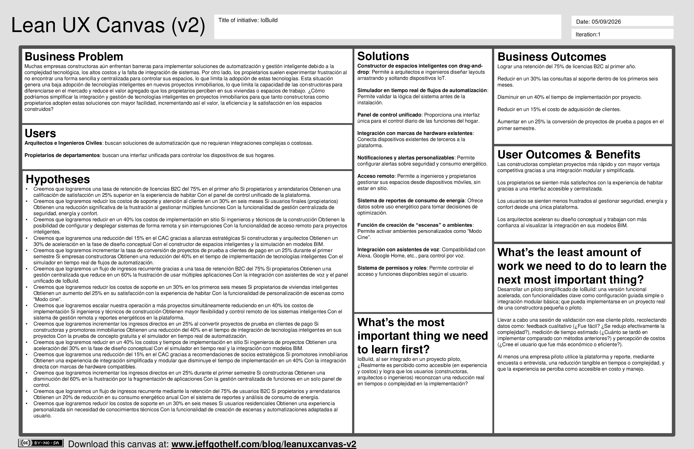
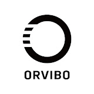
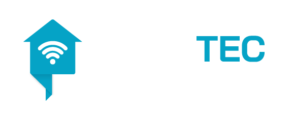

# <center>COURSE PROJECT</center>

<p align="center">
    </img><br>
    <strong>Universidad Peruana de Ciencias Aplicadas</strong><br>
    <strong>Ingeniería de Software</strong><br>
    <strong>Periodo: 2026-2</strong><br>
    <strong>Desarrollo de Soluciones IoT</strong><br>
    <strong>NRC: 16518</strong><br>
    <strong>Profesor: Jimmy Enrique Sanchez Portugal</strong><br>
    <br>INFORME TRABAJO FINAL
</p>

<center>

#### Startup: **CcaritaTech**
#### Product: **IoBuild**

</center>

### <center>Team Members:</center>
<center>

| Member                           | Code       |
|----------------------------------|------------|
|Ordoñez Ricaldi, Axel Randall|U202216827|
|Ccarita Cruz, Brayan Roberto|U20221c218|
|Panta Castro, Fabrizio Martin|U20231a810|
|Loechle Arias, Mateo Italo|U202215004|
|Guia Carrasco, Pedro Andre|U202212010|
|Alejo Jesus, Anyelo Bill|U20231d149|
|Escalante Baygorrea, Janiel Franz|U201912668|


<br> Setiembre 2026
</center>  

# Registro de Versiones del Informe
<center>

| Version | Fecha | Autor | Descripcion de Modificacion |
| ----------- | ----------- | ----------- | ----------- |
| 0.0 | 05/09/2026 |CcaritaTech |Se crea el documento |  

</center>

# Project Report Collaboration Insights
[URL del repositorio](https://www.example.com)

(Imagenes de los commits cada entrega)


# Contenido

- [Registro de Versiones del Informe](#registro-de-versiones-del-informe)
- [Project Report Collaboration Insights](#project-report-collaboration-insights)
- [Student Outcome](#student-outcome)
- [Capítulo I: Introducción](#capítulo-i-introducción)
  - [1.1. Startup Profile](#11-startup-profile)
    - [1.1.1. Descripción de la Startup](#111-descripción-de-la-startup)
    - [1.1.2. Perfiles de integrantes del equipo](#112-perfiles-de-integrantes-del-equipo)
  - [1.2. Solution Profile](#12-solution-profile)
    - [1.2.1 Antecedentes y problemática](#121-antecedentes-y-problemática)
    - [1.2.2 Lean UX Process.](#122-lean-ux-process)
      - [1.2.2.1. Lean UX Problem Statements.](#1221-lean-ux-problem-statements)
      - [1.2.2.2. Lean UX Assumptions.](#1222-lean-ux-assumptions)
      - [1.2.2.3. Lean UX Hypothesis Statements.](#1223-lean-ux-hypothesis-statements)
      - [1.2.2.4. Lean UX Canvas.](#1224-lean-ux-canvas)
  - [1.3. Segmentos objetivo.](#13-segmentos-objetivo)
- [Capítulo II: Requirements Elicitation & Analysis](#capítulo-ii-requirements-elicitation--analysis)
  - [2.1. Competidores.](#21-competidores)
    - [2.1.1. Análisis competitivo.](#211-análisis-competitivo)
    - [2.1.2. Estrategias y tácticas frente a competidores.](#212-estrategias-y-tácticas-frente-a-competidores)
  - [2.2. Entrevistas.](#22-entrevistas)
    - [2.2.1. Diseño de entrevistas.](#221-diseño-de-entrevistas)
    - [2.2.2. Registro de entrevistas.](#222-registro-de-entrevistas)
    - [2.2.3. Análisis de entrevistas.](#223-análisis-de-entrevistas)
  - [2.3. Needfinding.](#23-needfinding)
    - [2.3.1. User Personas.](#231-user-personas)
    - [2.3.2. User Task Matrix.](#232-user-task-matrix)
    - [2.3.3. User Journey Mapping.](#233-user-journey-mapping)
    - [2.3.4. Empathy Mapping.](#234-empathy-mapping)
  - [2.4. Big Picture EventStorming.](#24-big-picture-eventstorming)
  - [2.5. Ubiquitous Language.](#25-ubiquitous-language)
- [Capítulo III: Requirements Specification](#capítulo-iii-requirements-specification)
  - [3.1. User Stories.](#31-user-stories)
  - [3.2. Impact Mapping.](#32-impact-mapping)
  - [3.3. Product Backlog.](#33-product-backlog)
- [Capítulo IV: Solution Software Design](#capítulo-iv-solution-software-design)
  - [4.1. Strategic-Level Domain-Driven Design.](#41-strategic-level-domain-driven-design)
    - [4.1.1. Design-Level EventStorming.](#411-design-level-eventstorming)
      - [4.1.1.1 Candidate Context Discovery.](#4111-candidate-context-discovery)
      - [4.1.1.2 Domain Message Flows Modeling.](#4112-domain-message-flows-modeling)
      - [4.1.1.3 Bounded Context Canvases.](#4113-bounded-context-canvases)
    - [4.1.2. Context Mapping.](#412-context-mapping)
    - [4.1.3. Software Architecture.](#413-software-architecture)
      - [4.1.3.1. Software Architecture System Landscape Diagram.](#4131-software-architecture-system-landscape-diagram)
      - [4.1.3.2. Software Architecture Context Level Diagrams.](#4132-software-architecture-context-level-diagrams)
      - [4.1.3.3. Software Architecture Container Level Diagrams.](#4133-software-architecture-container-level-diagrams)
      - [4.1.3.4. Software Architecture Deployment Diagrams.](#4134-software-architecture-deployment-diagrams)
  - [4.2. Tactical-Level Domain-Driven Design](#42-tactical-level-domain-driven-design)
    - [4.2.X. Bounded Context: &lt;Bounded Context Name&gt;](#42x-bounded-context-bounded-context-name)
      - [4.2.X.1. Domain Layer.](#42x1-domain-layer)
      - [4.2.X.2. Interface Layer.](#42x2-interface-layer)
      - [4.2.X.3. Application Layer.](#42x3-application-layer)
      - [4.2.X.4. Infrastructure Layer.](#42x4-infrastructure-layer)
      - [4.2.X.5. Bounded Context Software Architecture Component Level Diagrams.](#42x5-bounded-context-software-architecture-component-level-diagrams)
      - [4.2.X.6. Bounded Context Software Architecture Code Level Diagrams.](#42x6-bounded-context-software-architecture-code-level-diagrams)
        - [4.2.X.6.1. Bounded Context Domain Layer Class Diagrams.](#42x61-bounded-context-domain-layer-class-diagrams)
        - [4.2.X.6.2. Bounded Context Database Design Diagram.](#42x62-bounded-context-database-design-diagram)
- [Capítulo V: Solution UI/UX Design](#capítulo-v-solution-uiux-design)
  - [5.1. Style Guidelines.](#51-style-guidelines)
    - [5.1.1. General Style Guidelines.](#511-general-style-guidelines)
    - [5.1.2. Web, Mobile and IoT Style Guidelines.](#512-web-mobile-and-iot-style-guidelines)
  - [5.2. Information Architecture.](#52-information-architecture)
    - [5.2.1. Organization Systems.](#521-organization-systems)
    - [5.2.2. Labeling Systems.](#522-labeling-systems)
    - [5.2.3. SEO Tags and Meta Tags](#523-seo-tags-and-meta-tags)
    - [5.2.4. Searching Systems.](#524-searching-systems)
    - [5.2.5. Navigation Systems.](#525-navigation-systems)
  - [5.3. Landing Page UI Design.](#53-landing-page-ui-design)
    - [5.3.1. Landing Page Wireframe.](#531-landing-page-wireframe)
    - [5.3.2. Landing Page Mock-up.](#532-landing-page-mock-up)
  - [5.4. Applications UX/UI Design.](#54-applications-uxui-design)
    - [5.4.1. Applications Wireframes.](#541-applications-wireframes)
    - [5.4.2. Applications Wireflow Diagrams.](#542-applications-wireflow-diagrams)
    - [5.4.3. Applications Mock-ups.](#543-applications-mock-ups)
    - [5.4.4. Applications User Flow Diagrams.](#544-applications-user-flow-diagrams)
  - [5.5. Applications Prototyping.](#55-applications-prototyping)
  - [5.6. IoT Device Design.](#56-iot-device-design)
- [Capítulo VI: Product Implementation, Validation & Deployment](#capítulo-vi-product-implementation-validation--deployment)
  - [6.1. Software Configuration Management.](#61-software-configuration-management)
    - [6.1.1. Software Development Environment Configuration.](#611-software-development-environment-configuration)
    - [6.1.2. Source Code Management.](#612-source-code-management)
    - [6.1.3. Source Code Style Guide & Conventions.](#613-source-code-style-guide--conventions)
    - [6.1.4. Software Deployment Configuration.](#614-software-deployment-configuration)
  - [6.2. Landing Page, Services & Applications Implementation.](#62-landing-page-services--applications-implementation)
    - [6.2.X. Sprint n](#62x-sprint-n)
      - [6.2.X.1. Sprint Planning n.](#62x1-sprint-planning-n)
      - [6.2.X.2. Aspect Leaders and Collaborators.](#62x2-aspect-leaders-and-collaborators)
      - [6.2.X.3. Sprint Backlog n.](#62x3-sprint-backlog-n)
      - [6.2.X.4. Development Evidence for Sprint Review.](#62x4-development-evidence-for-sprint-review)
      - [6.2.X.5. Testing Suite Evidence for Sprint Review.](#62x5-testing-suite-evidence-for-sprint-review)
      - [6.2.X.6. Execution Evidence for Sprint Review.](#62x6-execution-evidence-for-sprint-review)
      - [6.2.X.7. Services Documentation Evidence for Sprint Review.](#62x7-services-documentation-evidence-for-sprint-review)
      - [6.2.X.8. Software Deployment Evidence for Sprint Review.](#62x8-software-deployment-evidence-for-sprint-review)
      - [6.2.X.9. Team Collaboration Insights during Sprint.](#62x9-team-collaboration-insights-during-sprint)
  - [6.3. Validation Interviews.](#63-validation-interviews)
    - [6.3.1. Diseño de Entrevistas.](#631-diseño-de-entrevistas)
    - [6.3.2. Registro de Entrevistas.](#632-registro-de-entrevistas)
    - [6.3.3. Evaluaciones según heurísticas.](#633-evaluaciones-según-heurísticas)
  - [6.4. Video About-the-Product.](#64-video-about-the-product)
- [Conclusiones](#conclusiones)
- [Conclusiones y recomendaciones.](#conclusiones-y-recomendaciones)
- [Video About-the-Team.](#video-about-the-team)
- [Bibliografía](#bibliografía)
- [Anexos](#anexos)  

# Student Outcome

| Criterio Específico | Acciones Realizadas | Conclusiones |
|---|---|---|
| Participa en equipos multidisciplinarios con eficacia, eficiencia y objetividad, en el marco de un proyecto en soluciones de ingeniería de software. | **Compañero 1:**<br> *TB1:* Texto de evidencia...<br> *TB2:* Texto de evidencia... | Conclusión del criterio |
| Conoce al menos un sector empresarial o dominio de aplicación de soluciones de software. | **Compañero 1:**<br> *TB1:* Texto de evidencia...<br> *TB2:* Texto de evidencia... | Conclusión del criterio |

---

# Capítulo I: Introducción

## 1.1. Startup Profile
### 1.1.1. Descripción de la Startup
**IoBuild** es una startup tecnológica que nace con el propósito de democratizar y simplificar la integración del Internet de las Cosas (IoT) en el sector residencial y de la construcción. Diseñamos una **plataforma integral web y móvil** para el control y la gestión unificada de dispositivos IoT en condominios, abordando de manera cohesionada tanto los espacios comunes como los departamentos individuales.

A diferencia de las complejas soluciones industriales o de domótica propietaria de alto costo, IoBuild se enfoca en una solución accesible, práctica y viable. En su alcance principal, nuestra plataforma centraliza el monitoreo de **condiciones ambientales (sensores de temperatura y humedad)** y el control automatizado de la **iluminación a través de actuadores (módulos de relé)**. Esto permite, por ejemplo, automatizar el encendido y apagado de luces en pasillos y zonas compartidas de un condominio según horarios o niveles ambientales, así como brindar a cada residente el control remoto y personalizado del confort lumínico y térmico de su propio departamento desde su smartphone o navegador web.

IoBuild se dirige a dos segmentos clave:

- **Empresas constructoras, arquitectos y administradores de condominios:** que buscan incorporar un valor agregado tecnológico real, estandarizado y de bajo costo en sus proyectos residenciales, facilitando la supervisión y automatización básica de las áreas comunes.
- **Propietarios e inquilinos residenciales:** que desean disfrutar de mayor confort, supervisión ambiental y autonomía en sus viviendas mediante una interfaz amigable y sin complicaciones técnicas.

Nuestra propuesta de valor se sustenta en la simplicidad, la accesibilidad económica y la cohesión: conectar hardware accesible (microcontroladores, sensores y actuadores) con una arquitectura digital moderna que elimina la dispersión de aplicaciones.

- **Misión:** Facilitar la modernización de espacios residenciales a través de soluciones IoT accesibles, brindando a constructoras, administradores y residentes herramientas prácticas para el monitoreo ambiental y el control eficiente de dispositivos.
- **Visión:** Convertirnos en la plataforma referente de integración IoT residencial en la región, promoviendo viviendas y condominios más conectados, confortables y energéticamente conscientes.

### 1.1.2. Perfiles de integrantes del equipo
| Miembros del equipo | Código Estudiante | Carrera | Conocimientos / Habilidades |
|---|---|---|---|
| Axel Randall Ordoñez Ricaldi  | U202216827 | Ingeniería de Software | [Habilidades y conocimientos] |
| Brayan Roberto Ccarita Cruz  | U20221c218 | Ingeniería de Software | [Habilidades y conocimientos] |
| Fabrizio Martin Panta Castro  | U20231a810 | Ingeniería de Software | [Habilidades y conocimientos] |
| Mateo Italo Loechle Arias  | U202215004 | Ingeniería de Software | [Habilidades y conocimientos] |
| Pedro Andre Guia Carrasco  | U202212010 | Ingeniería de Software | [Habilidades y conocimientos] |
| Anyelo Bill Alejo Jesus  | U20231d149 | Ingeniería de Software | [Habilidades y conocimientos] |
| Janiel Franz Escalante Baygorrea  | U201912668 | Ingeniería de Software | [Habilidades y conocimientos] |

## 1.2. Solution Profile
### 1.2.1 Antecedentes y problemática
En los últimos años, el sector inmobiliario y de la construcción ha experimentado una transformación impulsada por la creciente demanda de espacios inteligentes, sostenibles y personalizables. Las tendencias globales en domótica, IoT (Internet of Things) y eficiencia energética han comenzado a redefinir la forma en que las personas interactúan con sus viviendas y lugares de trabajo. Sin embargo, en gran parte de Latinoamérica y específicamente en el Perú, la adopción de estas tecnologías sigue siendo limitada debido a altos costos de implementación, falta de estandarización y ausencia de soluciones accesibles para el usuario final.

Actualmente, la mayoría de proyectos inmobiliarios no incorpora de manera nativa funcionalidades inteligentes como control automatizado de iluminación, climatización, seguridad o gestión energética en tiempo real. Cuando estas soluciones se incluyen, suelen estar restringidas a segmentos de alto poder adquisitivo, generando una brecha de accesibilidad entre quienes pueden disfrutar de la tecnología y quienes no.

Por otro lado, los propietarios e inquilinos enfrentan problemas al intentar personalizar sus espacios: las opciones suelen ser costosas, requieren conocimientos técnicos avanzados o dependen de la contratación de múltiples proveedores sin integración entre sistemas. Esto genera experiencias fragmentadas y reduce el valor percibido de la inversión.

En el caso de las constructoras, arquitectos e ingenieros, la problemática se centra en la necesidad de diferenciar sus proyectos en un mercado altamente competitivo. Si bien existe interés en ofrecer soluciones innovadoras, los equipos de construcción se enfrentan a falta de plataformas unificadas que simplifiquen la integración de tecnología inteligente en sus edificaciones, lo que dificulta la planificación y eleva los costos de implementación.

La problemática puede resumirse en los siguientes puntos:
- **Accesibilidad limitada:** la mayoría de soluciones de automatización están dirigidas a mercados premium, dejando de lado a gran parte de la población.

- **Falta de estandarización:** los sistemas actuales suelen ser propietarios y poco compatibles, lo que genera barreras técnicas.

- **Costos elevados:** implementar tecnologías inteligentes requiere inversiones iniciales altas, lo que desalienta a constructoras y propietarios.

- **Complejidad técnica:** los usuarios finales carecen de herramientas intuitivas para personalizar y gestionar sus espacios de manera autónoma.

- **Baja diferenciación en proyectos inmobiliarios:** las constructoras tienen dificultades para ofrecer un valor agregado innovador frente a la competencia.

En este contexto, IoBuild surge como respuesta a la necesidad de democratizar el acceso a los espacios inteligentes, ofreciendo una plataforma que facilita la integración tecnológica desde la etapa de construcción hasta la personalización por parte del usuario final.<br><br>

**1. What (¿Qué?)**

La mayoría de proyectos inmobiliarios no incorporan de manera integral soluciones inteligentes desde su diseño, lo que provoca que los espacios continúen siendo rígidos y poco adaptables a las necesidades de los usuarios. Las opciones que existen en el mercado suelen estar enfocadas en segmentos de alto costo, como consecuencia, los usuarios finales terminan recurriendo a dispositivos aislados, como focos inteligentes o asistentes de voz, que no siempre son compatibles entre sí.

**2. Why (¿Por qué?)**

Porque las tecnologías de domótica e IoT han sido diseñadas de forma fragmentada, con estándares poco unificados que dificultan la integración entre sistemas. Además, el costo de implementación es elevado, ya que no solo implica la adquisición de hardware, sino también licencias y soporte especializado. A ello se suma la complejidad tecnológica, pues la configuración y mantenimiento de estos sistemas requieren conocimientos avanzados que no todos los usuarios poseen.

**3. Who (¿Quién?)**

Impacta principalmente en empresas constructoras, arquitectos e ingenieros que buscan diferenciar sus proyectos, pero no encuentran soluciones accesibles que les permitan añadir valor con espacios inteligentes. También, afecta a los propietarios e inquilinos, quienes experimentan frustración al no poder personalizar fácilmente sus viviendas u oficinas y ven reducido su nivel de confort.

**4. Where (¿Dónde?)**

Se manifiesta tanto en proyectos de construcción urbana como en remodelaciones de viviendas y oficinas. En el primer caso, los edificios se levantan bajo modelos tradicionales, con muy poca o nula integración de sistemas inteligentes, lo que limita el atractivo de las propuestas inmobiliarias. En el segundo, los propietarios interesados en modernizar sus espacios encuentran barreras técnicas y económicas que dificultan la incorporación de funcionalidades de automatización.

**5. When (¿Cuándo?)**

Se presenta en la actualidad, en un momento en que la digitalización y la sostenibilidad se han convertido en factores clave de competitividad. La demanda de espacios inteligentes es cada vez más alta, especialmente entre nuevas generaciones que valoran la tecnología como parte de su estilo de vida.

**6. How (¿Cómo?)**

Se refleja en la dificultad de las constructoras y arquitectos para ofrecer proyectos innovadores sin depender de sistemas costosos y difíciles de implementar. Para los propietarios e inquilinos, se traduce en experiencias limitadas, ya que deben conformarse con dispositivos sueltos que no logran integrarse en un ecosistema coherente.

**7. How much (¿Cuánto?)**

El costo de implementar tecnologías inteligentes en espacios inmobiliarios tradicionales suele ser elevado, no solo por el precio de los dispositivos, sino también por la necesidad de contratar integradores especializados y adquirir licencias propietarias. Para una empresa constructora, la integración de soluciones de automatización puede representar entre un 10 % y un 20 % adicional sobre el presupuesto inicial de un proyecto, lo que limita su adopción en desarrollos de bajo o mediano costo. Para un propietario, la inversión inicial en sistemas fragmentados puede superar varios miles de dólares, sin garantizar una experiencia unificada ni la posibilidad de escalar a nuevas funcionalidades.


### 1.2.2 Lean UX Process.
#### 1.2.2.1. Lean UX Problem Statements.
IoBuild es una plataforma digital que permite a empresas constructoras, arquitectos, ingenieros y propietarios transformar edificios y espacios en entornos inteligentes, accesibles y personalizables, fomentando la innovación en el sector inmobiliario y mejorando la experiencia de habitar y gestionar espacios.

**Contexto:** IoBuild es una plataforma que busca transformar edificios y espacios inmobiliarios en entornos inteligentes, accesibles y altamente personalizables. Nuestro servicio permite a empresas constructoras, arquitectos e ingenieros integrar fácilmente funcionalidades inteligentes en sus proyectos, al mismo tiempo que ofrece a propietarios e inquilinos la posibilidad de gestionar y personalizar su experiencia dentro de los espacios que habitan, sin necesidad de conocimientos técnicos avanzados.

**Observación del problema:** Sin embargo, hemos identificado que muchas empresas constructoras aún enfrentan barreras para implementar soluciones de automatización y gestión inteligente debido a la complejidad tecnológica, los altos costos y la falta de integración de sistemas. Por otro lado, los propietarios suelen experimentar frustración al no encontrar una forma sencilla y centralizada para controlar sus espacios, lo que limita la adopción de estas tecnologías. Estas observaciones provienen de entrevistas con profesionales de la construcción, arquitectos y usuarios finales, quienes señalan dificultades para incorporar soluciones accesibles y confiables que se adapten a las necesidades reales de sus proyectos y hogares.

**Impacto:** Esta situación genera una baja adopción de tecnologías inteligentes en nuevos proyectos inmobiliarios, lo que limita la capacidad de las constructoras para diferenciarse en el mercado y reduce el valor agregado que los propietarios perciben en sus viviendas o espacios de trabajo. Además, la falta de accesibilidad tecnológica contribuye a una brecha entre la innovación disponible y la experiencia práctica de los usuarios, afectando tanto la competitividad del sector como la satisfacción de los clientes finales.

**Necesidad insatisfecha:** Actualmente, las empresas constructoras, arquitectos e ingenieros necesitan soluciones integradas y fáciles de implementar para modernizar sus proyectos con tecnologías inteligentes. Al mismo tiempo, los propietarios requieren herramientas intuitivas y accesibles que les permitan personalizar y gestionar sus espacios de manera práctica, confiable y sin barreras técnicas.

**Pregunta de mejora:** ¿Cómo podríamos simplificar la integración y gestión de tecnologías inteligentes en proyectos inmobiliarios para que tanto constructoras como propietarios adopten estas soluciones con mayor facilidad, incrementando así el valor, la eficiencia y la satisfacción en los espacios construidos?

#### 1.2.2.2. Lean UX Assumptions.

En la fase inicial de desarrollo de la plataforma IoBuild, hemos identificado y articulado una serie de supuestos fundamentales siguiendo los principios de la metodología Lean UX. Estos supuestos son nuestras hipótesis iniciales sobre quiénes son nuestros usuarios, qué beneficios esperan, cómo operará el negocio, el impacto que anticipamos generar y las características clave que necesitamos para lograrlo. Formalizar estas creencias nos permite enfocar el desarrollo del producto en la validación temprana, la minimización de riesgos y la toma de decisiones estratégicas basada en datos.

Los supuestos se han clasificado en cinco categorías principales para una estructuración clara:

- **User Assumptions**: Nuestras creencias sobre las necesidades, comportamientos y motivaciones de las empresas constructoras, arquitectos y propietarios.
- **User Outcome Assumptions**: Los resultados positivos y las ganancias de eficiencia que esperamos que nuestros usuarios experimenten al interactuar con IoBuild.
- **Business Assumptions**: Hipótesis sobre la viabilidad de nuestro modelo de negocio y el contexto del mercado inmobiliario.
- **Business Outcome Assumptions**: Los impactos mensurables que esperamos que la plataforma genere en la empresa, como crecimiento de ingresos y reducción de costos.
- **Feature Assumptions**: Nuestras creencias sobre cómo funcionalidades específicas resolverán los problemas de los usuarios y validarán los supuestos de negocio.

Estos supuestos formarán la estructura de nuestra estrategia de diseño y proporcionarán un marco para la validación continua.

- **User Assumptions** 
   - **Creemos que el 65 % de las empresas constructoras y arquitectos buscan soluciones de automatización de edificios que no requieran una integración compleja y costosa**, ya que las barreras tecnológicas y económicas actuales limitan la adopción de la domótica en sus proyectos.

   - **Creemos que el 90 % de los propietarios y arrendatarios valoran una interfaz de control unificada para sus hogares inteligentes**, porque la fragmentación de aplicaciones y dispositivos genera una experiencia frustrante e ineficiente.

   - **Creemos que el 80 % de los propietarios desea personalizar su entorno doméstico (iluminación, temperatura, seguridad) sin necesidad de conocimientos técnicos**, debido a que la personalización es un factor clave en la satisfacción residencial moderna.

   - **Creemos que el 75 % de los ingenieros y técnicos de la construcción desean herramientas que les permitan configurar y desplegar sistemas inteligentes de forma remota y sin interrupciones**, porque la gestión de proyectos a gran escala demanda flexibilidad y control en tiempo real.

   - **Creemos que el 55 % de los promotores inmobiliarios priorizarán la integración de tecnologías inteligentes si estas les permiten ofrecer un valor distintivo en el mercado**, ya que la innovación tecnológica se está convirtiendo en un factor decisivo de compra y arrendamiento.
<br>

- **User Outcome Assumptions**
   - **Creemos que si las constructoras pueden integrar nuestra solución con un proceso simplificado y modular, entonces reducirán el tiempo de implementación de tecnologías inteligentes en al menos un 40 %**, lo que les permitirá finalizar proyectos más rápido y de manera más competitiva.

    - **Creemos que si los propietarios tienen una herramienta accesible para controlar sus espacios, entonces su calificación de satisfacción con la experiencia de habitar será un 25 % superior** en encuestas de salida o de satisfacción anual.

    - **Creemos que si nuestra plataforma permite la gestión centralizada de múltiples funciones (seguridad, energía, confort), entonces el 60 % de los usuarios reportará una reducción significativa de la frustración** asociada al uso de múltiples aplicaciones dispares.

    - **Creemos que si los arquitectos y diseñadores pueden visualizar y simular la integración de nuestros sistemas en sus modelos BIM, entonces acelerarán su fase de diseño conceptual en un 30 %,** mejorando la eficiencia de sus flujos de trabajo.
<br>

- **Business Assumptions**
   - **Creemos que el 70 % de nuestros ingresos provendrá de la venta de licencias de proyecto (B2B)** a constructoras y arquitectos, y el 30 % restante de suscripciones y servicios de gestión para propietarios finales (B2C), ya que el sector de la construcción se digitaliza a un ritmo acelerado.

    - **Creemos que el 15 % de los proyectos registrados en la plataforma en el primer año superará los 100 usuarios activos**, lo que nos permitirá generar ingresos adicionales por el escalado de licencias.

    - **Creemos que mantendremos un margen bruto del 60 %**, ya que nuestro modelo de negocio de software y la producción bajo demanda evitan los costos de inventario.

    - **Creemos que cerraremos al menos 10 alianzas estratégicas con fabricantes de hardware y domótica**, lo que solidificará nuestra propuesta de valor y atraerá a un 20 % de clientes que prefieren ecosistemas de productos definidos.

    - **Creemos que al ofrecer una prueba de concepto gratuita para proyectos pequeños, lograremos convertir al 25 % de esos usuarios en clientes de pago en los primeros seis meses**, validando así la efectividad de nuestro embudo de ventas.

    - **Creemos que el 50 % de nuestras nuevas adquisiciones de clientes provendrá de marketing de contenido y alianzas con influenciadores de la industria inmobiliaria**, porque la confianza y las referencias son cruciales en este sector.
<br>

- **Business Outcome Assumptions**
    - **Creemos que si los propietarios adoptan y utilizan la plataforma con regularidad, entonces lograremos una tasa de retención de licencias B2C del 75 % en el primer año**, lo que generará un flujo de ingresos recurrente.
    - **Creemos que si la plataforma ofrece una experiencia de usuario fluida y sin complicaciones, entonces reduciremos los costos de soporte y atención al cliente en un 30 %** durante los primeros seis meses, mejorando la rentabilidad operativa.
    - **Creemos que si los ingenieros pueden configurar los sistemas de forma remota, entonces se reducirá en un 40 %** el tiempo y los costos de implementación en sitio, permitiéndonos escalar nuestra operación a más proyectos simultáneamente.
    - **Creemos que si fortalecemos las alianzas estratégicas, entonces conseguiremos una reducción del 15 % en los costos de adquisición de clientes (CAC)**, ya que las recomendaciones de nuestros socios nos proporcionarán nuevos clientes de forma más eficiente.
    - **Creemos que si las empresas constructoras pueden integrar nuestra plataforma fácilmente, entonces incrementaremos la tasa de conversión de proyectos de prueba a clientes de pago en un 25 %** durante el primer semestre, aumentando los ingresos directos.
<br>

- **Feature Assumptions**
    - **Creemos que la funcionalidad de un constructor de espacios inteligentes permitirá a los arquitectos e ingenieros diseñar layouts arrastrando y soltando dispositivos IoT**, de modo que el 60 % de ellos lo utilice para planificar sus proyectos en la plataforma.
    - **Creemos que el simulador en tiempo real de flujos de automatización permitirá a las constructoras validar la lógica de sus sistemas antes de la instalación**, de forma que el 90 % lo utilice para testear sus configuraciones.
    - **Creemos que el panel de control unificado permitirá a los propietarios gestionar su espacio desde una sola interfaz**, consiguiendo que el 80 % lo use como su herramienta principal de control diario.
    - **Creemos que la integración con marcas de hardware permitirá a los usuarios conectar sus dispositivos existentes a la plataforma**, logrando que el 70 % de los clientes B2C lo use en su primera semana de activación.
    - **Creemos que las notificaciones y alertas personalizables permitirán a los usuarios estar al tanto de la seguridad y el consumo de energía en sus propiedades**, de forma que el 50 % de ellos configure al menos 3 alertas en los primeros 30 días.
    - **Creemos que la funcionalidad de acceso remoto permitirá a los ingenieros y propietarios gestionar sus espacios desde cualquier lugar**, alcanzando que el 75 % de las gestiones fuera de la oficina se realicen en dispositivos móviles.
    - **Creemos que el sistema de reportes de consumo de energía permitirá a los usuarios tomar decisiones para optimizar sus gastos**, logrando una disminución del 20 % en el consumo energético reportado en el primer año.
    - **Creemos que la funcionalidad de creación de "escenas" o ambientes (ej. "Modo cine") simplificará la vida de los propietarios**, con el 60 % de ellos creando al menos una escena en el primer mes de uso.
    - **Creemos que la integración con asistentes de voz (ej. Alexa, Google Home) mejorará la experiencia del usuario**, consiguiendo que el 40 % de los usuarios de hogares inteligentes conecte su cuenta en los primeros tres meses.
    - **Creemos que un sistema de permisos y roles permitirá a los administradores de proyectos controlar quién puede acceder a qué funciones**, logrando una reducción del 95 % en los problemas de seguridad o acceso no autorizado reportados.
<br>

#### 1.2.2.3. Lean UX Hypothesis Statements.

- **Creemos que lograremos** una tasa de retención de licencias B2C del 75% en el primer año  
  **Si** propietarios y arrendatarios  
  **Obtienen** una calificación de satisfacción un 25% superior en la experiencia de habitar  
  **Con** el panel de control unificado de la plataforma.<br><br>

- **Creemos** que lograremos reducir los costos de soporte y atención al cliente en un 30% en seis meses  
  **Si** usuarios finales (propietarios)  
  **Obtienen** una reducción significativa de la frustración al gestionar múltiples funciones  
  **Con** la funcionalidad de gestión centralizada de seguridad, energía y confort.<br><br>

- **Creemos** que lograremos reducir en un 40% los costos de implementación en sitio  
  **Si** ingenieros y técnicos de la construcción  
  **Obtienen** la posibilidad de configurar y desplegar sistemas de forma remota y sin interrupciones  
  **Con** la funcionalidad de acceso remoto para proyectos inteligentes.<br><br>

- **Creemos** que lograremos una reducción del 15% en el CAC gracias a alianzas estratégicas  
  **Si** constructoras y arquitectos  
  **Obtienen** un 30% de aceleración en la fase de diseño conceptual  
  **Con** el constructor de espacios inteligentes y la simulación en modelos BIM.<br><br>

- **Creemos** que lograremos incrementar la tasa de conversión de proyectos de prueba a clientes de pago en un 25% durante el primer semestre  
  **Si** empresas constructoras  
  **Obtienen** una reducción del 40% en el tiempo de implementación de tecnologías inteligentes  
  **Con** el simulador en tiempo real de flujos de automatización.<br><br>

- **Creemos** que lograremos un flujo de ingresos recurrente gracias a una tasa de retención B2C del 75%  
  **Si** propietarios  
  **Obtienen** una gestión centralizada que reduce en un 60% la frustración de usar múltiples aplicaciones  
  **Con** la integración con asistentes de voz y el panel unificado de IoBuild.<br><br>

- **Creemos** que lograremos reducir los costos de soporte en un 30% en los primeros seis meses  
  **Si** propietarios de viviendas inteligentes  
  **Obtienen** un aumento del 25% en su satisfacción con la experiencia de habitar  
  **Con** la funcionalidad de personalización de escenas como “Modo cine”.<br><br>

- **Creemos** que lograremos escalar nuestra operación a más proyectos simultáneamente reduciendo en un 40% los costos de implementación  
  **Si** ingenieros y técnicos de construcción  
  **Obtienen** mayor flexibilidad y control remoto de los sistemas inteligentes  
  **Con** el sistema de gestión remota y reportes energéticos en la plataforma.<br><br>

- **Creemos** que lograremos incrementar los ingresos directos en un 25% al convertir proyectos de prueba en clientes de pago  
  **Si** constructoras y promotores inmobiliarios  
  **Obtienen** una reducción del 40% en el tiempo de integración de tecnologías inteligentes en sus proyectos  
  **Con** la prueba de concepto gratuita y el simulador en tiempo real de automatización.<br><br>

- **Creemos** que lograremos reducir en un 40% los costos y tiempos de implementación en sitio  
  **Si** ingenieros de proyectos  
  **Obtienen** una aceleración del 30% en la fase de diseño conceptual  
  **Con** el simulador en tiempo real y la integración con modelos BIM.<br><br>

- **Creemos** que lograremos una reducción del 15% en el CAC gracias a recomendaciones de socios estratégicos  
  **Si** promotores inmobiliarios  
  **Obtienen** una experiencia de integración simplificada y modular que disminuye el tiempo de implementación en un 40%  
  **Con** la integración directa con marcas de hardware compatibles.<br><br>

- **Creemos** que lograremos incrementar los ingresos directos en un 25% durante el primer semestre  
  **Si** constructoras  
  **Obtienen** una disminución del 60% en la frustración por la fragmentación de aplicaciones  
  **Con** la gestión centralizada de funciones en un solo panel de control.<br><br>

- **Creemos** que lograremos un flujo de ingresos recurrente mediante la retención del 75% de usuarios B2C  
  **Si** propietarios y arrendatarios  
  **Obtienen** un 20% de reducción en su consumo energético anual  
  **Con** el sistema de reportes y análisis de consumo de energía.<br><br>

- **Creemos** que lograremos reducir los costos de soporte en un 30% en seis meses  
  **Si** usuarios residenciales  
  **Obtienen** una experiencia personalizada sin necesidad de conocimientos técnicos  
  **Con** la funcionalidad de creación de escenas y automatizaciones adaptadas al usuario.<br><br>


#### 1.2.2.4. Lean UX Canvas.

<div align="center">
  
</div>

## 1.3. Segmentos objetivo.

| Variables | Segmento 1: Arquitectos e Ingenieros Civiles (B2B) | Segmento 2: Dueños y Residentes de Apartamentos (B2C) |
|---|---|---|
| **Definición del segmento** | Profesionales de la construcción, diseño arquitectónico e ingeniería civil involucrados en la planificación, edificación o administración de proyectos inmobiliarios multifamiliares y condominios residenciales. | Propietarios e inquilinos que habitan departamentos en condominios residenciales y buscan modernizar su vivienda con soluciones prácticas de confort, supervisión ambiental y automatización. |
| **Geográfica** | Principalmente en áreas urbanas de alto crecimiento inmobiliario en Latinoamérica, con especial énfasis en ciudades capitales (como Lima Metropolitana, Bogotá o Ciudad de México), donde la demanda y densificación de proyectos de vivienda colectiva y torres de departamentos es intensiva. | Residentes en zonas urbanas consolidadas y distritos de media y alta densidad residencial (como distritos céntricos o suburbanos de Lima y principales urbes). Priorizan la conectividad, la accesibilidad a servicios y la modernidad de su entorno habitacional. |
| **Demográfica** | • **Edad:** 30 a 55 años.<br>• **Género:** Hombres y mujeres profesionales.<br>• **Educación:** Superior universitaria completa (Arquitectura, Ingeniería Civil, Edificaciones o afines).<br>• **Nivel de Ingresos:** Medio-alto a alto.<br>• **Ocupación:** Proyectistas independientes, contratistas o líderes técnicos en empresas constructoras e inmobiliarias. | • **Edad:** 25 a 45 años.<br>• **Género:** Mixto.<br>• **Educación:** Nivel universitario o técnico superior.<br>• **Nivel de Ingresos:** Medio a medio-alto.<br>• **Estado Civil / Hogar:** Solteros, parejas jóvenes o familias pequeñas que adquieren su primera o segunda vivienda.<br>• **Ocupación:** Profesionales urbanos, colaboradores en modalidad remota/híbrida o emprendedores. |
| **Psicológica (Psicográfica)** | Orientados a la innovación y sostenibilidad, valoran la diferenciación competitiva y la eficiencia de costos. Buscan integrar tecnología domótica e IoT sin complicaciones de instalación industrial ni sobrecostos que encarezcan el metro cuadrado. Son meticulosos, analíticos y pragmáticos, motivados por entregar edificaciones modernas y atractivas para la venta o arriendo. | Buscadores de confort térmico, lumínico y tranquilidad. Tienen una actitud práctica ante la tecnología: valoran la conveniencia del día a día, la privacidad y el ahorro energético. Su estilo de vida es dinámico y aprecian llegar a un hogar con ambientes acogedores, automatizados y fáciles de controlar sin requerir soporte técnico constante. |
| **Función de comportamiento** | Evalúan e incorporan soluciones tecnológicas desde la etapa de diseño de planos y memoria descriptiva. Valoran la estandarización y compatibilidad con hardware accesible (sensores ambientales y actuadores/relés para iluminación en pasillos o áreas comunes). Se frustran enormemente por sistemas propietarios cerrados, costosos o difíciles de configurar en obra. Su meta es entregar condominios con valor agregado inteligente garantizando viabilidad técnica y operativa. | Uso frecuente y diario de aplicaciones móviles y asistentes para el hogar. Su adopción de tecnología se basa estrictamente en la facilidad de uso y la inmediatez: desean verificar la temperatura/humedad de sus habitaciones y controlar las luces (o activar escenas como "Modo Noche" o "Modo Cine") con un toque. Se frustran ante la multiplicidad de apps incompatibles o fallas de configuración. Su meta es maximizar el bienestar dentro de su vivienda de forma intuitiva. |

---

# Capítulo II: Requirements Elicitation & Analysis

## 2.1. Competidores.
### 2.1.1. Análisis competitivo.
|  | **Competitive Analysis** |
| :---: | :--- |
| ¿Por qué llevar acabo este análisis? | El objetivo es identificar oportunidades de mejora y diferenciación frente a nuestros principales competidores en el sector de automatización, control de acceso y domótica. |

|  | IoBuild | MWF Solutions | Orvibo Perú | Domotec Perú |
| :---: | :--- | :--- | :--- | :--- |
| *Logo* |  |  |  |  |
| *Overview* | Startup que transforma edificios y espacios en entornos inteligentes, accesibles y personalizables. Ofrece una plataforma digital sencilla para constructoras, arquitectos y propietarios, facilitando la integración de soluciones smart. | Empresa líder en soluciones multitécnicas. Especialistas en diseño, ejecución y mantenimiento de proyectos de ingeniería. | Empresa dedicada a soluciones de domótica y automatización de hogares. | Especialistas en convertir hogares y edificios en Smart Home, ofreciendo control desde dispositivos móviles y asistentes de voz. |
| *Ventaja competitiva ¿Qué valor ofrece a los clientes?* | Enfoque low-barrier: integración simplificada, costos accesibles y experiencia de usuario unificada. Prioriza la personalización, escalabilidad y eficiencia energética. | Equipo de ingenieros altamente capacitados. Experiencia comprobada en proyectos exitosos. Alta calidad, eficiencia energética y estándares internacionales. Partner estratégico en todas las fases del proyecto (diseño, ejecución, mantenimiento). | Ofrecen soluciones completas de domótica personalizadas para hogares y empresas. Control y monitoreo fácil desde app, voz y diversos equipos smart. | Soluciones profesionales, completas y fáciles de usar. Integración con asistentes de voz (Apple, Alexa, Google). Garantizan la ciberseguridad y control centralizado de todos los dispositivos. |
| *Mercado Objetivo* | Constructoras que buscan diferenciarse con proyectos inteligentes sin complejidad tecnológica. Propietarios que desean personalizar y gestionar sus hogares de manera práctica y accesible. | Empresas constructoras de oficinas, edificaciones industriales, comerciales y residenciales que necesiten ingeniería multitécnica. | Oficinas y hogares interesados en automatización y domótica. | Hogares, edificios, hoteles y oficinas interesados en automatización y modernización smart. |
| *Estrategia de Marketing* | Redes sociales (Facebook, Instagram, Youtube, Linkedin). Marketing de contenidos (demos). | Activos en Facebook, Linkedin, Instagram y Youtube. Promoción de servicios, casos de éxito, y artículos de ingeniería. | Redes Sociales (Facebook, Instagram, Youtube). Promocionan productos y nuevas tecnologías en posts. | Redes Sociales (Facebook, Instagram, Linkedin); Enfocados en la experiencia de usuario y difusión de soluciones smart. |
| *Productos y servicios* | Control unificado de iluminación, clima, seguridad, riego y energía. Funcionalidades avanzadas: escenas personalizadas, reportes de consumo, permisos multiusuario, integración con Alexa/Google Home. | Aire acondicionado, ventilación, clima, seguridad electrónica, domótica, automatización, energía, instalación eléctrica, sistemas contra incendio, refrigeración, mantenimiento. | Smart Film, cortinas inteligentes, gestión y ahorro de energía, seguridad smart, equipos Sonoff, luces smart, audio, jardín smart. | Cerraduras inteligentes, cortinas inteligentes, iluminación inteligente, seguridad, redes unificadas, interfaces, soluciones de automatización personalizadas. |
| *Precios y costos* | B2B: licencias por proyecto + servicios de integración. Instalación inicial con costo fijo ajustado al proyecto. B2C: suscripción mensual/anual según tamaño del espacio. | Cotización personalizada, generalmente modelo proyecto a medida (no disponibles en línea). | Servicios personalizados. Contacto para cotización (no disponibles en línea) basado en la selección del cliente. | Servicios personalizados. Contacto para cotización. Ventas por proyecto, cada solución es a medida. |
| *Canales de distribución (Web y/o Móvil)* | Plataforma web y aplicación móvil. Contacto directo vía sitio web, WhatsApp, correo y redes sociales. | Web, contacto vía sitio, redes sociales, WhatsApp, email, móvil para atención y soporte. | Web, contacto por teléfono, correo, WhatsApp, y redes sociales. | Web, WhatsApp, contacto por teléfono, presencial. |
| *Fortalezas* | Modelo de negocio por suscripción (ingresos recurrentes). Alianza directa con constructoras. Servicio integral que incluye instalación, soporte de cableado y plataforma centralizada. Doble interfaz para administradores y residentes. | Especialistas en experiencia de cliente smart y conectividad centralizada. Trabajan múltiples verticales (hogares, hoteles, edificios). Alto nivel de integración. | Propuesta innovadora con soluciones “llave en mano” para hogares inteligentes. Fácil integración y foco en simplificar la tecnología al usuario doméstico. | Experiencia multisectorial, enfoque integral en proyectos. Soluciones personalizadas para empresas. Alta capacidad técnica y enfoque en eficiencia y cumplimiento normativo. |
| *Debilidades* | Alta dependencia del sector construcción e inmobiliario. Ciclo de ventas potencialmente largo con las constructoras. Requiere una inversión inicial fuerte en tecnología y personal técnico especializado. | Foco muy avanzado puede limitar llegada a usuarios menos familiarizados. Reto en escalar por requerir asesoría y soporte muy personalizado. | Menor penetración en segmento corporativo. Posible dependencia de productos de marcas externas/globales para domótica. Segmentación principalmente residencial. | Dependencia de proyectos grandes (segmento corporativo/industrial). Requiere relaciones comerciales de largo plazo. Adaptación tecnológica constante frente a nuevas tendencias globales. |
| *Oportunidades* | Auge de los "edificios inteligentes" como estándar en nuevos proyectos inmobiliarios. Potencial para ofrecer servicios de valor añadido (mantenimiento predictivo, analítica de datos). Expansión a otros mercados verticales. | Hoteles y edificios buscan modernización. Auge de viviendas premium smart. Oportunidad de crear plataformas propias de gestión y control. Potencial expansión internacional. | Tendencia de adopción masiva de IoT y hogares inteligentes en Latinoamérica. Posibilidad de alianzas con desarrolladoras inmobiliarias. Ampliación de servicios postventa y soporte. | Crecimiento del mercado en automatización industrial y sostenibilidad. Expansión a nuevos mercados verticales (hospitales, data centers, infraestructuras especiales). Alianzas con marcas globales. |
| *Amenazas* | Posible resistencia de las constructoras a adoptar un modelo de suscripción. Ciberseguridad como riesgo crítico al centralizar el control del edificio. Rápida evolución de estándares y protocolos IoT que exigen actualización constante. | Vulnerabilidad a cambios en protocolos de asistentes de voz o plataformas smart grandes. Volatilidad del mercado inmobiliario. Ciberseguridad como preocupación creciente. | Entradas de nuevas startups globales con soluciones más económicas o DIY. Cambio rápido de estándares (protocolos, compatibilidad). Piratería tecnológica. | Competencia de multinacionales o integradores globales. Cambios regulatorios en el sector técnico. Riesgo tecnológico por obsolescencia rápida de equipos o sistemas. |

### 2.1.2. Estrategias y tácticas frente a competidores.
| Competidores -> | Nosotros (IoBuild) | Competidor 1 | Competidor 2 |
|---|---|---|---|
| Fortalezas | | | |
| Debilidades | | | |
| Oportunidades | | | |
| Amenazas | | | |

## 2.2. Entrevistas.
### 2.2.1. Diseño de entrevistas.
**Preguntas generales:**
1. ¿Cuál es su nombre?
2. ¿Qué edad tiene?
3. ¿A qué se dedica?
4. ¿Qué experiencia previa tiene con sistemas de monitoreo o soluciones IoT?

**Entrevistas usuario Segmento 1:**
1. ¿... ?
2. ¿... ?
3. ¿... ?

**Entrevistas usuario Segmento 2:**
1. ¿... ?
2. ¿... ?
3. ¿... ?

### 2.2.2. Registro de entrevistas.
**Segmento 1:**
- **Nombre:** _____
- **Edad:** _____
- **Ocupación:** _____
- **Foto/Captura:** 
- **Resumen/Transcripción:** [Detalle de la entrevista]

**Segmento 2:**
- **Nombre:** _____
- **Edad:** _____
- **Ocupación:** _____
- **Foto/Captura:** 
- **Resumen/Transcripción:** [Detalle de la entrevista]

### 2.2.3. Análisis de entrevistas.
- **Análisis Segmento 1:** [Hallazgos clave]
- **Análisis Segmento 2:** [Hallazgos clave]

## 2.3. Needfinding.
### 2.3.1. User Personas.
**Segmento 1:**


**Segmento 2:**


### 2.3.2. User Task Matrix.
| ID | Tarea / Task | Importancia (Seg. 1) | Frecuencia (Seg. 1) | Importancia (Seg. 2) | Frecuencia (Seg. 2) |
|---|---|---|---|---|---|
| UT01 | [Descripción de la tarea] | Alta | Alta | Media | Baja |

### 2.3.3. User Journey Mapping.
**Registro e inicio:**
- ...

**Uso principal y monitoreo:**
- ...

**Interacción avanzada y reportes:**
- ...

### 2.3.4. Empathy Mapping.
**Segmento 1:**


**Segmento 2:**


## 2.4. Big Picture EventStorming.
[Diagrama y narrativa del Big Picture EventStorming que modela el dominio del negocio de extremo a extremo: Domain Events, Commands, Read Models, Aggregates y Policies]


## 2.5. Ubiquitous Language.
```
- Término 1: Definición clara dentro del contexto delimitado del negocio.
- Término 2: Definición clara dentro del contexto delimitado del negocio.
```

---

# Capítulo III: Requirements Specification

## 3.1. User Stories.
| ID | Título | Como... | Quiero... | Para... | Criterios de Aceptación |
|---|---|---|---|---|---|
| US01 | [Título de historia] | [Rol/Usuario] | [Acción/Deseo] | [Beneficio/Valor] | **Escenario 1:** Dado... Cuando... Entonces... |

## 3.2. Impact Mapping.


## 3.3. Product Backlog.
| # Orden | User Story ID | Título | Descripción | Story Points | Sprint |
|---|---|---|---|---|---|
| 1 | US01 | [Título] | [Descripción] | [1/2/3/5/8] | Sprint 1 |

---

# Capítulo IV: Solution Software Design

## 4.1. Strategic-Level Domain-Driven Design.
### 4.1.1. Design-Level EventStorming.
#### 4.1.1.1 Candidate Context Discovery.
[Identificación y justificación de los Bounded Contexts candidatos descubiertos]

#### 4.1.1.2 Domain Message Flows Modeling.
[Modelado de flujos de mensajes, comandos y eventos entre los contextos]

#### 4.1.1.3 Bounded Context Canvases.
[Canvas descriptivo para cada Bounded Context identificado]

### 4.1.2. Context Mapping.
[Mapa de contextos que define las relaciones: Upstream/Downstream, Customer/Supplier, Shared Kernel, Conformist, Open Host Service, etc.]


### 4.1.3. Software Architecture.
#### 4.1.3.1. Software Architecture System Landscape Diagram.


#### 4.1.3.2. Software Architecture Context Level Diagrams.


#### 4.1.3.3. Software Architecture Container Level Diagrams.


#### 4.1.3.4. Software Architecture Deployment Diagrams.


## 4.2. Tactical-Level Domain-Driven Design
### 4.2.X. Bounded Context: &lt;Bounded Context Name&gt;
#### 4.2.X.1. Domain Layer.
[Entidades, Value Objects, Agregados, Domain Events, Repositorios e interfaces de dominio]

#### 4.2.X.2. Interface Layer.
[Controladores REST, DTOs, Handlers de mensajería o WebSockets]

#### 4.2.X.3. Application Layer.
[Casos de uso / Command Handlers / Query Handlers / Application Services]

#### 4.2.X.4. Infrastructure Layer.
[Implementación de repositorios, clientes externos, adaptadores IoT/MQTT/HTTP, persistencia]

#### 4.2.X.5. Bounded Context Software Architecture Component Level Diagrams.


#### 4.2.X.6. Bounded Context Software Architecture Code Level Diagrams.
##### 4.2.X.6.1. Bounded Context Domain Layer Class Diagrams.


##### 4.2.X.6.2. Bounded Context Database Design Diagram.


---

# Capítulo V: Solution UI/UX Design

## 5.1. Style Guidelines.
### 5.1.1. General Style Guidelines.
- **Color:** [Descripción de la paleta de colores corporativos y su justificación]
- **Tipografía:** [Fuentes, tamaños y jerarquía tipográfica]
- **Branding:** [Identidad visual, logotipo e iconografía]

### 5.1.2. Web, Mobile and IoT Style Guidelines.
- **Web App:** [Fondos, estilos de botones, formularios, alertas y componentes web]
- **Mobile App:** [Diseño adaptativo, directrices iOS/Android, componentes táctiles]
- **IoT Dashboard/Display:** [Visualización de telemetría, estados de dispositivos y alertas visuales]

## 5.2. Information Architecture.
### 5.2.1. Organization Systems.
[Estructura jerárquica, secuencial y matricial de la información]

### 5.2.2. Labeling Systems.
[Etiquetado claro de navegación, menús y formularios]

### 5.2.3. SEO Tags and Meta Tags
- **Title Tag:** `<title>IoBuild - Soluciones Inteligentes IoT</title>`
- **Description Meta:** `<meta name="description" content="Plataforma de monitoreo y gestión IoT." />`
- **Keywords:** `<meta name="keywords" content="IoT, monitoreo, sensores, dashboards" />`

### 5.2.4. Searching Systems.
[Mecanismos de filtrado, búsqueda de dispositivos, eventos e historiales]

### 5.2.5. Navigation Systems.
[Sistemas de navegación jerárquica, global, local y contextual]

## 5.3. Landing Page UI Design.
### 5.3.1. Landing Page Wireframe.


### 5.3.2. Landing Page Mock-up.


## 5.4. Applications UX/UI Design.
### 5.4.1. Applications Wireframes.


### 5.4.2. Applications Wireflow Diagrams.


### 5.4.3. Applications Mock-ups.


### 5.4.4. Applications User Flow Diagrams.


## 5.5. Applications Prototyping.
[URL del Prototipo Interactivo (Figma u otra herramienta)](https://www.example.com)

## 5.6. IoT Device Design.
[Diseño conceptual y físico del dispositivo IoT: microcontroladores (ESP32/Arduino/Raspberry Pi), sensores, actuadores, esquemático de conexiones, protocolo de comunicación (MQTT/HTTP) y carcasa/empaque]


---

# Capítulo VI: Product Implementation, Validation & Deployment

## 6.1. Software Configuration Management.
### 6.1.1. Software Development Environment Configuration.
[Configuración de IDEs, SDKs, herramientas de desarrollo y extensiones recomendadas]

### 6.1.2. Source Code Management.
[Estrategia de ramas (Gitflow), convenciones de commits y repositorios en GitHub]

### 6.1.3. Source Code Style Guide & Conventions.
[Guías de estilo de código para Backend, Frontend, Firmware IoT y linters configurados]

### 6.1.4. Software Deployment Configuration.
[Configuración de entornos CI/CD, Docker, pipelines de despliegue y servidores en la nube]

## 6.2. Landing Page, Services & Applications Implementation.
### 6.2.X. Sprint n
#### 6.2.X.1. Sprint Planning n.
[Objetivos del Sprint, alcance y acuerdos del equipo]

#### 6.2.X.2. Aspect Leaders and Collaborators.
| Aspecto / Módulo | Líder Responsable | Colaboradores |
|---|---|---|
| Firmware IoT & Hardware | [Nombre] | [Nombres] |
| Backend & APIs | [Nombre] | [Nombres] |
| Frontend Web & Landing | [Nombre] | [Nombres] |
| Mobile Application | [Nombre] | [Nombres] |
| QA & Testing | [Nombre] | [Nombres] |

#### 6.2.X.3. Sprint Backlog n.
| User Story ID | Tarea | Responsable | Estimación | Estado |
|---|---|---|---|---|
| US01 | [Tarea técnica] | [Nombre] | [Horas/Puntos] | Done / In Progress |

#### 6.2.X.4. Development Evidence for Sprint Review.


#### 6.2.X.5. Testing Suite Evidence for Sprint Review.


#### 6.2.X.6. Execution Evidence for Sprint Review.


#### 6.2.X.7. Services Documentation Evidence for Sprint Review.


#### 6.2.X.8. Software Deployment Evidence for Sprint Review.


#### 6.2.X.9. Team Collaboration Insights during Sprint.


## 6.3. Validation Interviews.
### 6.3.1. Diseño de Entrevistas.
[Guía y preguntas estructuradas para la validación con usuarios finales]

### 6.3.2. Registro de Entrevistas.
[Evidencias fotográficas, grabaciones y resúmenes de las sesiones de validación]

### 6.3.3. Evaluaciones según heurísticas.
[Evaluación heurística de usabilidad de Nielsen aplicada a la solución]

## 6.4. Video About-the-Product.
[Enlace del video promocional y demostrativo del producto IoT]

---

# Conclusiones
[Conclusiones generales del desarrollo de la solución]

# Conclusiones y recomendaciones.
[Recomendaciones y lecciones aprendidas para futuros proyectos]

# Video About-the-Team.
[Enlace al video de presentación del equipo CcaritaTech]

# Bibliografía
[Referencias bibliográficas en formato APA o IEEE]

# Anexos
[Documentación complementaria, hojas de datos de sensores, diagramas adicionales]


